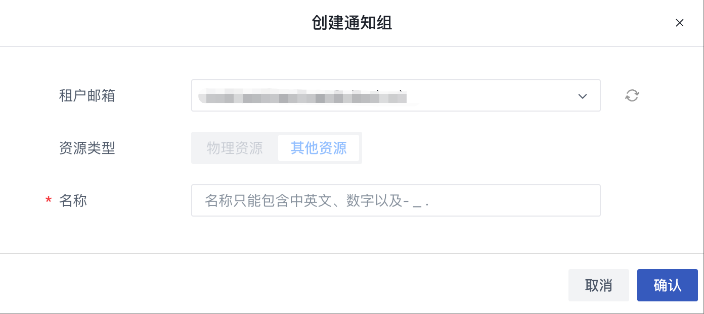
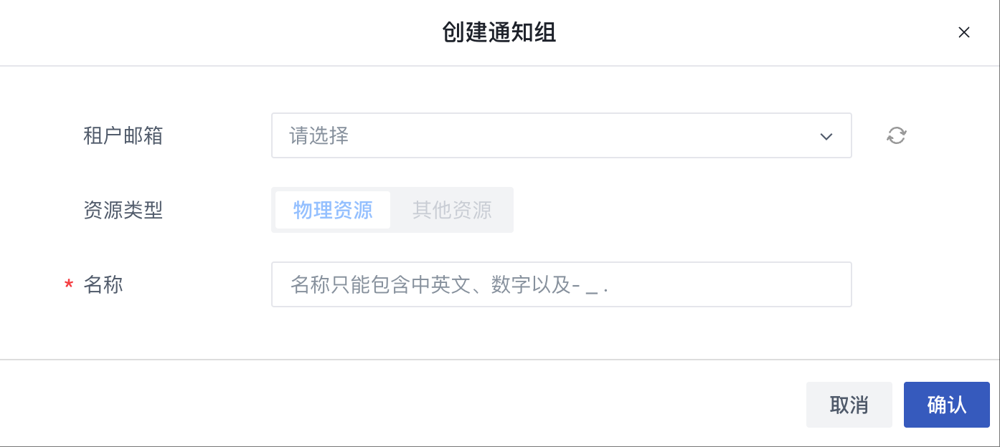
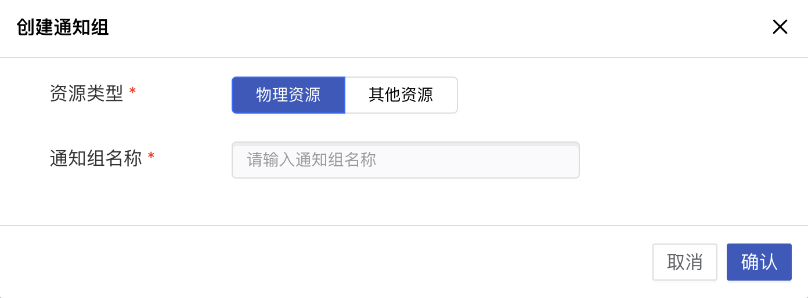
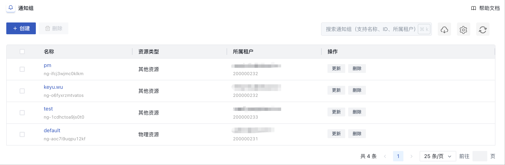
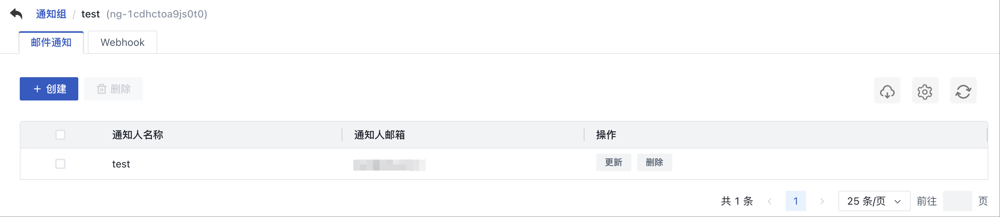
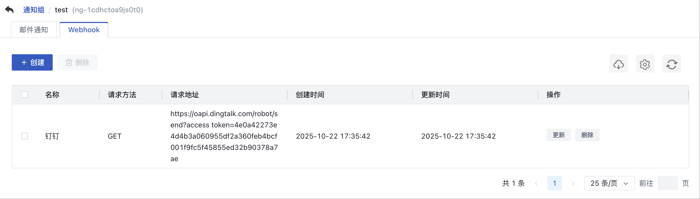
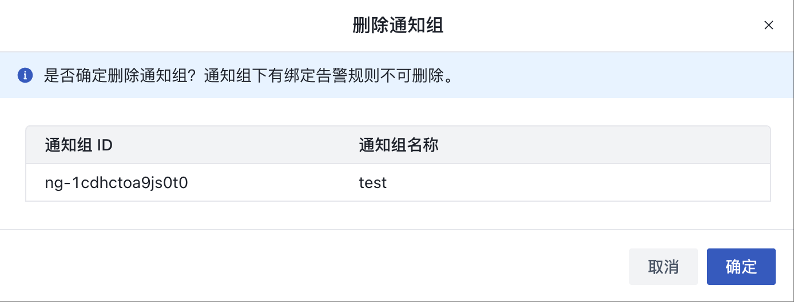
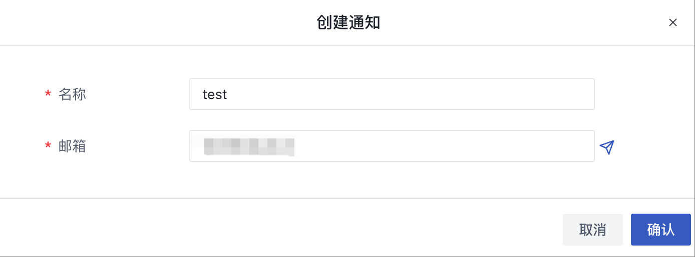
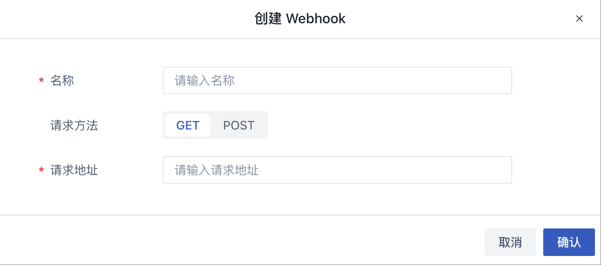

# 30 通知组

通知组是指监控报警发送告警通知的方式及联系人信息，通过对用户邮箱，webhook地址的记录，将不同资源告警通过以上两种方式通知给通知人，以便划分全责，精细化处理告警通知。

- 通知组是一组通知人的组合，可以包含一个或多个联系人；
- 同一个联系人，可以加入多个通知组；
- 通知方式包括邮件通知，webhook通知。

在使用监控告警模板时，需要先创建一个通知组，添加相关联系人信息，并设置通知组的通知方式，以便关联告警模板，而想让通知人能够收到邮件，需要在系统管理-全局设置-系统服务-邮箱配置中，开启邮件服务，并配置邮件服务地址，通知组具体管理详见下文。

### 30.1 创建通知组

#### 30.1.1 租户创建通知组

用户可通过控制台导航栏进入“**监控与运维管理**”模块，切换至“**通知组**”页面通过通知组管理页面的“**创建通知组**”按钮进入通知组的创建向导页面，如下图所示指定通知组名称及通知方式进行创建操作：

- 资源类型：租户侧资源类型为"其他资源"；
- 通知组名称：当前需要创建的通知组名称及标识。

#### 30.1.2 管理员创建通知组

- 租户邮箱：指定用户；暂不绑定的通知组，是提供给计算集群、存储集群、节点的告警通知使用，HCI 和 Virt 版本不支持选择租户邮箱；
- 资源类型：其他资源对应租户，物理资源对应 admin；
- 通知组名称：当前需要创建的通知组名称及标识。

HCI 和 Virt 版本如下图所示：

点击确定后，进入通知组列表页面，可查看已创建的通知组信息，并对通知组进行相关操作及管理。

### 30.2 查看通知组

用户可通过监控告警控制台进入通知组页面查看通知组列表信息，同时可通过点击列表上通知组的名称进入详情页面，用于查看通知组的详细信息及通知人的管理。

#### 30.2.1 通知组列表

通知组列表页面可查看当前账号下已拥有的通知组列表，列表信息包括名称、资源类型、所属租户及对单个通知组的操作项，如下图所示：

- 名称：通知组的名称标识及全局唯一标识符；
- 资源类型：当前通知组的资源类型；
- 所属租户：创建通知组的租户信息，包括租户 ID 和租户邮箱；
- 操作：对单个通知组的操作项，包括创建、更新、删除。

#### 30.2.2 通知组详情

通过通知组列表的 `名称` 进入通知组详情页面，可查看当前基础通知的基本信息，如下图所示：

- 基础通知信息：包括通知人名称、通知人邮箱以及创建、更新、删除操作；

选择 Webhook 按键进入 webhook 通知人详情页面，可查看当前 webhook 通知的基本信息，并可通过通知人管理进行通知联系人的管理，如下图所示：

- Webhook 通知信息：包括名称、请求方法、请求地址、创建时间、更新时间以及创建、更新、删除操作；
- 通知人管理：当前通知组的通知联系人管理，包括通知人的创建、查看、更新及删除，详见下文 30.5 章节 通知人管理。

### 30.3 更新通知组

更新通知组是指对单个通知组的修改，修改项的选择与配置与创建通知组相同，可参考下文 30.5.1 章节 创建通知人。

### 30.4 删除通知组

删除通知组前需确认通知组未被绑定至任何一个告警规则中，若已被添加至一个告警规则，则无法删除。被成功删除的通知组即被销毁，需用户确认才可成功删除。用户可通过通知组控制台列表操作项中的“删除”进行通知组删除，如下图所示：

### 30.5 通知人管理

通知人是指告警规则发送通知的具体联系人，包括联系人姓名、邮箱或者 webhook 地址等信息。每个通知组可添加 1 个或多个通知人，在资源发生告警时会通过所设置的通知方式至所有通知人。

通知人邮箱或者全局配置里边的邮箱、webhook 服务，都有发件收件数量、频率的限制，该策略会影响能不能完整收到告警通知。具体限制请查看相关服务商策略，并按服务商推荐的处理方式，调整策略，以确保能够收到完整告警通知。

#### 30.5.1 创建通知人

用户可通过通知组基础通知页面和webhook页面的“**创建**”功能进行通知人的添加，创建通知人时需更具不同通知方式添加相应参数，如下图所示：

基础通知创建示意

- 通知人名称：指当前需要创建的联系人姓名或昵称；
- 通知人邮箱：指当前需要创建的联系人邮箱地址。

webhook 通知创建示意

- 通知人名称：指当前需要创建的联系人姓名或昵称；
- 请求方式：发送的警告信息请求方式，可选 get 和 post（钉钉不支持 get 的请求方式；钉钉机器人有安全设置要求，可以使用自定义关键字选项：中文关键字：“告警”；英文关键字：“Alert”，或者也可以使用 IP 地址段，平台暂未支持加签的方式）
- 请求地址：从相应产品的群机器人设置中获取，具体设置方式可参考以下文档：

钉钉 https://open.dingtalk.com/document/robots/custom-robot-access；

飞书 https://www.feishu.cn/hc/zh-CN/articles/360024984973；

点击确定后，即可成功创建一个通知联系人，可通过通知组详情的通知人列表查看联系人信息。

#### 30.5.2 更新通知人信息

更新通知人信息是指对单个通知人的信息进行修改，修改项的配置与创建通知人规则相同，可参考上文 30.5.1 章节创建通知人。

#### 30.5.3 删除通知人

删除通知人指对单个通知人进行删除，通知人删除后即直接销毁，可重新添加联系人信息。
