# 37 容器镜像仓库

## 37.1 概述

容器镜像仓库用于管理多个具有关联属性的镜像，可分为用户镜像库、平台镜像、分享镜像库，镜像库的名称必须全局唯一（平台级别）。

## 37.2 用户镜像库

用户镜像仓库是用于存储和管理镜像的服务，支持用户上传、拉取、删除镜像。

### 37.2.1 创建用户镜像库

平台支持用户创建用户镜像库，可指定名称、备注、是否为公有仓库、项目组、标签。

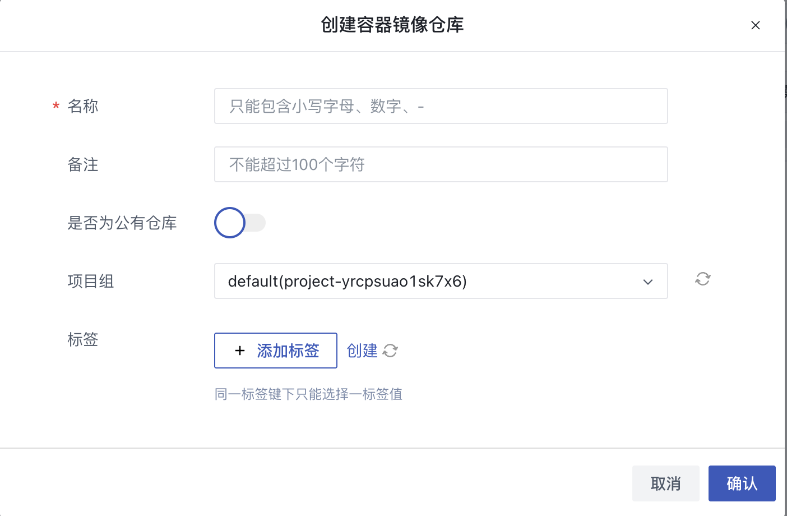

### 37.2.2 查看用户镜像库列表

平台支持用户查看用户镜像库列表，包括名称、资源ID、状态、是否为公有仓库、镜像拉取次数、镜像数量、项目组、标签、创建时间、更新时间、操作，如下图所示：

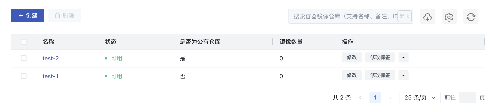

* 名称/资源ID：全局唯一标识；
* 状态：镜像库的状态，例如可用、删除中；
* 是否为公有仓库：镜像库的属性，可设为公有、私有；
* 镜像拉取次数：镜像库内镜像拉取的次数，每15分钟刷新一次；
* 项目组：镜像库所在项目组；
* 标签：镜像库的标签；
* 创建时间/更新时间：镜像库的创建/更新时间；
* 操作：可对镜像库执行的操作，包括修改、修改标签、删除；

### 37.2.3 修改用户镜像库

平台支持用户修改镜像仓库是否为公有仓库，私有仓库的镜像只允许有权限的用户查看和拉取镜像，公有仓库的镜像允许所有人查看和拉取。

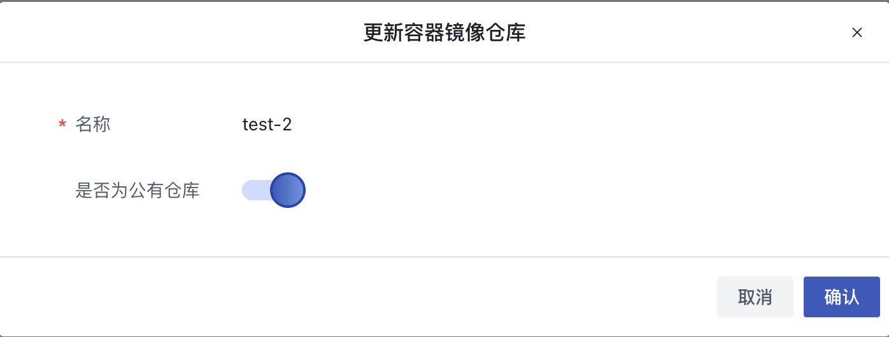

### 37.2.4 修改用户镜像库标签

平台支持用户修改用户镜像库标签。

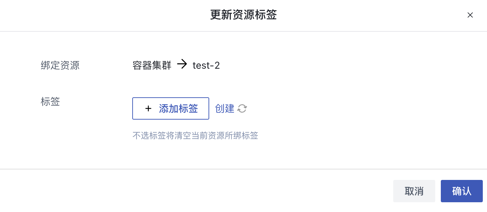

### 37.2.5 删除用户镜像库

平台支持用户删除/批量删除用户镜像库，若镜像库内没有镜像，可直接操作删除；若镜像库内有镜像，需先勾选“**删除镜像仓库中所有镜像**”，否则不可删除。

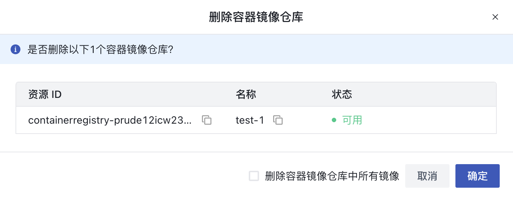


### 37.2.6 上传和拉取镜像

#### 37.2.6.1 上传镜像

本地对镜像打一个tag，并提交镜像到镜像库

```
docker tag {本地镜像名} {镜像库地址}/{镜像}:tag
docker push {镜像库地址}/{镜像}:tag
```

#### 37.2.6.2 拉取镜像

```
docker pull {镜像库地址}/{镜像}:tag
```

### 37.2.7 查看镜像列表

平台支持用户查看镜像列表，可通过点击镜像库名称进入，列表包括名称、最新Tag、镜像拉取次数、拉取命令、创建时间、操作，如下图所示：


* 名称：镜像名称；
* 镜像拉取次数：镜像下所有Tag的拉取次数，实时更新；
* 拉取命令：镜像拉取命令，通过命令可拉取最新Tag的镜像；
* 创建时间：镜像上传到镜像库的时间；
* 操作：镜像支持的操作，包括查看Tag列表、删除；

### 37.2.8 查看Tag列表

可通过点击镜像列表的“**Tag列表**”按钮，查看镜像的Tag列表，包括名称、Digest、拉取命令、镜像拉取次数、创建时间、操作，如下图所示：

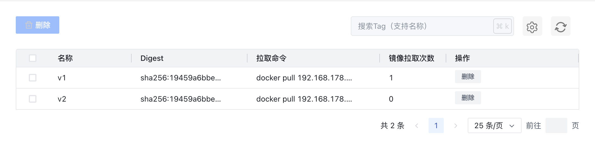

* 名称：镜像Tag名称；
* 镜像拉取次数：当前Tag的镜像拉取次数，实时更新；
* 拉取命令：当前Tag的镜像拉取命令；
* 创建时间：当前Tag的镜像上传到镜像库的时间；
* 操作：仅支持删除Tag；

### 37.2.9 删除镜像Tag

支持操作删除/批量删除镜像Tag，若镜像下所有Tag都被删除，镜像会一同删除。

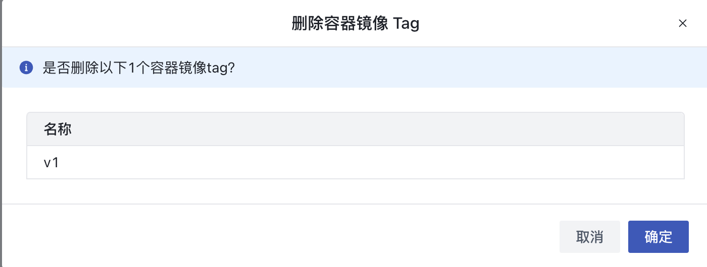

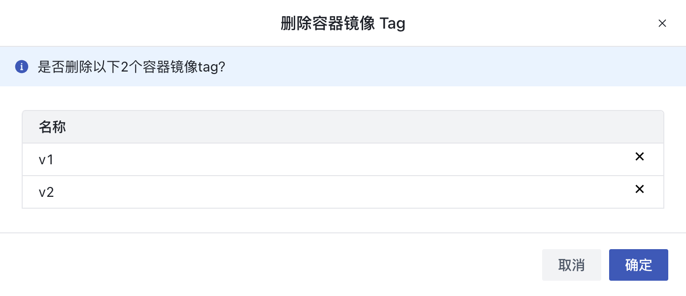

### 37.2.10 删除镜像

平台支持用户操作删除/批量删除镜像，镜像删除后，镜像内所有Tag会一同删除。

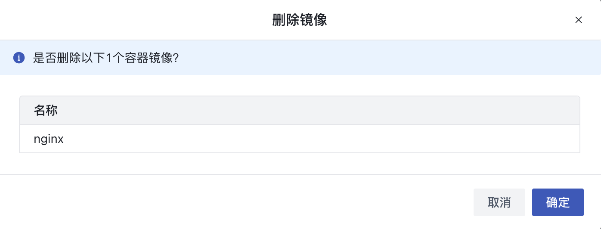

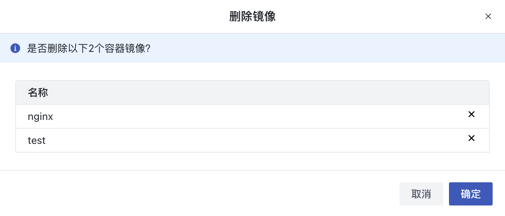

## 37.3 平台镜像

平台镜像是平台提供的镜像，支持所有用户查看和拉取。

### 37.3.1 查看平台镜像列表

通过点击“**平台镜像**”可查看平台镜像列表，包括名称、最新Tag、镜像拉取次数（实时更新）、拉取命令、创建时间、操作（查看Tag列表）。如下图所示：

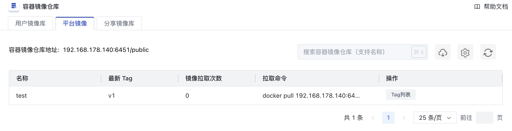

### 37.3.2 查看Tag列表

可通过点击“**Tag列表**”按钮，查看平台镜像的Tag列表，包括名称、Digest、拉取命令、镜像拉取次数（实时更新）、创建时间。如下图所示：

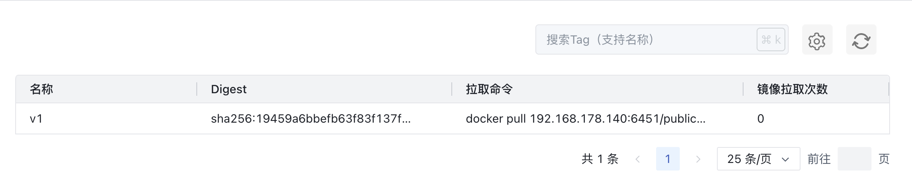

## 37.4 分享镜像库

平台支持用户查看分享镜像库，设为公有仓库的用户镜像库会同时在分享镜像库中展示，分享镜像库的镜像允许所有用户查看和拉取。分享镜像库随对应的用户镜像库变更而更新。

### 37.4.1 查看分享镜像库列表

通过点击“**分享镜像库**”可查看分享镜像库列表，包括名称、资源ID、状态、是否为公有仓库、镜像拉取次数、镜像数量、项目组、标签、创建时间、更新时间。如下图所示：

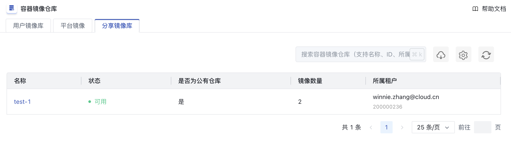

### 37.4.2 查看镜像列表

通过点击镜像库名称进入镜像库详情，可查看镜像列表，包括名称、最新Tag、镜像拉取次数（实时更新）、拉取命令、创建时间、操作（查看Tag列表）。如下图所示：

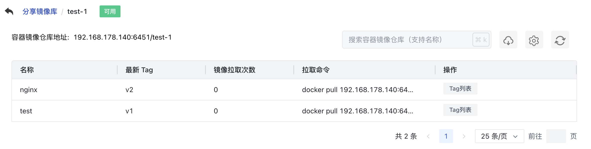

### 37.4.3 查看Tag列表

可通过点击“**Tag列表**”按钮，查看镜像的Tag列表，包括名称、Digest、拉取命令、镜像拉取次数（实时更新）、创建时间。如下图所示：

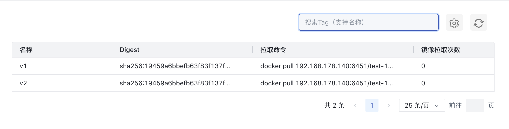
