# 34 备份服务

## 34.1 概述

备份服务是平台为用户提供数据保护的备份服务。支持对Mysql，Redis，对象存储，文件存储进行定时自动备份和手动备份。Mysql支持逻辑备份，物理备份，快照备份，增量备份；Redis支持逻辑备份；对象存储和文件存储支持快照备份。

## 34.2 创建备份网关

平台支持用户创建备份网关操作，备份网关需要绑定外网 IP，用于和外部数据源备份通信，一个租户只支持创建一个备份网关。可通过导航栏进入【备份服务】模块，切换到“**备份网关**”页面进行操作，如下图所示：

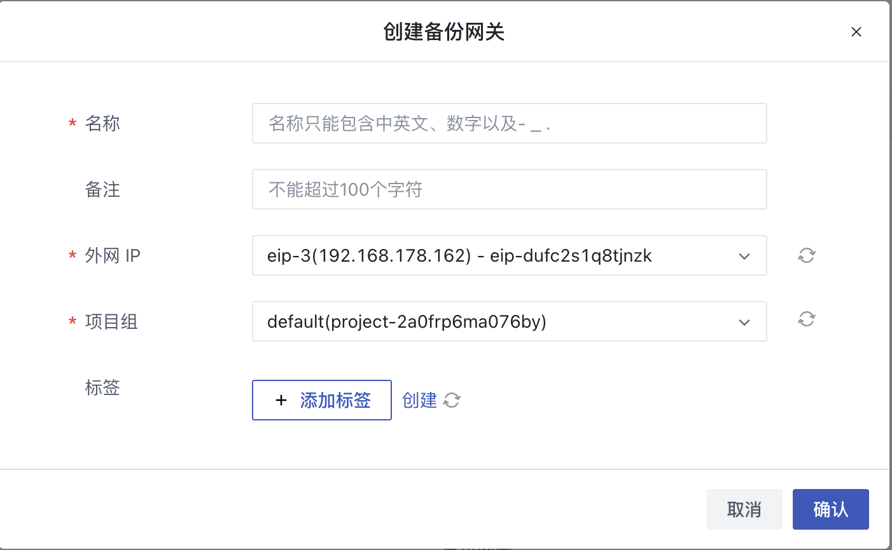

- 外网IP支持的类型包括：IPv4和IPv6。

## 34.3 查看备份网关

平台支持用户查看备份网关列表，包括名称、资源ID、状态、IP地址/网段、带宽、项目组、标签、操作，如下图所示：

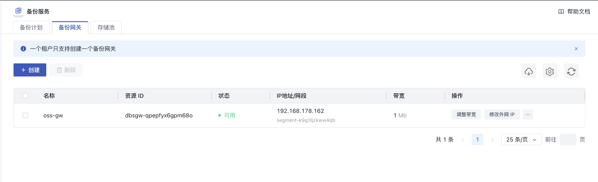

## 34.4 调整备份网关带宽

平台支持用户调整备份网关带宽

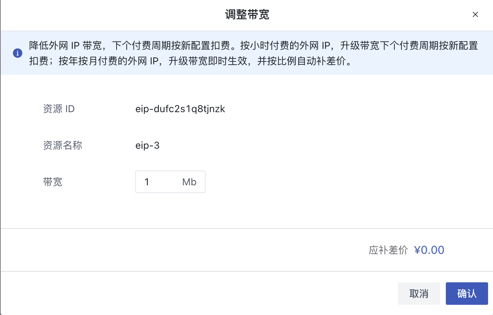

## 34.5 修改外网ip

平台支持用户修改备份网关的外网 IP

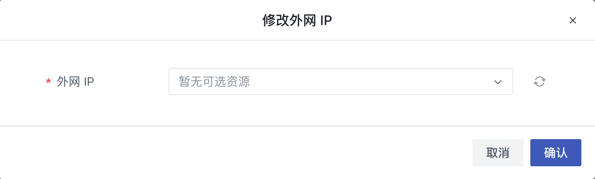

## 34.6 删除备份网关

平台支持用户删除备份网关，删除之前，保证存储池列表没有外部S3存储池资源

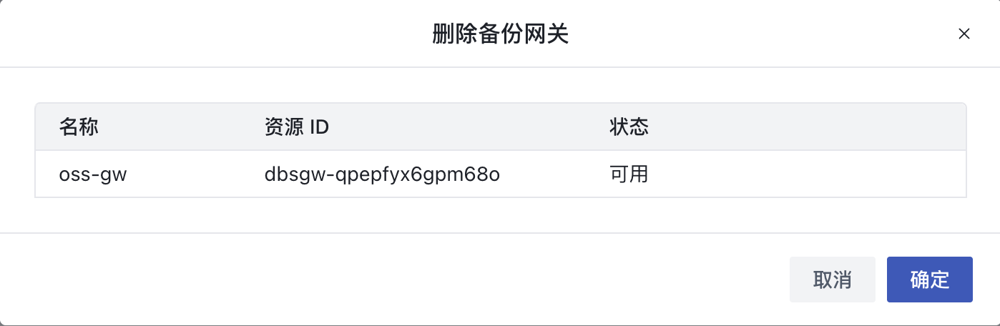

## 34.7 绑定存储池

平台支持用户进行存储池绑定操作，存储类型支持对象存储。可通过导航栏进入【备份服务】模块，切换到“**存储池**”页面进行绑定操作，如下图所示：

1）存储类型为对象存储：

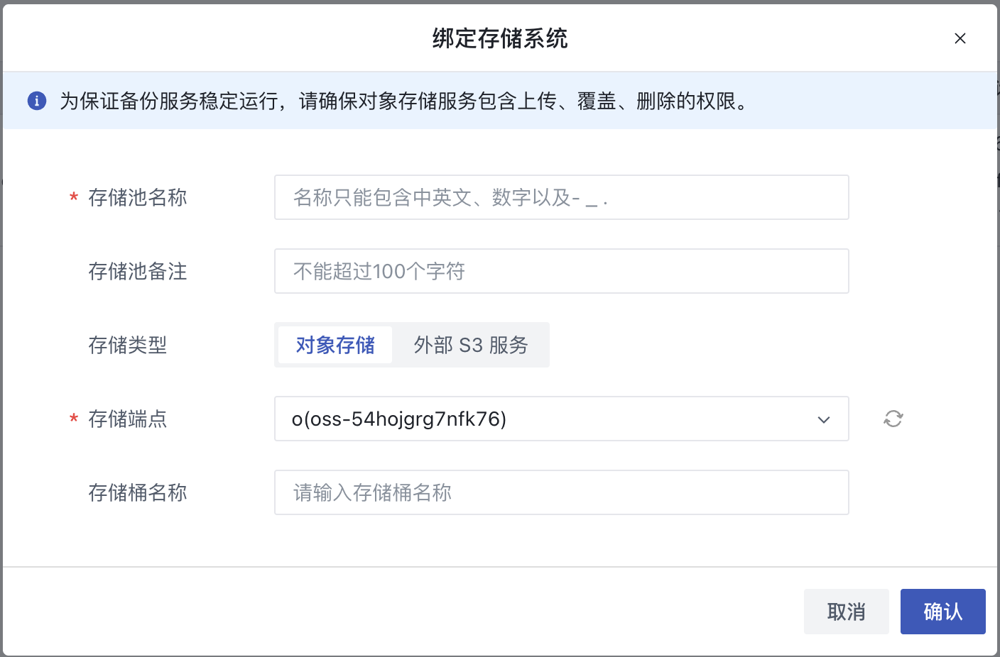

- 存储端点：平台中的对象存储；
- 存储桶名称：若填写，会将备份文件写入指定桶中；若不填写，会自动创建名称为“dbs”的桶，并将备份文件写入该桶内。

2）存储类型为外部S3服务：

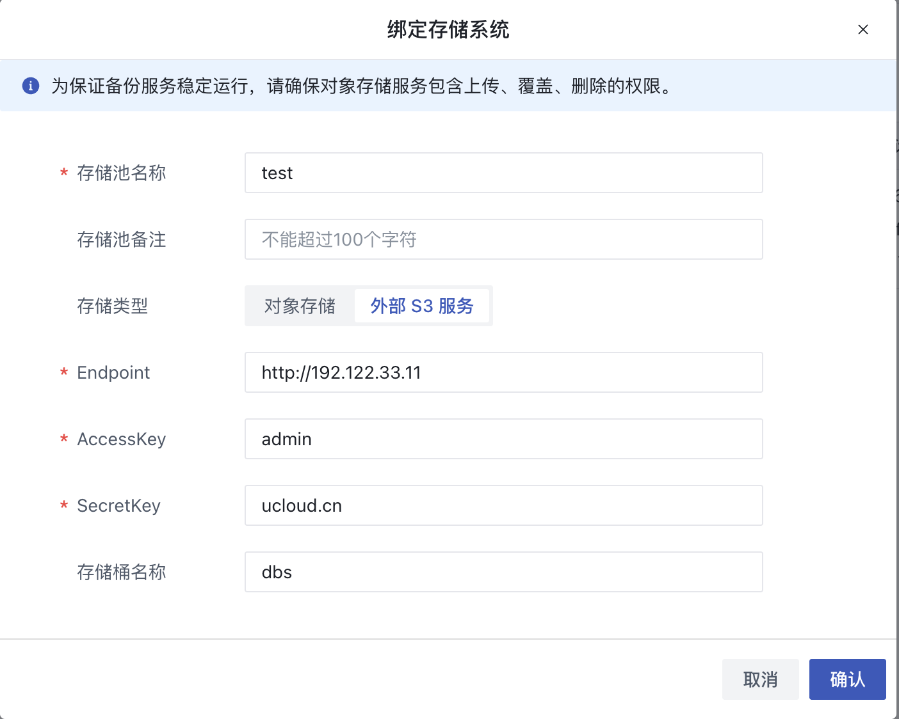

- Endpoint：外部S3地址；
- AccessKey：外部S3令牌的公钥；
- SecreKey：外部S3令牌的私钥；
- 存储桶名称：需要保证令牌拥有对存储桶的上传、删除等权限。

## 34.8 查看存储池列表

平台支持用户查看存储池列表，包括名称、资源ID、状态、存储类型、对象存储、关联备份计划、创建时间、更新时间、操作，如下图所示：

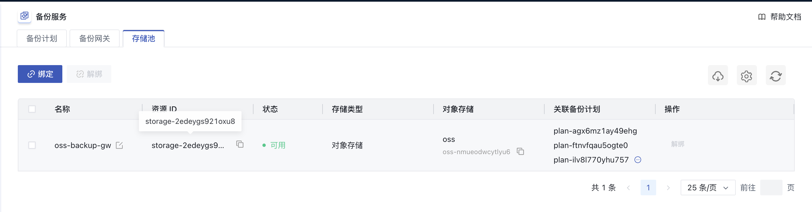

## 34.9 更新存储池

平台支持用户对存储池进行更新操作，更新内容包括存储池名称、存储池备注。可通过存储池列表中操作项“**更新**”按钮进行操作，如下图所示：

- 更新**对象存储**类型的存储池：

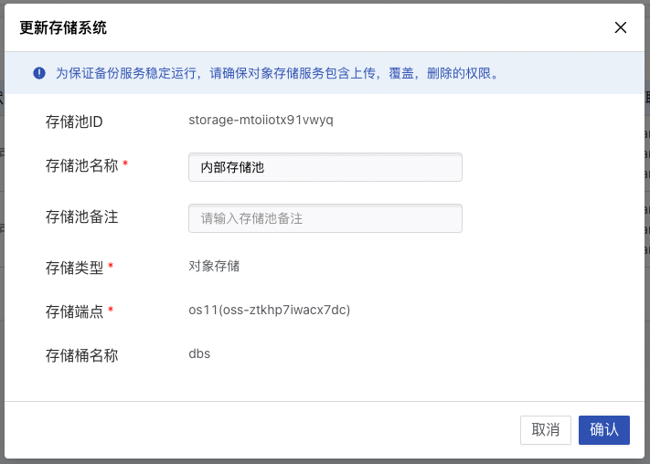

- 更新**外部S3服务**类型的存储池：

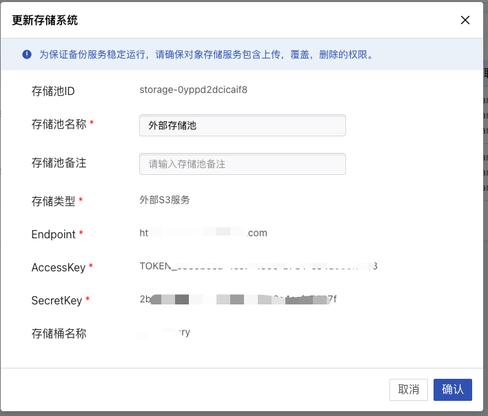

## 34.10 解绑存储池

平台支持用户对已绑定存储池进行解绑操作，可通过存储池列表中操作项“**解绑**”按钮进行操作，只有当存储池中没有备份计划才可被删除，如下图所示：

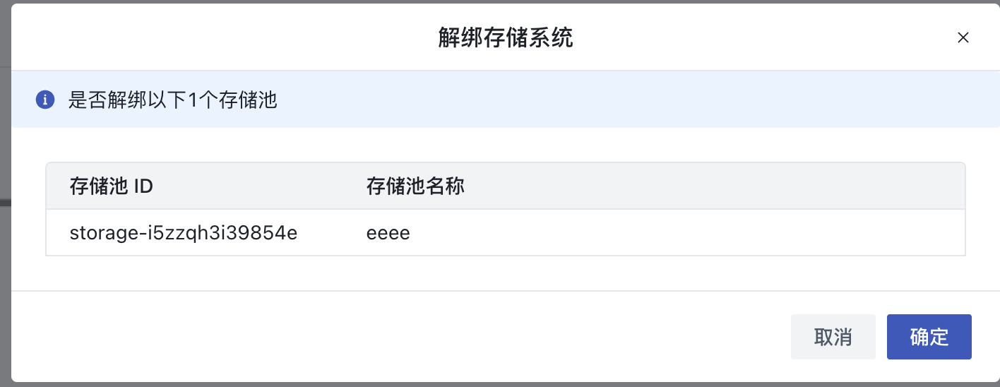

## 34.11 创建备份计划

平台支持用户进行备份计划创建操作，支持指定备份策略、备份源类型、备份资源、存储池、保留时间等信息。可通过导航栏进去【数据库备份】进行操作，如下图所示：

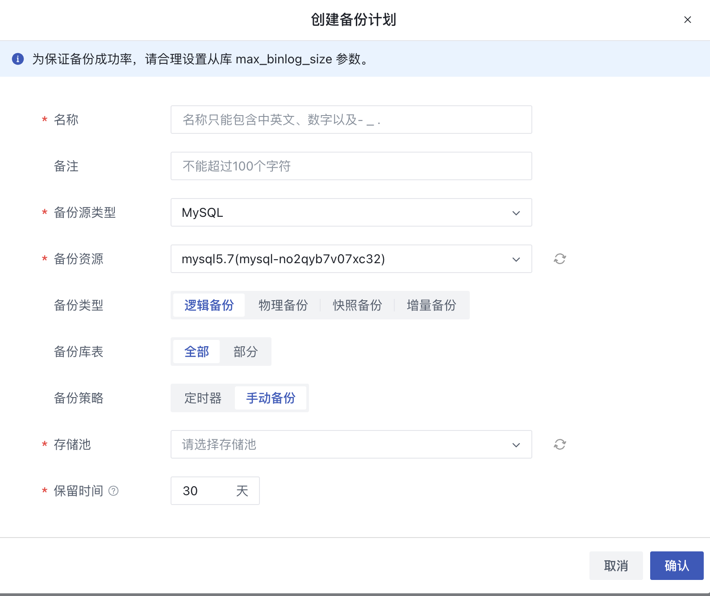

Mysql支持指定库表备份，如下图所示：

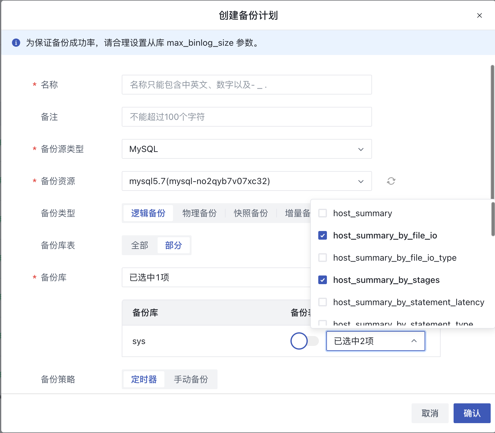

## 34.12 查看备份计划列表

平台支持用户查看备份计划列表，包括名称、资源ID、状态、存储池、源数据类型、源数据地域、源数据、备份策略、定时器、备份类型、备份保留时间(天)、创建时间、更新时间、操作。如下图所示：

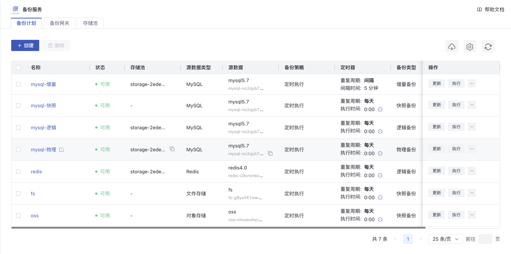

- 名称：备份计划的名称；
- 资源ID：备份计划的ID，全局唯一标识；
- 状态：包括可用、失败等；
- 存储池：备份计划中的备份存储的位置；
- 源数据类型：备份源的类型，包括MySQL、Redis、文件存储和对象存储；
- 备份策略：包括定时执行和手动执行；
- 定时器：展示**定时执行**备份策略的定时规则；
- 备份类型：备份计划的类型，包括逻辑备份、物理备份、快照备份等；
- 关联计划：关联的其它备份计划，目前只用MySQL增量备份会有关联计划。

## 34.13 查看备份计划详情

平台支持用户查看备份计划详情，包括基础信息和备份数据列表。可点击备份计划名称进入详情页。详情页如下图所示：

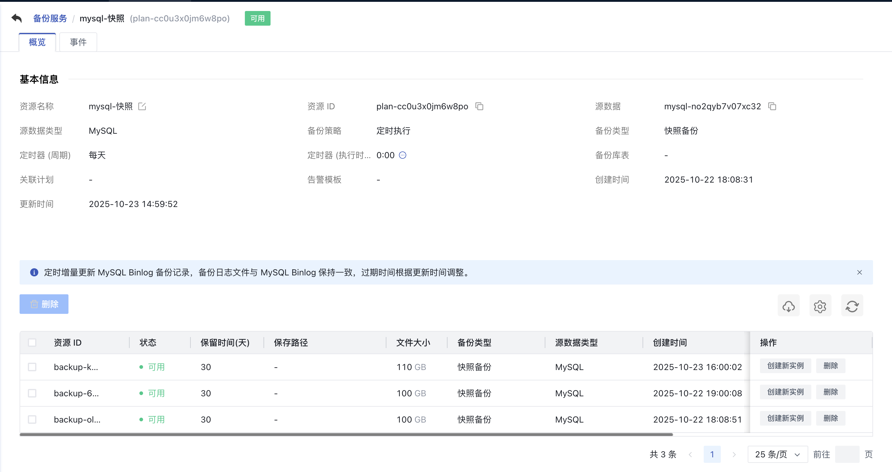

### 34.13.1 从备份数据创建实例

平台支持用户从备份计划的可用备份数据创建实例。如下图所示：

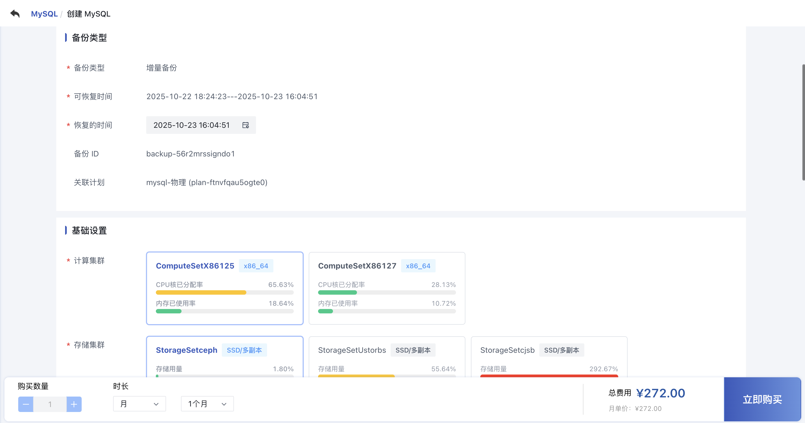

### 34.13.2 删除备份数据

平台支持用户删除备份数据，备份数据恢复中时不允许删除。如下图所示：

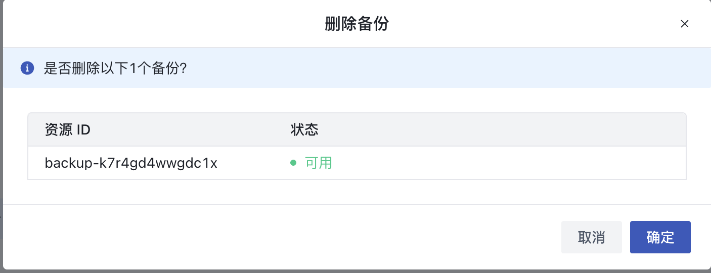

## 34.14 更新备份计划

平台支持用户进行备份计划的更新操作，更新内容包括备份计划名称/备注、备份策略、备份源类型、备份资源、重复周期、执行日期、执行时间、存储池、保留时间等。可通过备份计划列表中操作项的“**更新**”按钮进行操作如下图所示：

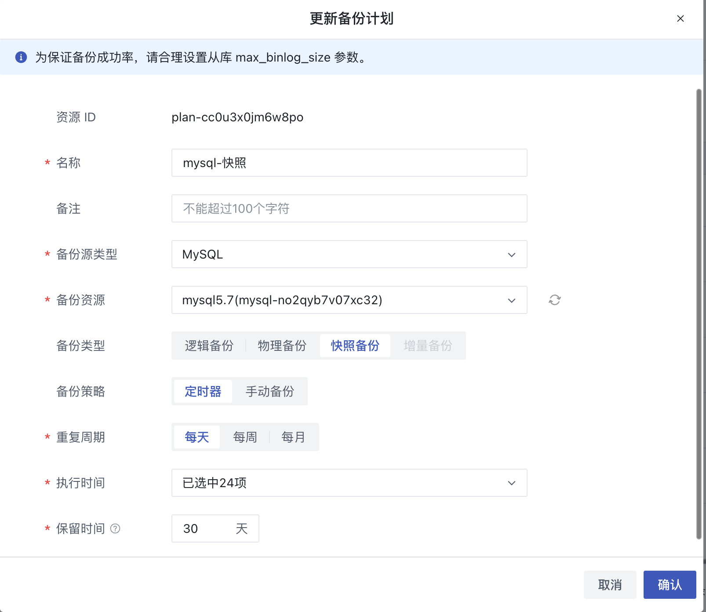

## 34.15 执行备份计划

平台支持用户对备份计划进行执行操作，包括备份策略为定时器和手动备份的备份计划。可通过备份计划列表中操作项的“**执行**”按钮进行操作，如下图所示：

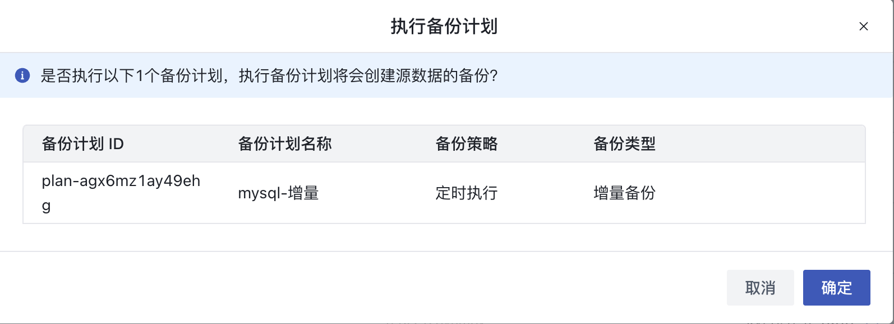

## 34.16 删除备份计划

平台支持用户对备份计划进行删除操作，可通过备份计划列表中操作项的“**删除**”按钮进行操作，只有当备份计划中的备份数据清空后，才可删除备份计划，如下图所示：

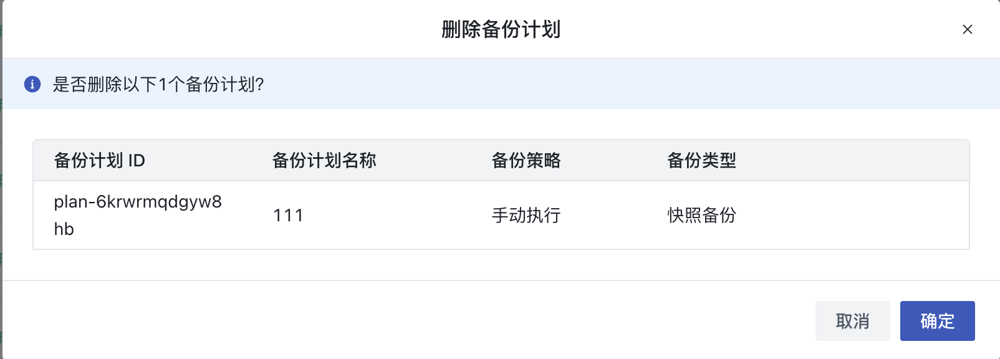

## 34.17 备份计划暂停恢复

平台支持用户对定时备份计划进行暂停和恢复操作，手动类型的备份计划暂时不支持暂停和恢复操作，如下图所示：

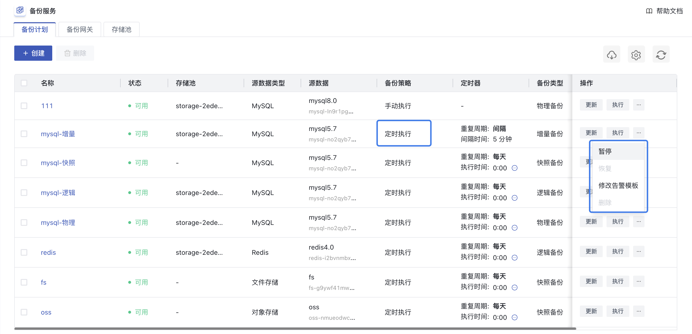

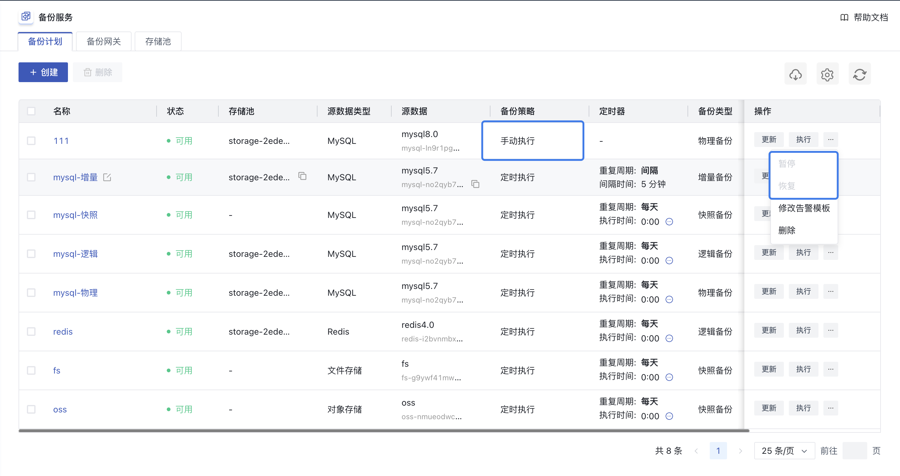

注意事项：
* 定时备份计划的实例关机后，备份计划会自动暂停，实例开机后备份计划会自动恢复
* 手动备份计划的实例关机后，备份计划不会自动暂停依旧保持运行中，不过在执行备份任务时会提示报错
* 无论手动备份计划还是定时备份计划，所绑定的存储池离线后，备份计划都不可用，在存储池恢复运行才能正常使用

## 34.18 备份计划监控信息

平台支持展示备份计划的监控数据，方便用户更好的了解备份计划使用资源的情况，内容包括CPU使用率、内存使用率、网络入流量、网络出流量，如下图所示：

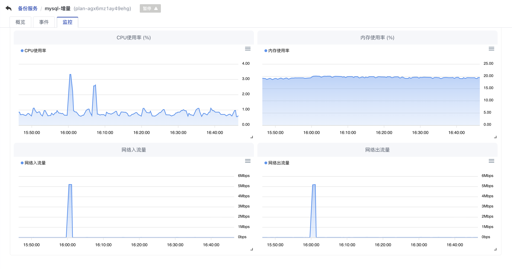

注意事项：快照类型的备份计划不展示监控数据

## 34.19 备份计划监控告警

支持对于 备份计划 列表页中的 备份计划实例进行修改监控告警操作，对备份计划的监控数据进行监控，如图所示：

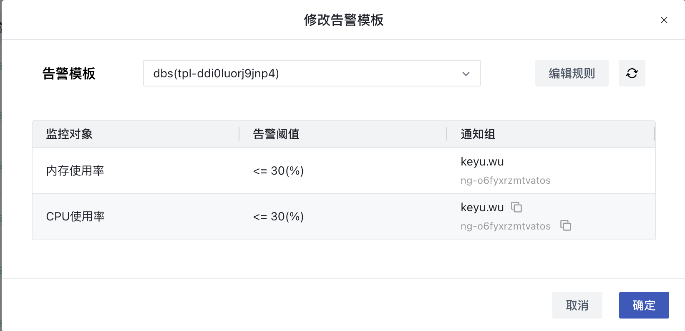

注意事项：快照类型的备份计划不支持绑定监控告警

## 34.20 备份计划事件

支持用户查看 备份计划 操作相关的资源事件，内容包括事件类型、事件等级、事件内容、事件发生次数、开始时间和更新时间，如下图所示：

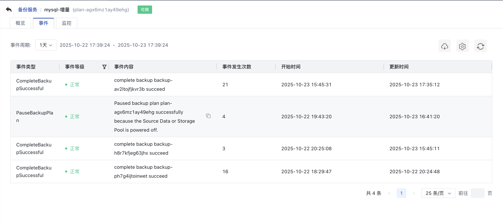

