# 48 数据传输服务

## 48.1 数据传输服务概述

数据传输服务（Data Transmission Service, DTS）是一种高效、安全的在线数据迁移与同步服务，支持多种数据源（如关系型数据库、非关系型数据库）之间的数据传输。与传统数据迁移工具相比，DTS 提供全量、增量、全量+增量一体化三种任务模式，提供功能更丰富、传输性能更强、易用性更高且安全可靠的数据传输服务。在私有云环境中，数据传输服务支持 MySQL 数据库到 MySQL 数据库，Redis 数据库到 Redis 数据库数据迁移，数据传输任务中，源实例类型和目的实例类型均支持平台内部数据库和连接串两种类型，为客户数据库上云、下云提供了可靠性的方案。

## 48.2 数据传输服务产品功能

### 48.2.1 创建数据传输服务

云平台支持创建全量任务、增量任务、全量+增量任务类型的数据传输服务（Data Transmission Service, DTS）。用户可以指定计算集群、存储集群、每秒最大同步数、数据源类型、传输目标类型、外网 IP 及数据源、传输目标相关配置信息一键创建 DTS，用于数据迁移。

#### 48.2.1.1 创建数据传输服务

1. 选择数据传输服务需运行的地域，在上方导航栏数据传输服务（DTS），进入 DTS 控制台，点击“创建” ，弹出 DTS 创建向导：

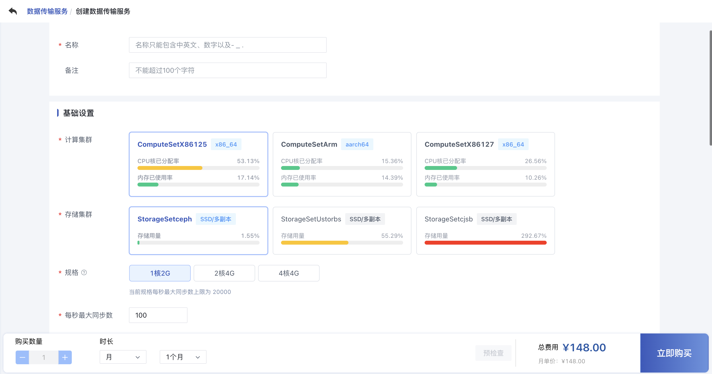

* 计算集群：运行 DTS 任务的计算集群类型，代表不同架构、不同型号的 CPU 或硬件特征；
* 存储集群：运行 DTS 任务的存储集群类型，例如分布式存储集群；
* 规格：支持用户在规格配置下面自行配置，最大支持 4C 4G，最小支持 1C 2G；
* 每秒最大同步数：上限随着规格动态变化，例如规格为 1C 2G，每秒最大同步数的范围是 100～20000，规格为 4C 4G，每秒最大同步数的范围是 100～100000；

2. 在任务设置中，通过选择任务类型、数据源类型、传输目标等配置项目设置数据传输任务，如下：

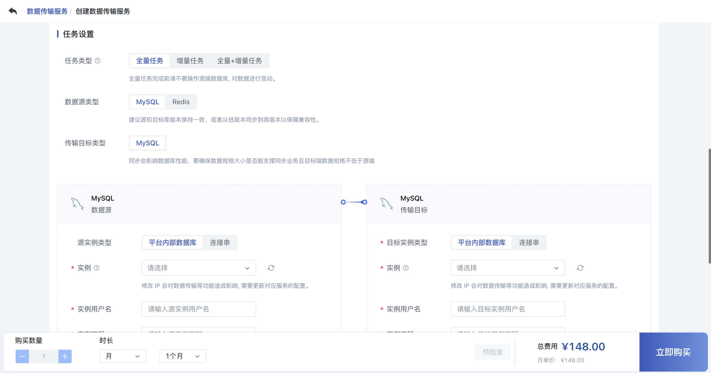

* 任务类型：支持全量任务、增量任务、全量+增量任务类型。全量任务是将数据源库中指定库表/整库的全量数据一次性传输到目标端；增量任务是指将数据源库中指定库表/整库的增量数据持续传输到目标端，任务持续运行。
* 数据源类型：支持 MySQL、Redis。
* 传输目标类型：与客户选择的数据源类型保持一致，即支持 MySQL、Redis。

3. 数据源、传输目标设置：

* 源实例类型：支持平台内部数据库和连接串两种方式，其中平台内部数据库是指云平台下同地域、同用户下面 MySQL 或者 Redis 实例；连接串的方式指定用户自建（MySQL、Redis）数据库，需要指定实例端口。
* 实例：MySQL 或者 Redis 实例。
* 实例用户名：MySQL 实例的用户名，比如 MySQL 用户名一般为 root，Redis 默认账户不需要填写用户名；
* 实例密码：MySQL 或者 Redis 实例的密码；
* ServerID：ServerID 是一个唯一标识符，用于区分不同的 MySQL 实例，为确保不同服务器之间能正确识别和协作，ServerID 不能与已有集群中的服务器 ID 相同。

4. 同步配置：

* 同步数据库：指定需要同步的源数据库名称，支持填写多个数据库名称，中间用 "," 分隔，例如：db1, db2，不填或者填通配符 "*" 表示所有的数据库，为保证数据同步的准确性，需确保源实例已存在同名数据库；
* 同步数据表：指定需要同步的源表名称，支持填写多个源表名称，中间用 "," 分隔，例如：db1.tab1, db2.tab2*，不填或者填通配符 "*" 表示所有的表；
* 忽略数据库：排除不需要同步的数据库（黑名单机制）；
* 忽略数据表：排除不需要同步的表（黑名单机制），支持数据库名.表名格式；
* 心跳表：用于监控同步延迟的辅助表，DTS 会在此表中定期写入时间戳，通过对比源和目标的时间戳计算延迟，若未指定，DTS 自动创建默认心跳表：dts_db.cdc_heartbeat。
* 心跳间隔：心跳表写入的时间间隔（单位：秒），间隔越短，延迟检测越实时，但会增加负载。

用于监控同步延迟，支持用户提前创建心跳表，表结构如下：

```sql
CREATE TABLE IF NOT EXISTS `dts_db`.`cdc_heartbeat` (
    `server_id` INT UNSIGNED COMMENT 'MySQL 实例的唯一 Server ID',
    `update_timestamp` TIMESTAMP DEFAULT CURRENT_TIMESTAMP COMMENT '心跳更新时间（DTS 定期写入）',
    `received_binlog_filename` VARCHAR(255) COMMENT '源库接收到的 binlog 文件名',
    `received_next_event_position` INT UNSIGNED COMMENT '源库接收到的 binlog 位置',
    `received_timestamp` VARCHAR(255) COMMENT '源库接收事件的时间戳',
    `flushed_binlog_filename` VARCHAR(255) COMMENT '目标库已刷盘的 binlog 文件名',
    `flushed_next_event_position` INT UNSIGNED COMMENT '目标库已刷盘的 binlog 位置',
    `flushed_timestamp` VARCHAR(255) COMMENT '目标库刷盘时间戳',
    PRIMARY KEY (`server_id`)
) ENGINE=InnoDB DEFAULT CHARSET=utf8mb4 COMMENT='DTS 心跳表，用于监控同步延迟';
```

此外，在增量任务中，同步配置可以通过指定 BinlogName、BinlogPosition 或者 GTID 两种方式指定源库开始同步的位点，当都不填写的时候说明从源库的当前位点开始同步：

（1）方式1:从指定 Binlog 位点开始同步:

- 适用场景：需从某个已知的 Binlog 位置恢复同步，需要指定：BinlogName、BinlogPosition；
- BinlogName：指源库的二进制日志文件名（binlog file）；
- BinlogPosition：指源库二进制日志的精确位置（偏移量）；

（2）方式二：从指定 GTID 开始同步：

- 适用场景：源库启用 GTID 时，需精确跳过或重放特定事务；
- GTID：全局事务标识符（Global Transaction Identifier），用于唯一标识源库的事务，需确保源库已开启 GTID 模式（gtid_mode=ON）；

（3）方式三：从当前位点开始同步：

- 适用场景：不指定 BinlogName、BinlogPosition 或者 GTID，DTS 自动从任务启动时刻的源库最新位点捕获变更。

在 DTS 任务的同步配置中需要注意以下几点：

（1） **忽略与同步的优先级**

- 「忽略数据库/表」的优先级高于「同步数据库/表」。
- *示例*：若忽略 `db1.table_1` 但同步 `db1`，则 `table_1` 不会被同步。

（2） **心跳表的适用场景**

- 仅用于 **MySQL 增量同步** 或 **全量+增量同步** 任务。
- 不适用于纯全量同步或非 MySQL 数据源（如 Redis）。

#### 48.2.1.2 注意事项

* 创建数据传输任务（DTS）需使用 image-openeuler-2203sp4 基础镜像，若误删请联系平台管理员恢复；
* 数据传输任务支持两种数据源类型，即 MySQL、Redis，支持 MySQL 之间、Redis 之间端到端的数据传输；
* 待同步的表需具备主键或唯一约束，且字段具有唯一性，否则可能会导致目标数据库中出现重复数据；
* 在 DTS 同步期间，不允许有除 DTS 外的数据写入目标库，否则会导致源库与目标库数据不一致；
* 为保证数据一致性，建议在迁移前清空目标实例的数据库表；
* 在增量的 DTS 任务中，仅支持 MySQL 之间数据传输与数据同步；
* 源实例类型、目标实例类型支持平台内数据库、连接串两种类型，如果实例选择连接串，需要给 DTS 绑定一个外网 IP；
* 在创建 DTS 任务时，建议源和目标库版本保持一致，或者从低版本同步到高版本以保障兼容性；
* 数据同步会受数据库性能影响，要确保数据规格大小可以支撑同步业务且目标端数据规格不低于源端；
* 在全量任务、全量+增量任务中全量同步数据阶段，在同步任务完成之前不要操作源端数据或者是对数据进行改动，以保证全量数据同步的准确性；
* 全量+增量任务中，全量任务只会执行一次；

### 48.2.2 查看数据传输服务列表

数据传输列表页可查看当前账户下已有的 DTS 资源列表，包括名称、资源 ID、状态、任务阶段、任务类型、每秒最大同步数、集群类型、规格、外网 IP、创建时间、过期时间及操作等，同时也可通过“自定义列表”按钮，自定义列表所需信息。

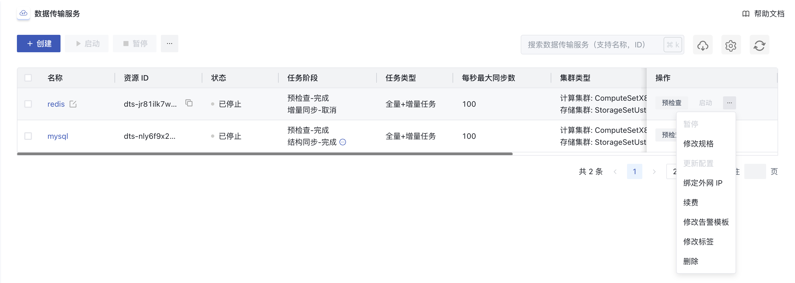

* 名称：DTS 的名称和备注，可通过列表页的编辑按钮进行修改；
* 资源 ID：DTS 的全局唯一 ID，可通过复制按钮对 ID 进行复制操作；
* 状态：DTS 当前的运行状态，包括初始化、已停止、运行中、运行完成、错误；
* 任务阶段：对于全量、增量、全量+增量数据传输任务有着不同的任务阶段：
  * 全量任务包括：预检查、结构同步、全量同步、约束同步四个阶段；
  * 增量任务包括：预检查、增量同步两个阶段；
  * 全量+增量任务包括：全量阶段完成后**自动切换**至增量同步，无感知中断；
* 任务类型：任务类型包括全量、增量、全量+增量任务，标识着任务配置的数据传输类型；
* 每秒最大同步数：DTS 实例配置的最高数据传输速率，上限受 DTS 规格配置的影响；
* 集群类型：DTS 所运行物理机的计算集群、存储集群；
* 规格：DTS 基本配置信息，包括 CPU、 内存规格；
* 外网 IP：用于外网访问的公共 IP 地址（当源库或目标库为自建数据库时需绑定）；
* 计费方式：DST 创建时指定的付费方式，包括按小时、按月、按年；
* 创建时间/过期时间：DTS 的创建时间和计费周期内的过期时间；
* 操作：对单个 DTS 任务的操作，包括启动、暂停、修改规格、更新配置、绑定外网 IP、续费、修改标签和删除，对 DTS 任务更新配置的详细设置需要在详情页下面操作。

默认列表每页可显示 25 条 DTS 信息，支持分页并设置每页可展示的 DTS 数量，每页最多可展示 100 条数据，可通过搜索框对 DTS 列表进行搜索和筛选，支持模糊搜索。为方便租户对 DTS 进行维护和操作，平台支持下载当前用户所拥有的所有 DTS 资源列表信息为 Excel 表格；同时支持对 DTS 的批量操作，包括批量启动、暂停、删除操作。

### 48.2.3 启动数据传输服务

用户通过控制台对已创建的 DTS 任务执行**启动**操作后，系统将根据任务类型自动进入对应传输阶段：

* **全量任务**依次执行预检查（验证源端和目标端的连通性及同步可行性）→结构同步（迁移数据库 schema）→全量同步（批量迁移历史存量数据）→约束同步（迁移索引、外键、约束等数据库对象）；
* **增量任务**立即开始预检查→增量同步（实时捕获并同步数据变更操作）；
* **全量+增量任务**优先完成全量阶段，随后无缝切换至增量同步。值得注意的是，全量任务只会执行一次，在全量+增量任务完成全量同步后暂停，再次启动后只会执行增量同步任务。

用户操作启动数据传输服务如下：

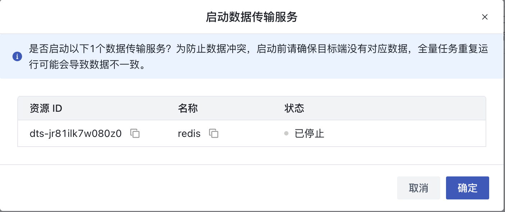

值得注意的是在启动数据传输服务之前，为防止数据冲突，建议检查并确保目标端没有对应数据，且全量任务重复运行可能会导致数据不一致。

### 48.2.4 暂停数据传输服务

用户可通过控制台对运行中的 DTS 任务执行**暂停**操作，系统将根据任务类型和当前状态进行以下处理：

* **全量任务** ：立即中断当前同步阶段（结构同步/全量同步等），再次启动时将重新从预检查阶段开始执行全流程，已同步到目标端的数据不会被清除，故在全量任务暂停再次启动时，确保目的端数据已经被处理；
* **增量任务** ：停止捕获源端变更，记录当前同步位点，确保恢复时可从断点继续；
* **全量+增量任务** ：如果 DTS 处于全量阶段，暂停后再次启动会重新全量同步，如果 DTS 处于增量阶段，暂停再次启动后将从断点继续同步。

用户操作暂停数据传输服务如下：

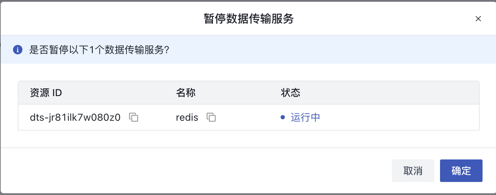

### 48.2.5 修改数据传输服务规格

用户可通过控制台对已创建的 DTS 任务执行在线规格升级操作（仅支持升配，不支持降级），如下图：

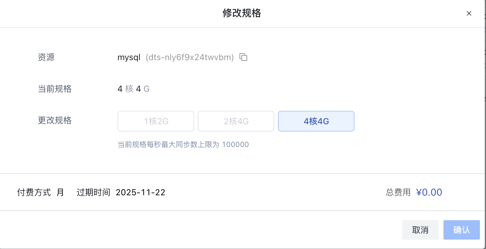

平台管理员可在规格配置中添加数据迁移服务的不同规格。需特别注意：aarch 架构的 DTS 不支持修改规格操作，建议在创建任务前充分评估数据迁移压力并选择合适的规格。规格变更将立即生效，请确保业务允许短时性能波动。

### 48.2.6 更新数据传输服务配置

支持用户通过更新数据传输服务配置更新每秒最大同步数、源/目标实例类型、实例、实例用户名、实例密码以及同步配置。值得注意的是，为了保证数据可靠性传输，对于增量、全量+增量任务做了部分字段的调整限制，如下：

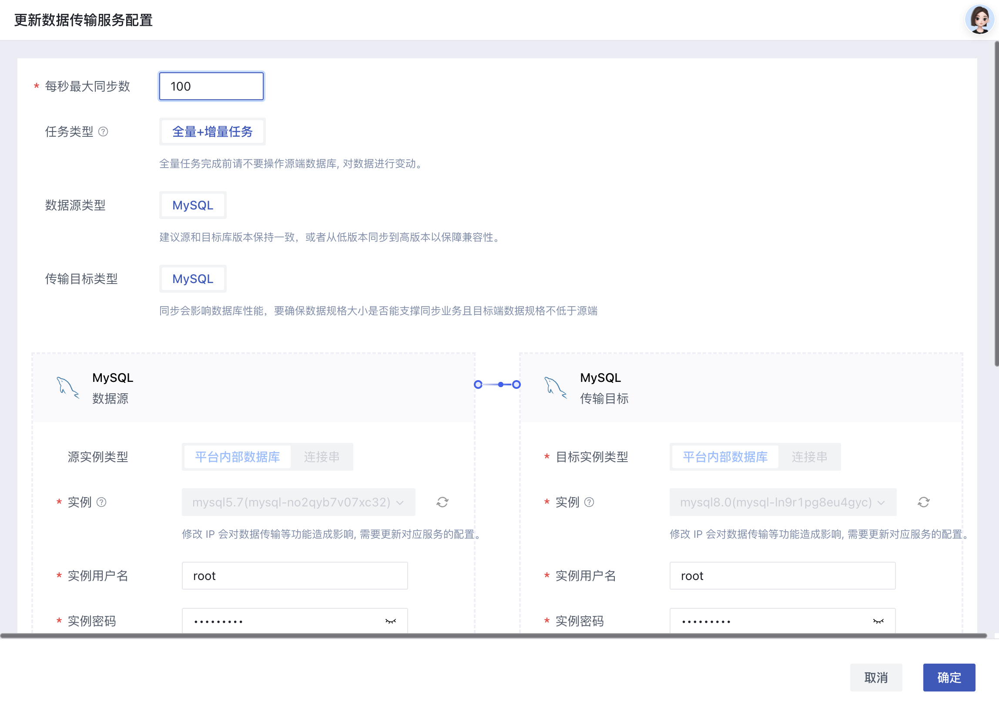

### 48.2.7 绑定数据传输服务外网 IP

当 DTS 任务的源实例或目标实例采用连接串形式（如自建数据库）时，必须为 DTS 实例绑定外网 IP 才能进行数据同步，如下：

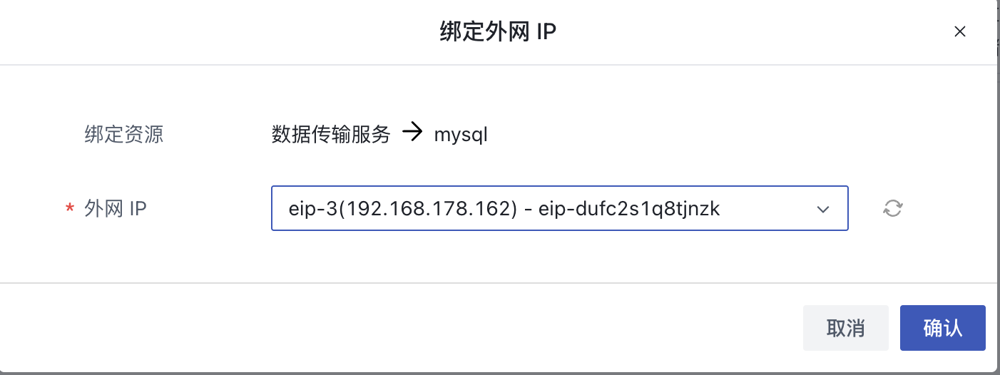

用户可通过控制台对外网 IP 执行绑定和解绑操作，具体规则如下：

1. **绑定操作** ：

* 支持用户在创建 DTS 任务、DTS 任务处于"已停止"状态时执行；
* DTS 任务所属的租户下面需要有一个处于"未绑定"状态的可用外网 IP；

2. **解绑操作** ：

* 解绑后立即释放 IP 资源，支持再次绑定；
* 处于“已停止"的 DTS 任务解绑外网 IP 后再次启动，可能导致数据同步任务"错误"；

### 48.2.8 数据传输服务续费

支持对于 DTS 列表页中的 DTS 实例进行续费操作，续费时会按照续费时长收取费用，如下图所示：

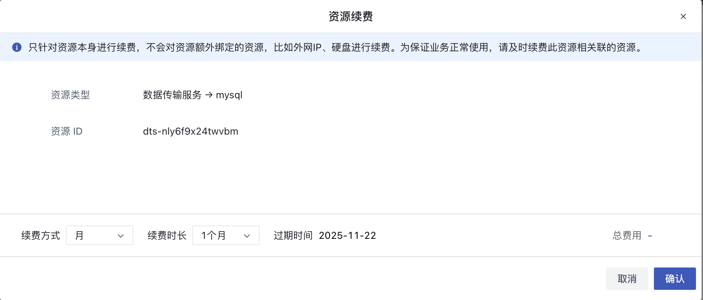

 DTS 续费时支持更改续费方式，只可由短周期改为长周期，例如按月的续费方式可更改为按月、按年。

### 48.2.9 数据传输服务删除

用户可通过控制台删除任意状态的 DTS 任务（支持批量操作），删除后数据传输将立即终止且配置不可恢复（目标端已同步数据保留），如下图所示：
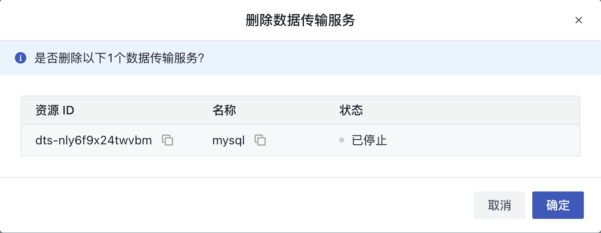

需特别注意：该操作不可逆，建议执行前确认数据完整性。若需重新启用相同配置，必须新建任务。

### 48.2.10 数据传输服务监控告警

支持对于 DTS 列表页中的 DTS 实例进行修改监控告警操作，对DTS的监控数据进行监控，如图所示：

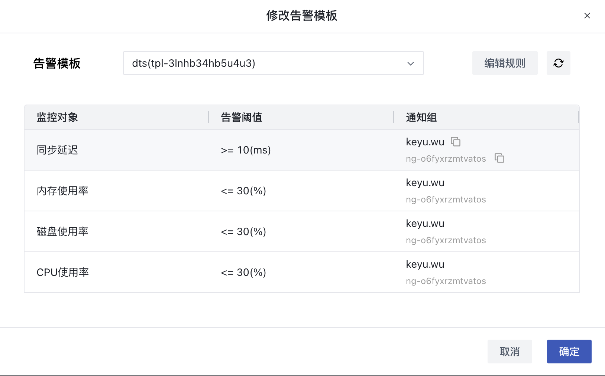

### 48.2.11 数据传输服务概览

在 DTS 列表上，点击 DTS 的名称可进入当前 DTS 的概览页面查看 DTS 详情，同时可切换到运行日志、操作日志、数据校验、事件页面查看 DTS 相关信息，如下图概览页所示：

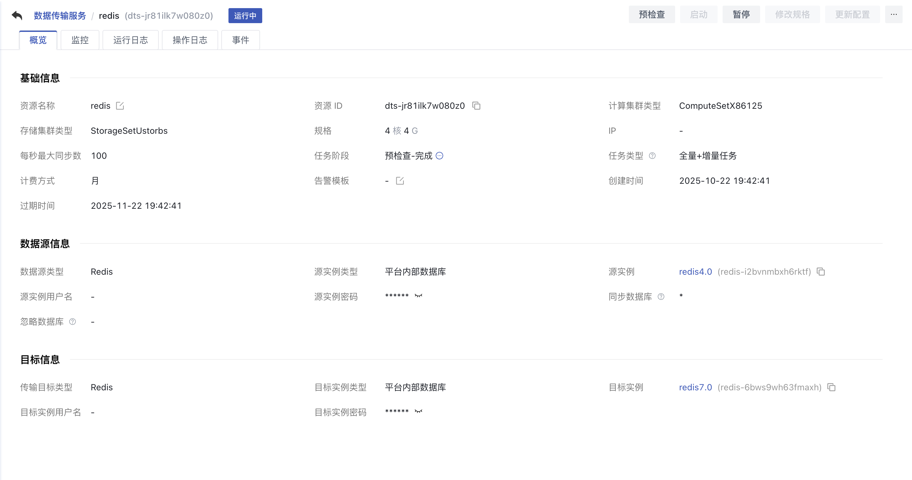

### 48.2.12 数据传输服务运行日志

运行日志是监控数据同步状态和排查问题的主要入口，记录DTS任务全生命周期各阶段（如预检查、结构同步等）的详细执行情况，如下图：

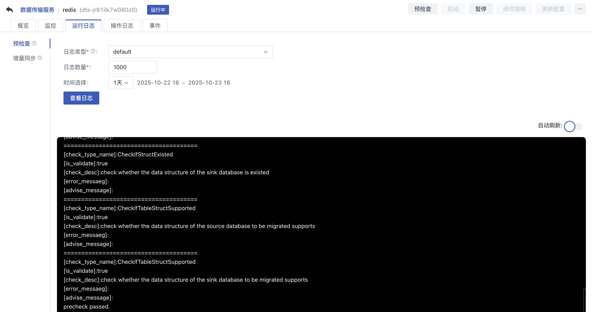

系统提供两种日志类型：

* **default** ：基础运行日志（包含系统事件和任务状态变更）
* **monitor** ：实时同步日志（记录数据行级操作和性能指标）

日志查询策略：

* 存储数量：100-1000条（滚动更新）
* 时间范围：支持查询1/3/7/14/30天或自定义时段的日志

### 48.2.13 数据传输服务操作日志

支持用户从平台管理员角度查看 DTS 操作日志，内容包括如下图所示操作(API)名称、所属模块、地域、关联资源、操作者、操作结果、操作时间和详情，如下：

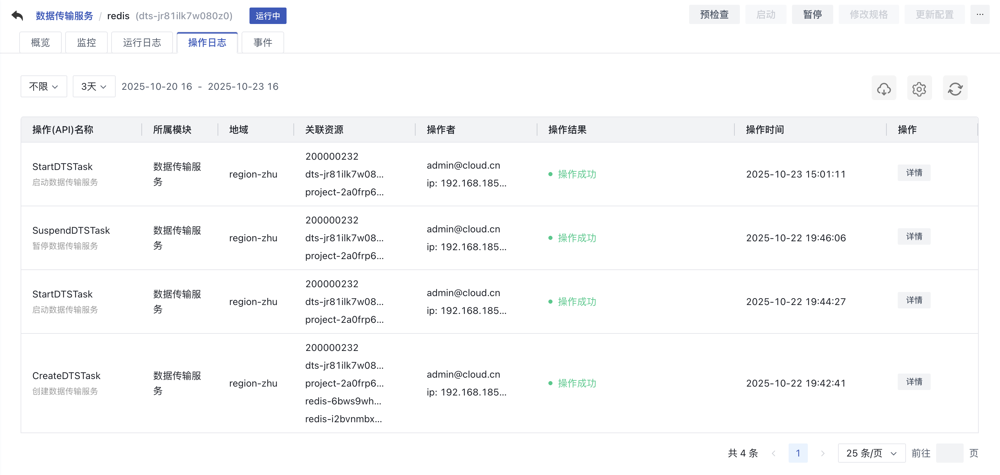

### 48.2.14 数据传输服务数据校验

数据校验功能适用于全量任务和全量+增量任务，使用前需确保全量任务已完成，若为全量+增量任务还需暂停增量同步，如下图：

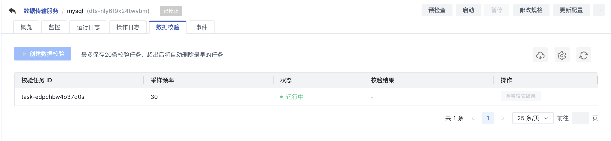

系统自动保留最近20条校验记录（超出自动清理早期记录），支持查看源库与目标库的数据差异详情，包括不一致的具体记录和字段信息，对待数据不一致的数据校验，支持查看校验结果，数据校验结果最多保留30天，值得注意的是数据源类型是 Redis 的数据迁移任务也不支持数据校验。

### 48.2.15 数据传输服务事件

支持用户查看 DTS 操作相关的资源事件，内容包括事件类型、事件等级、事件内容、事件发生次数、开始时间和更新时间，如下图所示：

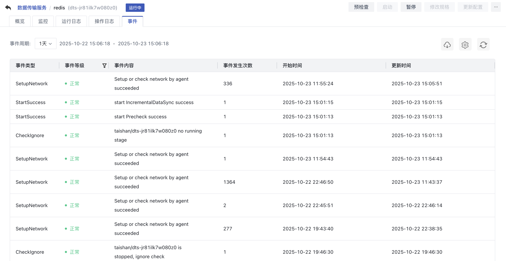

### 48.2.16 数据传输服务监控

支持用户查看 DTS 监控数据，内容包括CPU使用率、内存使用率、磁盘使用率、网络入流量、网络出流量、每秒拉取数据量、每秒拉取条数、每秒插入数据量、每秒插入条数和同步延迟，如下图所示：

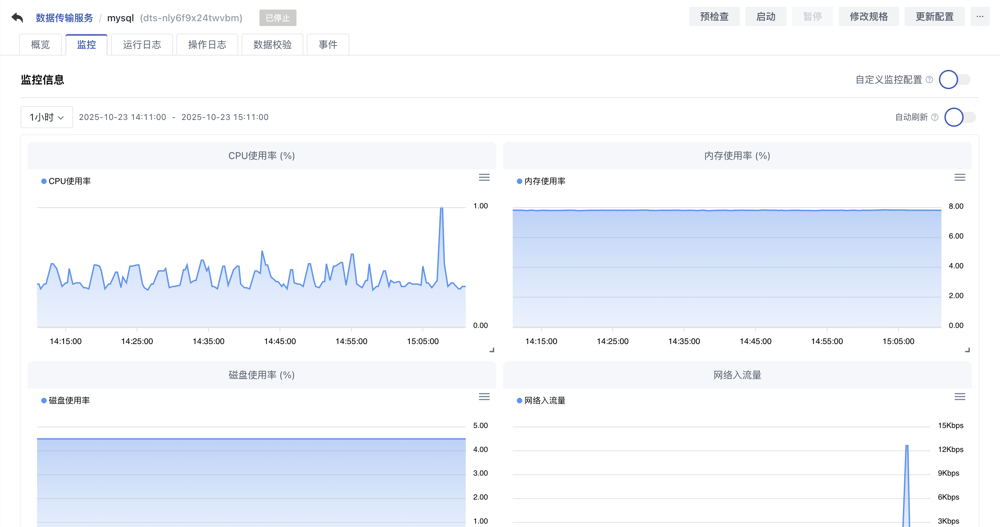


