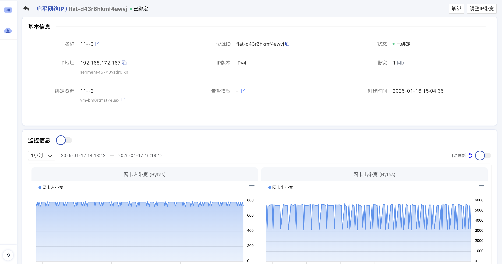
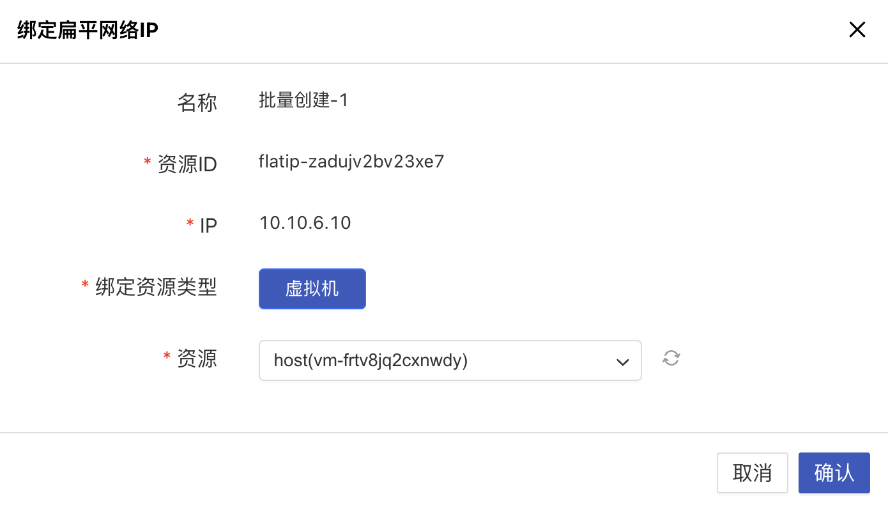
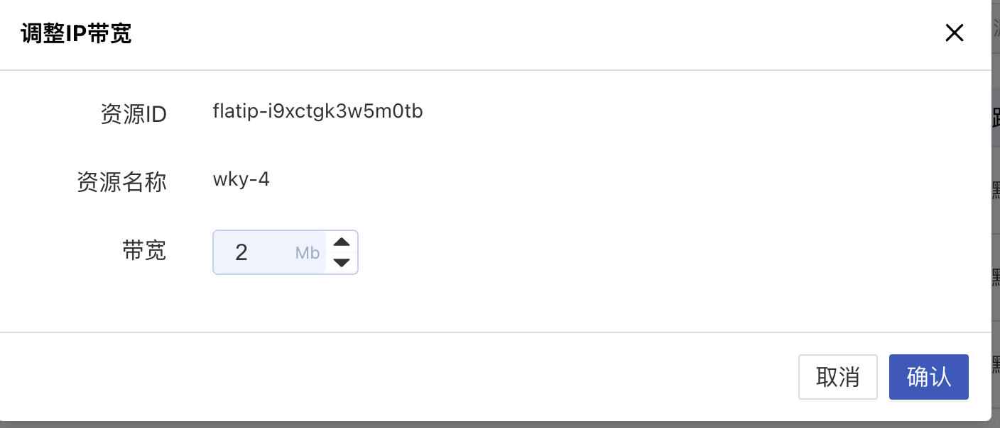
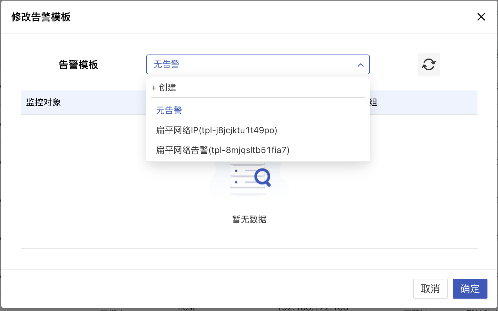

# 45 扁平网络 IP

## 45.1 扁平网络 IP 简介

扁平网络 IP 是平台提供的网络资源，用于简化 IP 地址的自动化配置和管理。启用 IP 地址管理的扁平网络具有自动分配和管理 IP 地址的能力。平台支持申请 IPv4/IPv6 双栈 IP 地址并将其绑定到虚拟机，为虚拟机提供 IPv4/IPv6 服务。此外，平台支持从虚拟机解绑 IP 地址，并根据需要将其绑定到其他虚拟机。平台还提供指定 IP 地址申请和 IP 地址冲突检测功能，便于业务网络地址的规划和管理。

## 45.2 功能特性

扁平网络 IP 为用户提供了便捷和高效的网络资源管理体验，功能特性如下：

- 支持自动分配和管理：平台支持在扁平网络网段范围内自动分配和管理 IP 地址，简化了网络配置和资源管理过程。
- 支持 IPv4/IPv6：支持申请和绑定 IPv4 和 IPv6 双栈 IP 地址，为虚拟机提供灵活的网络服务。
- 支持指定 IP 地址申请：提供指定 IP 地址申请功能，用户可以根据需求申请特定的 IP 地址，满足特定业务需求。
- IP 地址冲突检测：平台具备 IP 地址冲突检测功能，确保网络地址的唯一性和规划的准确性。
- 业务网络规划：支持用户根据业务需求规划和管理网络地址，提高网络资源的利用率和管理效率。

## 45.3 扁平网络 IP 管理

### 45.3.1 创建扁平网络 IP

创建扁平网络 IP 是指租户通过控制台从管理员自定义的扁平网络网段中申请一个 IPv4 或 IPv6 的扁平网络 IP 地址，并将 IP 地址绑定至虚拟机资源。

> **只有开启 IP 地址管理的扁平网络，才能创建扁平网络 IP**。

创建扁平网络 IP 时需指定 IP 版本、扁平网络、IP 地址、资源名称等信息，可通过导航栏进入【扁平网络 IP】资源控制台，通过“创建扁平网络 IP” 进入向导页面，如下图所示：

1. 选择并配置所申请扁平网络 IP 基础配置及管理设置信息：

* 名称/备注：申请扁平网络 IP 的名称和备注，申请时必须指定名称，备注不能超过 100 个字符。

- IP 版本：扁平网络 IP 地址的 IP 版本，支持 IPv4 和 IPv6 。
  - 选择 IPv4 时，则网段仅展示 IPv4 的网段；
  - 选择 IPv6 时，则网段仅展示 IPv6 的网段，若平台管理员未定义 IPv6 网段，则 IP 版本仅支持 IPv4 。
- 扁平网络：扁平网络 IP 所属的扁平网络，由平台管理员在【扁平网络】页面自定义，同时会展示该网段是否开启 IP 地址管理、网段、IP 范围、是否存在默认路由及可用 IP 数等信息，手动指定的 IP 地址必须在网段 IP 地址范围内。
- IP 地址：用户手动指定 IP 地址申请扁平网络 IP ，指定的 IP 地址必须在所选网段的 IP 范围内。若手动指定的 IP 地址已被使用，则会弹出占用提示。

2. 选择购买数量，点击“立即创建” 进行扁平 IP 的申请和创建。

- 购买数量：按照所选配置及参数批量创建多个扁平网络 IP 地址，当前支持批量创建 10 个扁平网络 IP，批量创建扁平网络 IP 时不支持指定 IP 地址；
- 立即创建：点击立即创建后，会返回扁平网络 IP 资源列表页，在列表页可查看扁平网络 IP 的申请过程，通常会先显示“申请中”的状态，几秒内转换为“未绑定”状态，即代表申请成功。

### 45.3.2 查看扁平网络 IP

通过导航栏进入扁平网络 IP 控制台，可查看扁平网络 IP 资源列表，并可通过列表上名称进入详情页面查看扁平网络 IP 的详细信息及操作日志等。

### 45.3.3 扁平网络 IP 列表

扁平网络 IP 列表可查看当前账户下所有扁平网络 IP 资源的列表信息，包括名称、资源 ID、状态、IP 地址、IP 版本、路由类型、绑定资源、创建时间、标签及操作项，如下图所示：

- 名称/ID：扁平网络 IP 资源的名称及全局唯一标识符。
- 状态：扁平网络 IP 资源的状态，包括创建中、未绑定、绑定中、已绑定、解绑中、删除中等状态。
- IP 地址：扁平网络 IP 资源的 IP 地址及网段名称，若 IP 版本为 IPv6 则显示为 IPv6 地址。
- IP 版本：扁平网络 IP 地址的 IP 版本，如 IPv4 或 IPv6 。
- 路由类型：扁平网络 IP 地址所属网段定义的路由类型，包括默认路由和非默认路由（指定路由或未指定路由）。
  - 默认路由绑定至虚拟资源，会自动下发目标地址为 0.0.0.0/0 的路由，即默认路由；
  - 非默认路由绑定至虚拟资源，仅会下发用户指定目标地址的路由。
- 绑定资源：扁平网络 IP 已绑定的资源名称和资源 ID，绑定资源类型为虚拟机。
- 创建时间：扁平网络 IP 资源的创建时间。
- 标签：扁平网络 IP 资源已绑定的标签。

列表上的操作项是指对单个扁平网络 IP 地址的操作，包括绑定、解绑、修改标签及删除等，可通过搜索框对扁平网络 IP 列表进行搜索和筛选，支持模糊搜索。

为方便租户对资源的统计及维护，平台支持下载当前用户所拥有的所有扁平网络 IP 资源列表信息为 Excel 表格；同时支持对扁平网络 IP 进行批量解绑和批量删除操作。

### 45.3.4 扁平网络 IP 详情

在扁平网络 IP 资源列表上，点击名称可进入概览页面查看当前扁平网络 IP 的基本信息和监控信息，如图所示：

基本信息：扁平网络 IP 的基本信息，包括名称、资源 ID、状态、IP 地址、IP 版本、带宽、绑定资源、告警模版、创建时间。可点击名称右侧按钮修改扁平网络 IP 的名称和备注信息；

监控信息：扁平网络 IP 告警功能为用户提供基于实时监控的自动化告警机制，覆盖多项关键性能指标。通过该功能，用户可以及时识别网络运行中的异常情况，有效提升网络性能和安全性管理能力，保障业务稳定运行。

扁平网络 IP 告警覆盖以下关键性能指标：

* **网卡出包量（个/s）** ：监测网卡发送数据包数量，当达到/超出设定的阈值时触发告警。
* **网卡出带宽（Bytes）** ：监测网卡发送流量，当流量达到/超出设定的带宽限制时触发告警。
* **网卡入包量（个/s）** ：监测网卡接收数据包数量，当达到/超出设定的阈值时触发告警。
* **网卡入带宽（Bytes）** ：监测网卡接收流量，当流量达到/超出设定的带宽限制时触发告警。

### 45.3.5 绑定扁平网络 IP

绑定扁平网络 IP 是指将扁平网络 IP 地址绑定至虚拟机，扁平网络虚拟机支持绑定多 IP。

* 虚拟机支持绑定 50 个 IPv4 和 10 个 IPv6 扁平网络 IP 地址。
* 未绑定状态的扁平网络 IP 只支持绑定所属网络为同扁平网络的虚拟机/无所属网络的虚拟机。
* 如果虚拟机所属网络是未开启 IP 地址管理的扁平网络，则不允许绑定扁平网络 IP。
* 虚拟机绑定扁平网络 IP 地址后，系统会将扁平网络 IP 地址及所属网段下发路由直接配置至虚拟机自带的默认扁平网络网卡，通过虚拟机操作系统可直接查看所有绑定至虚拟机的扁平网络 IP 地址及相关路由信息。

一个扁平网络 IP 仅支持绑定一个虚拟资源，仅支持未绑定状态的扁平网络 IP 进行绑定操作，且被绑定的资源必须处于运行中或关机状态。用户可通过扁平网络 IP 资源列表操作项的“绑定”进入扁平网络 IP 绑定向导页面，进行资源绑定操作，如下图所示：

绑定时需选择被绑定资源的类型及绑定资源对象：

（1）绑定资源类型：指被绑定对象的资源类型，支持绑定给虚拟机。

（2）资源：指被绑定的资源对象，可根据虚拟机名称/资源 ID/ IP 地址选择需绑定的虚拟机资源，不可选择至已绑定 50 个 IPv4 或 10 个 IPv6 地址的虚拟机；

绑定过程中扁平网络 IP 地址的状态为“**绑定中**”，待状态变更为“**已绑定**”即代表绑定成功，用户也可通过被绑定资源查看绑定扁平网络 IP 地址的信息。通常绑定会即时完成，可通过 `ping ` 扁平网络 IP 或相关网络工具测试绑定是否生效；若发现网络不通时，需先查看资源已绑定的安全组规则是否放通网络访问，虚拟机需针对场景检测安全组的规则策略。

### 45.3.6 解绑扁平网络 IP

解绑扁平网络 IP 是指将扁平网络 IP 地址从一个虚拟资源上分离出来，并可重新绑定至其它虚拟资源。仅支持解绑【已绑定】状态的扁平网络 IP 资源。用户可通过扁平网络 IP 列表操作项进行扁平网络 IP 的解绑操作，如下图所示：

解绑时，扁平网络 IP 的状态转换为“解绑中”，待扁平网络 IP 地址的状态转为换 “未绑定” ，即代表解绑成功，被解绑的资源网络或服务可能会受到影响。

* 虚拟机的扁平网络 IP 地址被解绑后，不会影响虚拟机本身的通信。若解绑的扁平网络 IP 地址为虚拟机默认网络出口，则虚拟机的该网络出口会被取消，需重新指定虚拟机出口。

### 45.3.7 修改扁平网络 IP 名称

修改扁平网络 IP 资源的名称和备注，在任何状态下均可进行操作。可通过点击扁平网络 IP 资源列表名称右侧的“**编辑**”按钮进行修改。

### 45.3.8 删除扁平网络 IP

用户可在控制台删除未绑定虚拟资源的扁平网络 IP 地址，支持批量删除。仅支持删除未绑定状态的扁平网络 IP 资源。被删除的扁平网络 IP 会自动进入“**回收站**”，可进行恢复和彻底销毁等操作。

可通过扁平网络 IP 列表操作项中的“删除”进行操作，如下图所示：

### 45.3.9 调整 IP 带宽

调整扁平网络 IP 带宽功能支持用户根据实际业务需求，动态调整扁平网络 IP 的带宽配置，确保网络性能灵活适配各种场景，从而提高资源利用效率和业务响应能力。

**功能说明**

1. **动态调整带宽**
   * 用户可以根据业务需求实时调整扁平网络 IP 的入带宽和出带宽，以适应不同的网络流量负载场景。
   * 带宽范围和默认限制可根据云平台的规格配置进行设置，带宽值可灵活选择。
2. **不限速模式**
   * 将带宽值设置为 0 时，表示当前扁平网络 IP 不限制带宽速率，适用于需要高流量传输或无限制网络吞吐的场景。
3. **适配多种业务场景**
   * **高流量场景** ：满足大流量数据传输，如视频流媒体、数据备份等业务需求。
   * **节约资源场景** ：对流量需求较低的业务，可以设置较低的带宽以节省资源。
   * **突发性能需求** ：可在特定时间段临时增加带宽以应对突发业务增长。
4. **范围配置**
   * 带宽范围由云平台管理员在规格配置中进行设定，用户可在允许范围内自主调整。

**注意事项**

1. **带宽范围** ：用户调整的带宽值需在平台定义的规格范围内，超出范围的配置无法提交。
2. **性能影响** ：调整带宽后，网络流量的变化会影响到当前业务的网络性能，请根据需求谨慎调整。
3. **资源分配** ：当平台资源紧张时，某些带宽调整请求可能会受到资源分配策略的限制。
4. **账单影响** ：调整带宽可能会影响资源计费，请关注实际使用过程中产生的费用变化。
5. **支持对象** ：仅适用于已分配扁平网络 IP 的带宽调整，不适用于动态创建的临时 IP。

### 45.3.10 修改告警模版

扁平网络 IP 告警功能为用户提供基于实时监控的自动化告警机制，覆盖多项关键性能指标。通过该功能，用户可以及时识别网络运行中的异常情况，有效提升网络性能和安全性管理能力，保障业务稳定运行。

**功能说明**

1. **告警触发**
   * 支持基于扁平网络 IP 的实时监控数据触发告警，及时识别网络异常。
   * 可根据用户需求设置告警阈值及告警策略，满足不同业务场景需求。
2. **告警指标**
   扁平网络 IP 告警覆盖以下关键性能指标：
   * **网卡出包量（个/s）** ：监测网卡发送数据包数量，当达到/超出设定的阈值时触发告警。
   * **网卡出带宽（Bytes）** ：监测网卡发送流量，当流量达到/超出设定的带宽限制时触发告警。
   * **网卡入包量（个/s）** ：监测网卡接收数据包数量，当达到/超出设定的阈值时触发告警。
   * **网卡入带宽（Bytes）** ：监测网卡接收流量，当流量达到/超出设定的带宽限制时触发告警。
3. **告警管理**

* 提供告警规则的创建、修改和删除功能，用户可根据实际需求灵活配置告警条件。
* 支持告警历史记录查询，方便用户对网络问题进行分析和复盘。
