# 36 容器集群

## 36.1 容器集群概述

容器集群是一个自主构建的云原生容器平台，用于部署、管理和扩展容器化应用程序。它提供了高度可靠、弹性和可扩展的基础架构，以支持在分布式环境中运行容器化工作负载。该容器集群由多个逻辑节点组成，通过 VPC网络 相互连接，形成一个集群。集群通过 API Server 对外提供服务，并支持多架构计算集群的混合使用。同时，它支持使用平台内的分布式存储系统，用于持久化数据和应用程序状态的存储。容器集群提供了网络和服务发现机制，使容器能够相互通信和发现服务。通过平台的负载均衡实现服务路由，结合 Service 和 Ingress 功能，为容器应用程序提供灵活的网络配置。为了实时监控集群和应用程序的运行状态，容器集群提供了监控和事件上报机制。它能够收集和分析日志数据，帮助进行故障排除和性能优化。通过这个容器集群，用户可以更灵活、高效地部署和管理容器化应用程序，提高应用程序的可靠性、可伸缩性和可维护性，从而加速应用程序的交付和创新。

## 36.2 创建容器集群

用户可以通过控制台创建一个容器集群，创建时需要指定容器集群名称，版本，计算集群，存储集群，VPC，子网，外网IP，Service CIDR。当前平台版本只支持1.25.0版本，容器集群的管理服务会在对应计算集群，存储集群中创建，选择 VPC子网 后，容器网络和同 VPC 的其它资源互通，新创集群的对应子网IP余量必须要大于等于10个。如需外部访问平台容器集群，需要为集群绑定外网IP，并支持更改，当前版本外网IP只支持 IPv4 。支持用户按时，月，年购买容器集群。集群默认最大 CPU 数量为100核，最大内存数量为204800MB，最大 Pods 数量为100。

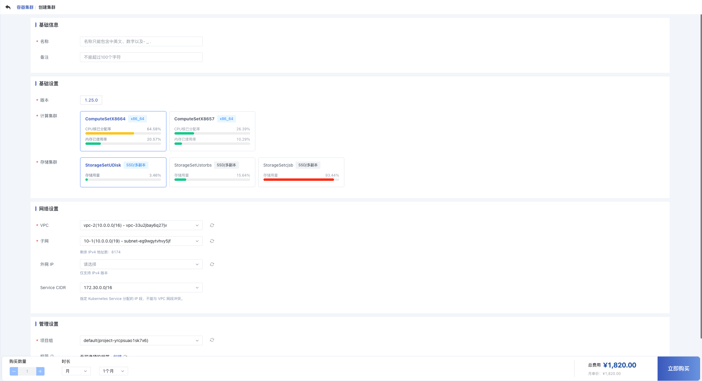

## 36.3 查看容器集群

创建完成后，在容器集群列表展示容器集群信息。容器集群创建通常需要十分钟左右，集群状态会从创建中变为运行中，如果管理服务出现异常，集群状态会变为异常。通过容器集群名称可以进入详情页，查看容器集群的详情信息。

### 36.3.1 查看容器集群列表

支持租户查看账号下的容器集群列表，内容包括：名称，集群ID，状态，版本，集群类型，apiServer列表，所属VPC，所属子网，serviceCIDR，最大CPU数量，最大内存，最大Pods数量，项目组，标签，创建时间，更新时间，过期时间，操作（包括：查看集群凭证，更新，绑定外网IP，解绑外网IP，续费，修改告警模版，修改标签，YAML创建资源，集群登录，删除）。容器集群列表支持租户按照名称，备注，资源ID，apiServer地址，版本搜索。

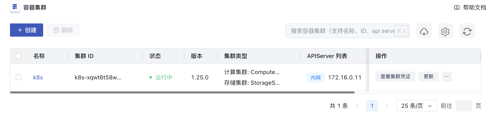

### 36.3.2 查看容器集群凭证

用户通过查看集群凭证，获取容器集群的配置文件，默认展示内网集群凭证，绑定外网IP后，则展示内外网集群凭证。将集群配置文件添加到 .kube/config ，即可通过 kubectl 访问容器集群。


### 36.3.3 编辑配置信息（管理员功能）

支持管理员编辑租户的容器集群配置，支持设置子网，最大 CPU 数量，最大内存数量，最大 Pods 数量、最大存储容量及开启/关闭集群限制。如下图所示：

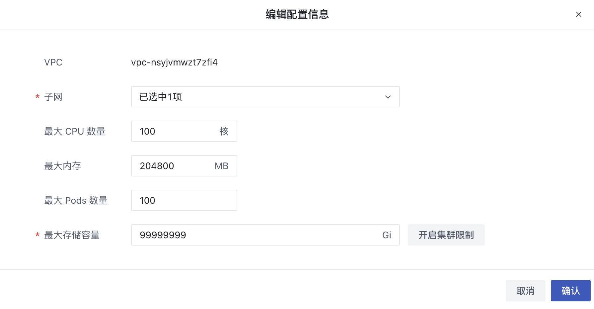

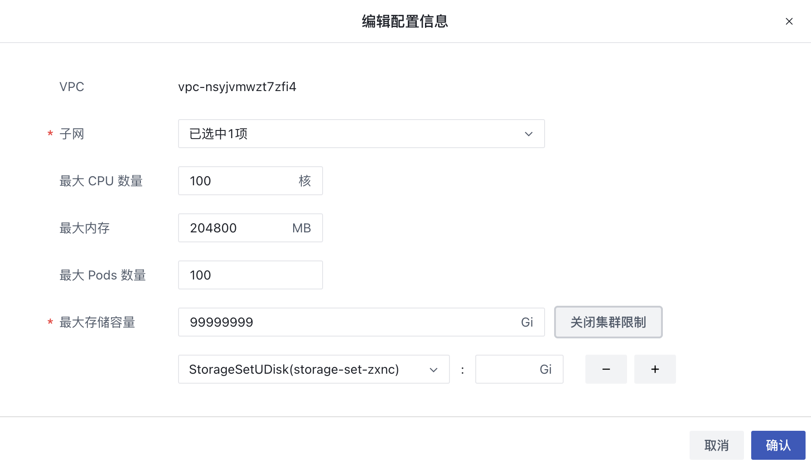

> 子网IP已被容器集群使用的情况下，不能将子网从容器集群中移除。

> 存储集群未开启集群限制时，该存储集群下支持创建的 PVC 容量受最大存储容量限制；存储集群开启集群限制后，允许单独设置存储集群的容量限制，支持创建的 PVC 容量受该存储集群设置的容量和最大存储容量限制。开启集群限制的存储集群设置的容量之和不能超过最大存储容量。

### 36.3.4 更新容器集群

支持租户更新容器集群子网信息，子网IP已被容器集群使用的情况下，不能将子网从容器集群中移除。

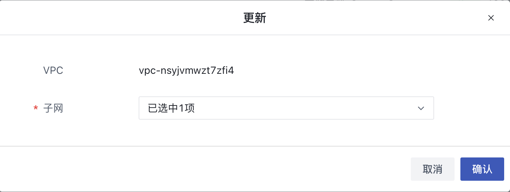

### 36.3.5 修改告警模版

支持租户修改容器集群告警模版，支持租户通过集群内存利用率，集群内存容量，集群 CPU 利用率，集群 CPU 数量等监控指标，设置告警规则。触发告警后通过通知组将告警发送到对应通知人。

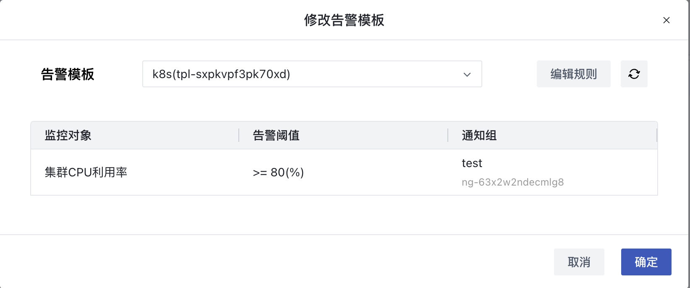

### 36.3.6 查看容器集群概览

查看容器集群概览，展示容器集群的基本信息，配置信息，资源健康状态，监控信息。基本信息包括：集群ID，集群名称，状态，版本，apiServer 列表，Service CIDR，集群凭证，创建时间，告警模版。配置信息包括：所属VPC，所属子网，最大 CPU 数量，最大内存数量，最大 pods 数量。资源健康状态包括：ETCD，KubeApiserver，KubeTerminal，KubeControllerManager，KubeScheduler，StorageProvider，CloudProvider。监控信息包括：集群 CPU 数量，集群 CPU 利用率，集群内存容量，内存利用率，支持按时间查询，支持自动刷新，支持自定义监控信息模版。

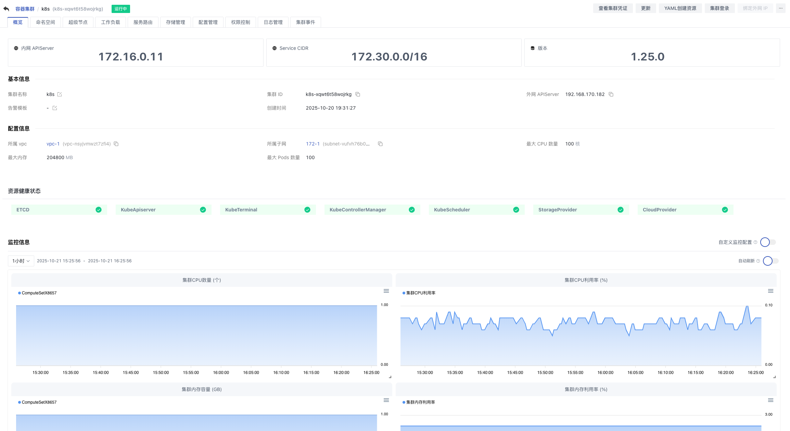

### 36.3.7 绑定外网IP

支持租户操作容器集群绑定外网IP，最多仅支持绑定一个外网IP。绑定外网IP后，集群凭证可查看到外网凭证。

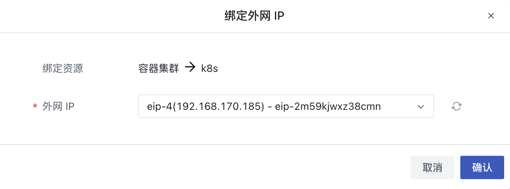

### 36.3.8 解绑外网IP

支持租户操作容器集群解绑外网IP，解绑外网IP后，集群凭证查看不到外网凭证。

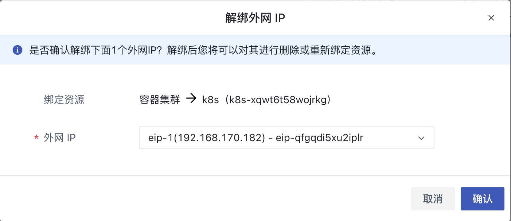

### 36.3.9 续费

支持租户操作容器集群按年、月、小时续费。

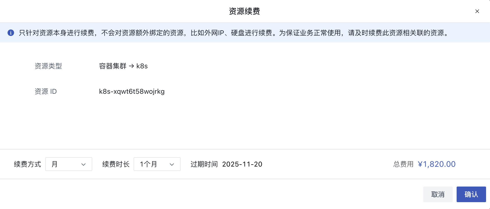

### 36.3.10 标签

支持租户修改容器集群标签。

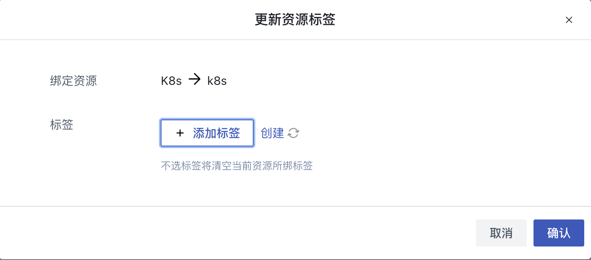

### 36.3.11 YAML 创建资源

支持租户创建具有多个资源的应用程序或服务。

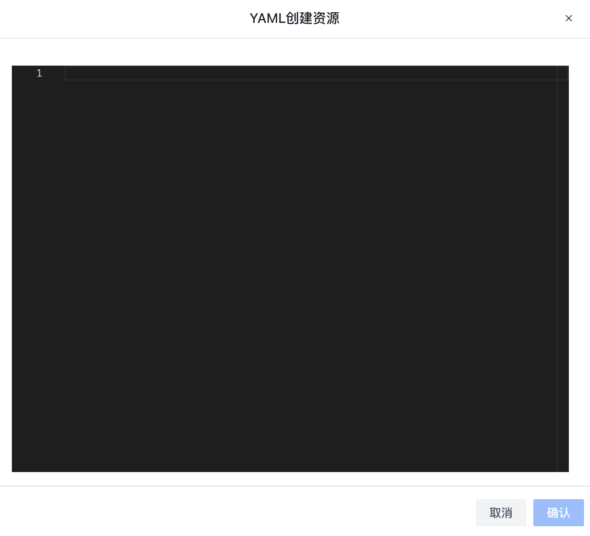

### 36.3.12 集群登录

支持租户登录到容器集群，并对容器集群进行操作和管理。


### 36.3.13 删除容器集群

支持租户删除容器集群，集群内的所有超级节点、Pod、服务以及路由都将随集群删除全部自动销毁。

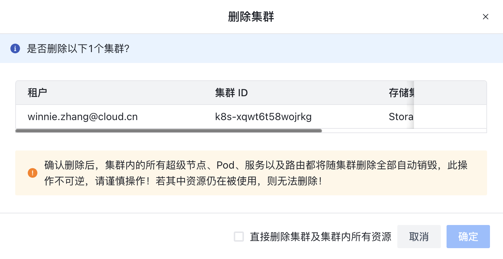

## 36.4 命名空间

命名空间提供一种机制，将同一容器集群中的资源划分为相互隔离的组。同一命名空间内的资源名称要唯一，但跨命名空间的资源名称可以一致。容集集群默认创建四个命名空间，包括default，kube-node-lease，kube-public，kube-system。创建资源时如果没有指定命名空间，将被默认分配到"default"命名空间中。

### 36.4.1 创建命名空间

支持租户创建命名空间，命名空间名称具有唯一性。

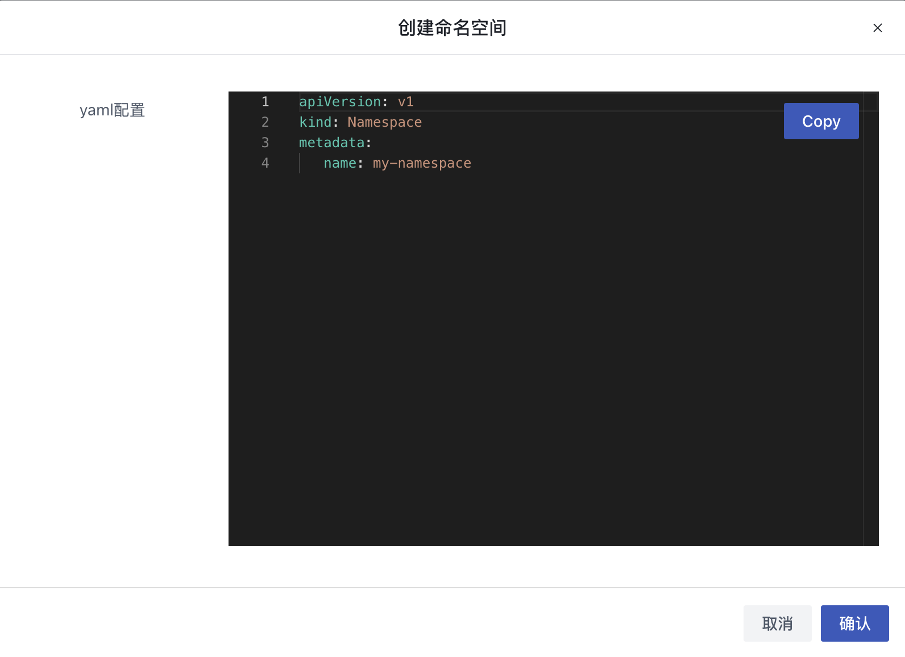

命名空间模版

```
apiVersion: v1
kind: Namespace
metadata:
   name: my-namespace
```

### 36.4.2 查看命名空间列表

命名空间创建完成后，在命名空间列表中展示，资源可指定新增的命名空间创建。

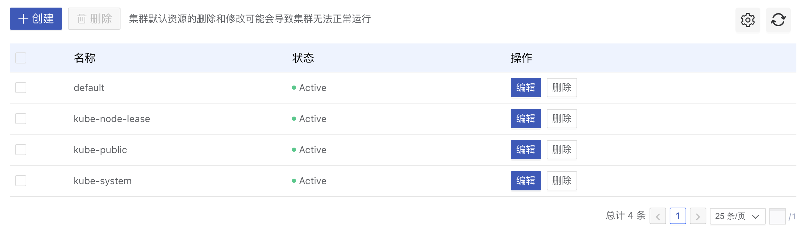

### 36.4.3 编辑命名空间

支持租户编辑命名空间。

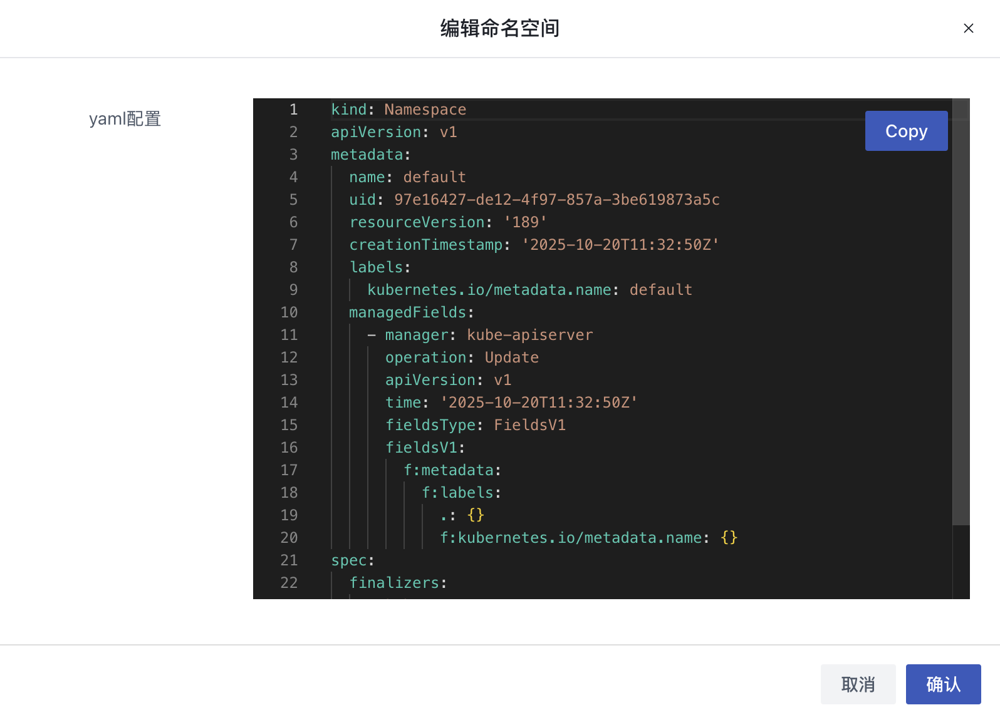

### 36.4.4 删除命名空间

支持租户删除/批量删除命名空间，删除命名空间后将销毁命名空间下的所有资源。为保证容器集群正常运行，不建议删除默认创建的命名空间。

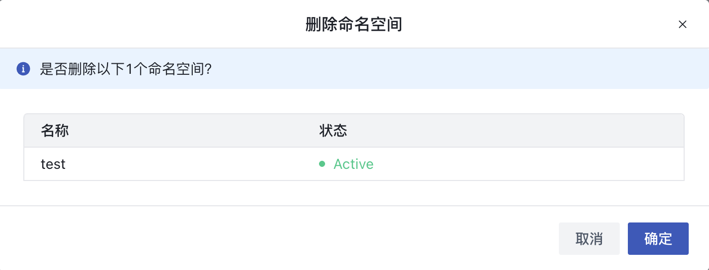

## 36.5 超级节点管理

超级节点为用于运行应用程序和容器化工作负载的工作节点，是逻辑上的节点。支持租户创建超级节点，更新超级节点，锁定节点，解锁节点，绑定 GPU，解绑 GPU，删除节点。集群创建完成后会默认创建一个节点名称为 supernode01 的节点，该节点默认最大 CPU 数量为50核，最大内存数量为102400MB，最大 Pods 数量为50个，状态默认为锁定状态，不可删除。

### 36.5.1 创建超级节点

支持租户创建超级节点，创建超级节点时，可以选择当前地域下的任意计算集群，存储集群。支持用户设置节点最大 CPU 数量，最大内存数量，最大 Pods 数量，未设置时默认设置当前集群一半的可用余量。超级节点无个数限制，节点资源用量总和不得超过容器集群资源用量。

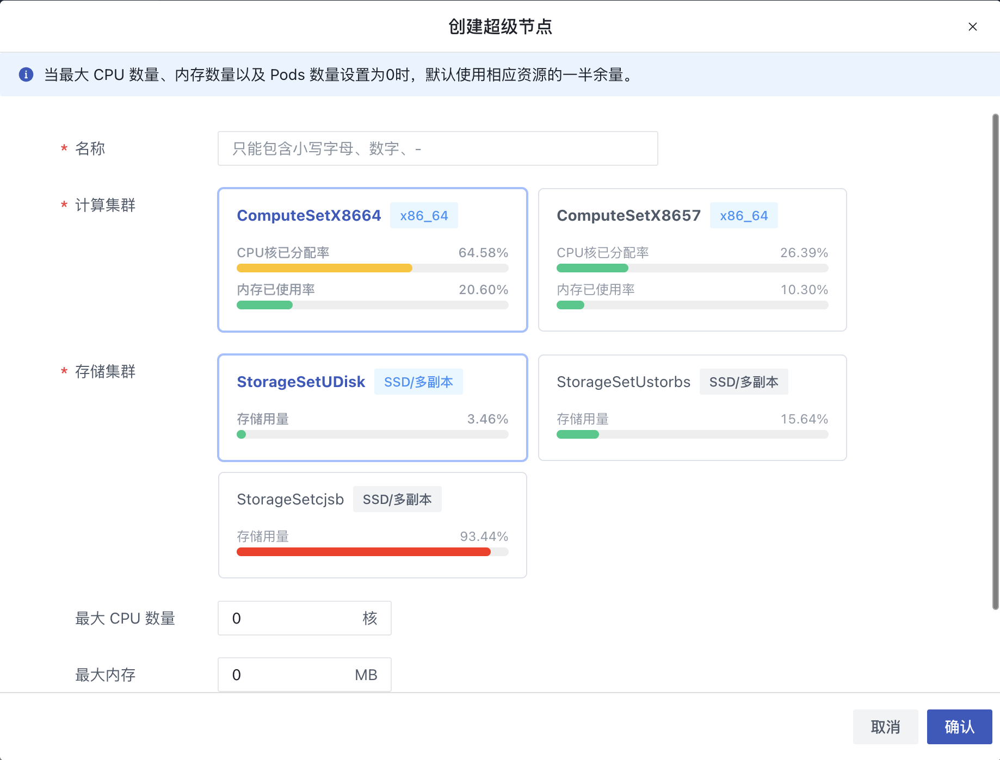

### 36.5.2 更新超级节点

支持租户更新超级节点，修改节点最大 CPU 数量，最大内存数量，最大 Pods 数量。

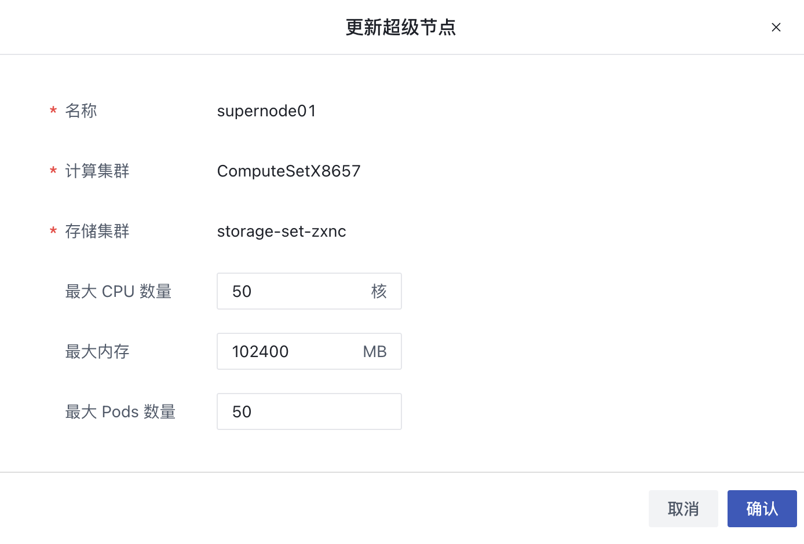

### 36.5.3 锁定超级节点

支持租户锁定超级节点，锁定节点后，pod 不再调度到该节点，已经调度到该节点的 pods 仍会继续运行，直到删除。

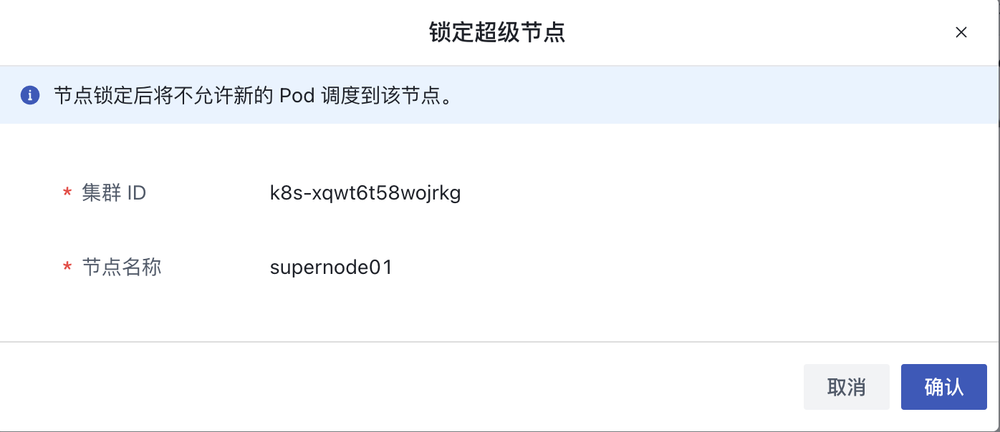

### 36.5.4 解锁超级节点

支持租户解锁超级节点，解锁节点后，pod 会调度到该节点上。

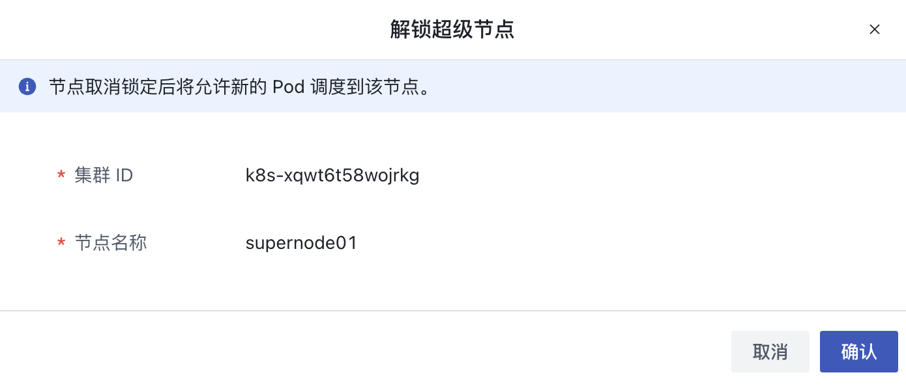

### 36.5.5 绑定 GPU

支持租户操作超级节点绑定 GPU，绑定到超级节点的 GPU 不可再分配给其他节点或虚拟机使用。

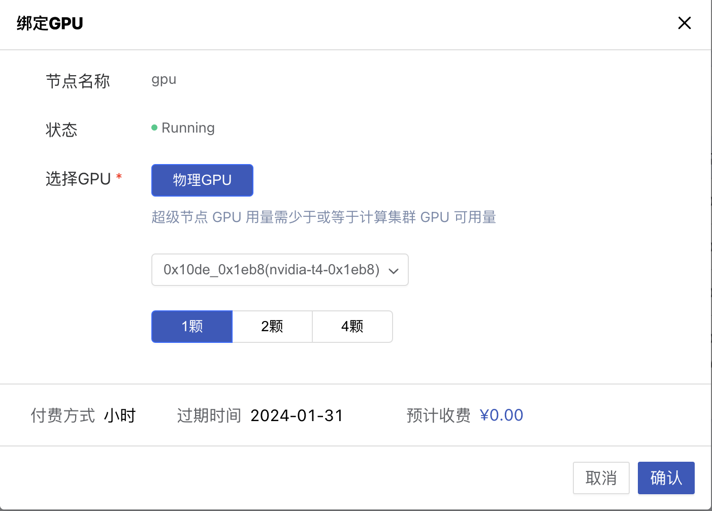

### 36.5.6 解绑 GPU

支持租户操作超级节点解绑 GPU，当前超级节点内的 Pod 未使用 GPU 时才可以操作解绑。


### 36.5.7 删除超级节点

支持租户删除/批量删除超级节点，节点删除前需要将节点上的 Pod 全部删除。

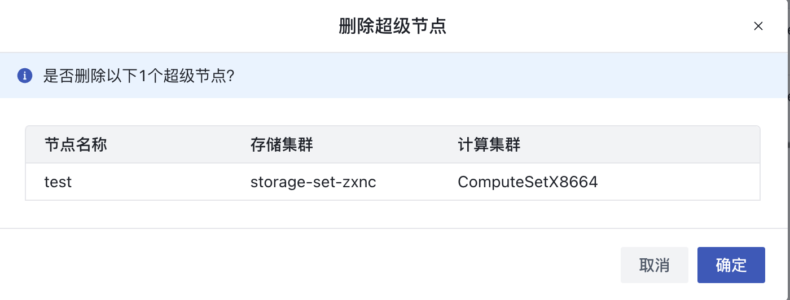

### 36.5.8 yaml 查看

支持租户通过 yaml 查看超级节点信息。

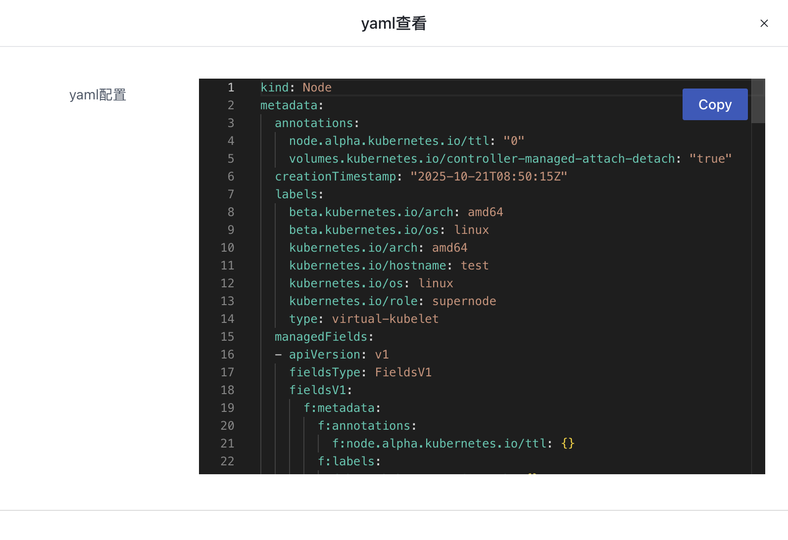

### 36.5.9 Pod 管理

支持租户管理节点下的 Pod，批量销毁 Pod，按照命名空间筛选 Pod，查看 Pod 的 yaml 配置，远程登录 pod。远程登录时需选择容器名称，命令行模式。Pod 管理列表展示 Pod 实例名称，命名空间，状态，实例IP，Request/Limits资源用量配置，创建时间，操作（销毁，查看yaml，远程登录）。未通过工作负载调度创建的 pod 销毁后不会重建。

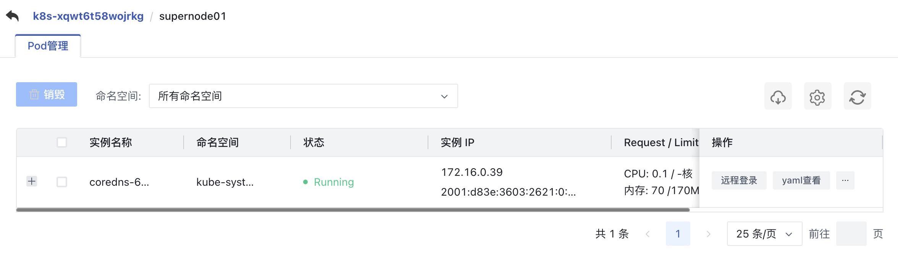

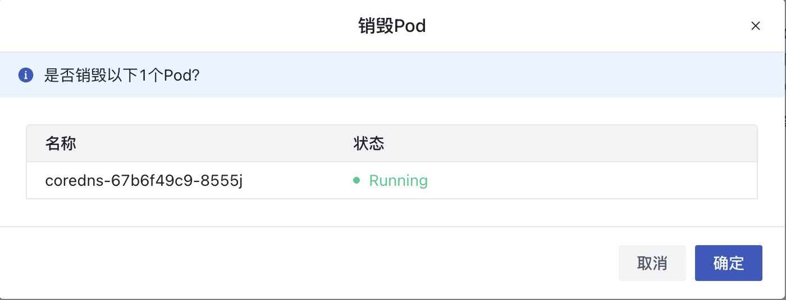

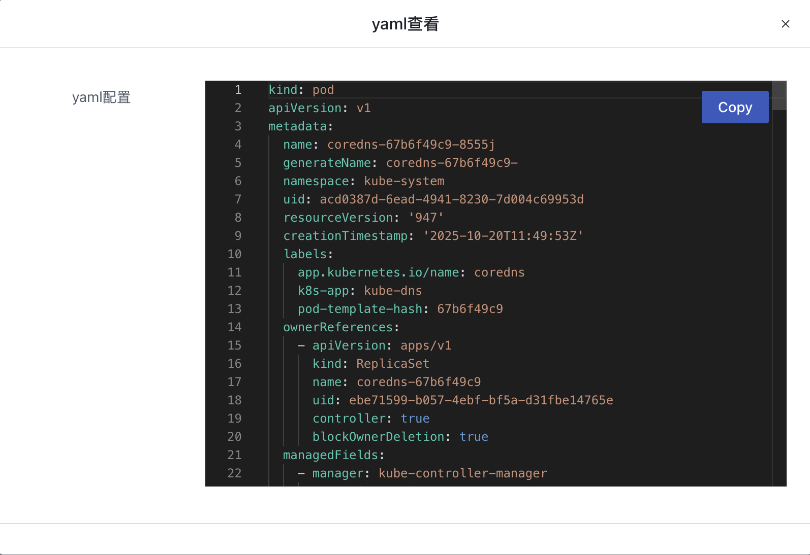


### 36.5.10 容器列表

支持租户管理节点下 Pod 的容器，容器列表内容包括容器名称，镜像版本号，状态，CPU Request，CPU Limit，内存 Request，内存 Limit，重启次数，操作（远程登录）。

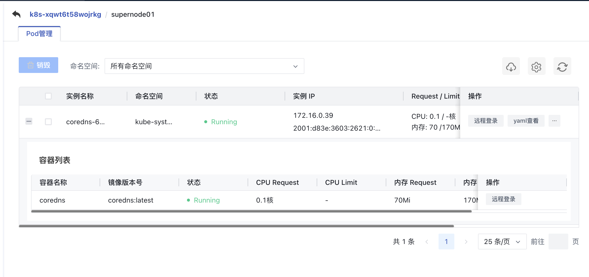

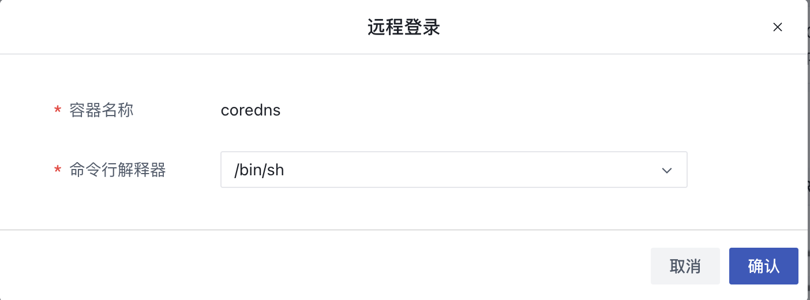

## 36.6 工作负载

支持用户在控制台通过 yaml 配置创建，更新工作负载。创建工作负载时，需要先选择命名空间，然后选择工作负载类型，点击添加 yaml，添加工作负载配置，创建工作负载。默认会显示工作负载的配置模版。工作负载包括：Deployment，StatefulSet，Job，CronJob。Deployment支持通过表单创建。

### 36.6.1 Deployment

Deployment 是 Kubernetes 中的一种资源对象，用于声明式地管理应用程序的部署和扩展。它提供了一种便捷的方式来定义和控制应用程序在 Kubernetes 集群中的副本数量、容器镜像、存储卷、网络配置等方面的规范。

#### 36.6.1.1 yaml创建Deployment

支持租户通过添加 yaml 方式创建 Deployment。

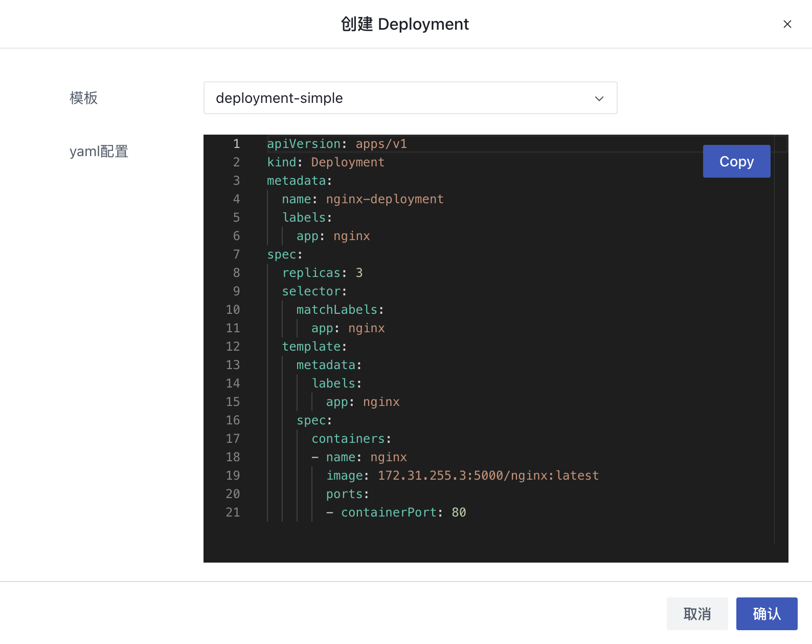

Deployment 模版

```
apiVersion: apps/v1
kind: Deployment
metadata:
name: nginx-deployment
labels:
    app: nginx
spec:
replicas: 3
selector:
    matchLabels:
    app: nginx
template:
    metadata:
    labels:
        app: nginx
    spec:
    containers:
    - name: nginx
        image: 172.31.255.3:5000/nginx:latest
        ports:
        - containerPort: 80
```

#### 36.6.1.2 表单创建 Deployment

支持租户通过表单创建的方式创建 Deployment。

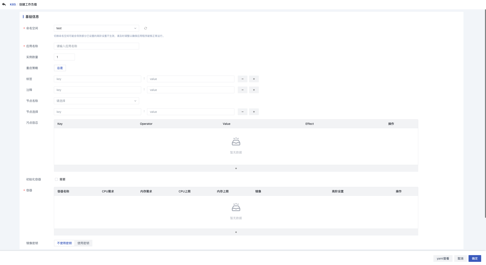

#### 36.6.1.3 查看 Deployment 列表

工作负载 Deployment 列表展示Deployment的名称，命名空间，Labels，Selector，运行/期望 Pods 数量，Request/Limit，操作（yaml 编辑，表单修改，删除）。

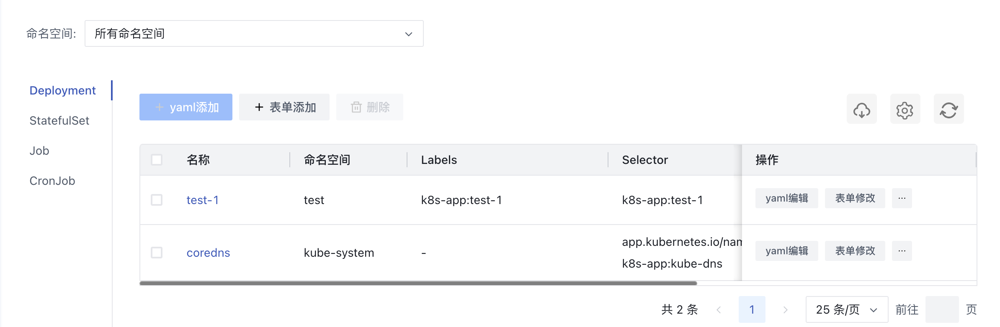

#### 36.6.1.4 yaml 编辑 Deployment

支持租户通过 yaml 编辑 Deployment。


#### 36.6.1.5 表单修改 Deployment

支持租户通过表单修改 Deployment，支持的修改项包括实例数量，容器名称，CPU 需求，内存需求，CPU 上限，内存上限，镜像。

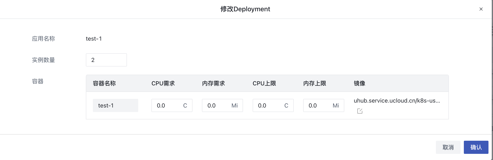

#### 36.6.1.6 删除 Deployment

支持租户删除 Deployment，删除 Deployment 后，Deployment 下的 Pod 会一同自动销毁。

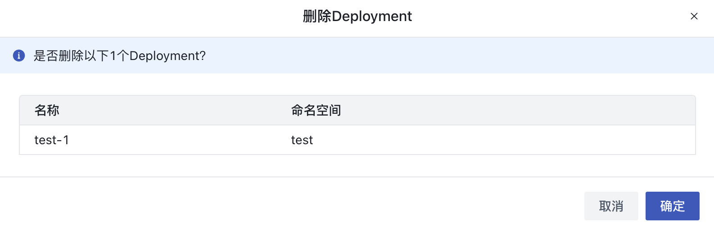

### 36.6.2 StatefulSet

StatefulSet 是 Kubernetes 中用于管理有状态应用程序的资源对象。它为每个 Pod 实例分配唯一标识符，并保持标识符的稳定性。StatefulSet 还支持有状态的持久性存储，使每个 Pod 实例能够访问自己的持久化数据。部署和扩展操作按照定义的顺序进行，确保应用程序的有状态性和稳定性。

工作负载 StatefulSet 列表展示 StatefulSet 的名称，命名空间，Labels，Selector，运行/期望 Pods 数量，Request/Limit，操作（编辑 yaml，删除）。

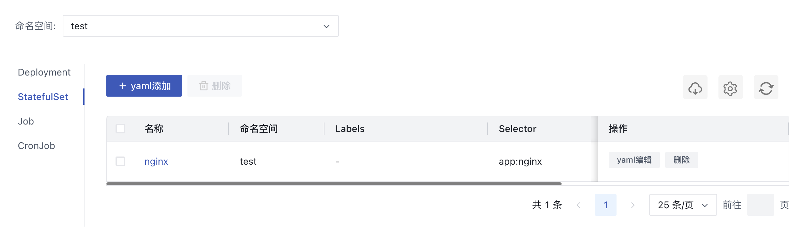

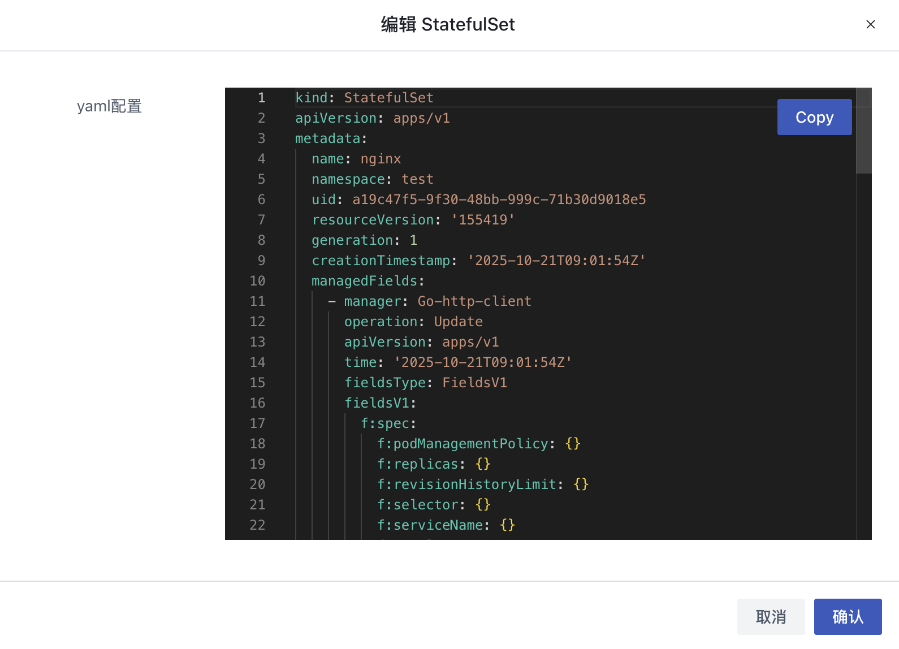


StatefulSet 模版

```
apiVersion: apps/v1
kind: StatefulSet
metadata:
  name: nginx
spec:
  serviceName: "nginx"
  replicas: 3
  selector:
    matchLabels:
      app: nginx
  template:
    metadata:
      labels:
        app: nginx
    spec:
      containers:
      - name: nginx
        image: 172.31.255.3:5000/nginx:latest
        ports:
        - containerPort: 80
          name: web
```

### 36.6.3 Job

Job 是 Kubernetes 中用于执行一次性任务或批处理作业的资源对象。它并行地创建和管理多个 Pod 实例来运行任务，并确保任务成功完成。Job 适用于需要执行短暂任务的场景，可以自动重试失败的任务，并提供任务顺序性的控制机制。

工作负载 Job 列表展示 Job 的名称，命名空间，Labels，Selector，并行数，重复次数，Request/Limit，操作（编辑 yaml，删除）。

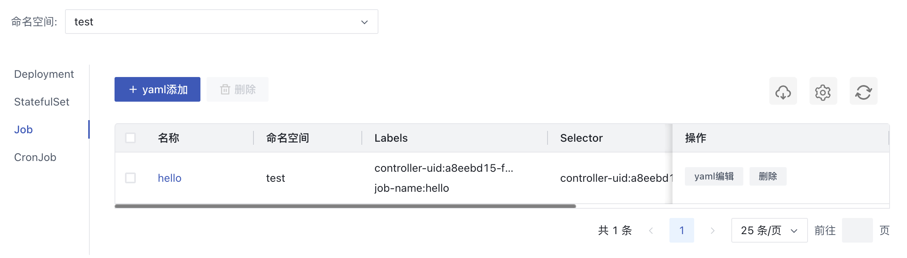

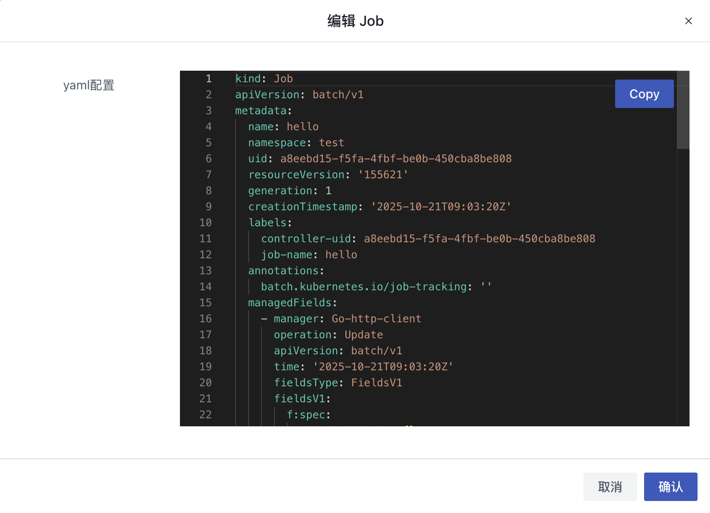

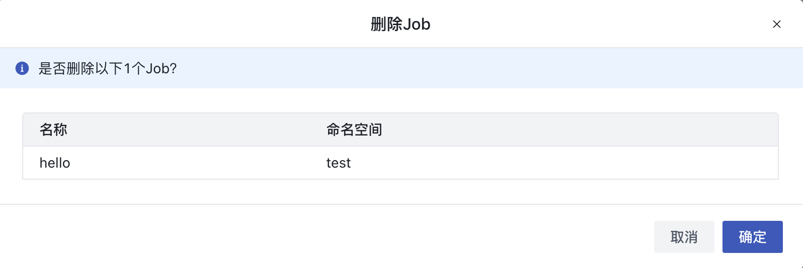

Job 模版

```
apiVersion: batch/v1
kind: Job
metadata:
  name: hello
spec:
  template:
    spec:
      containers:
      - name: hello
        image: 172.31.255.3:5000/busybox:latest
        command: ["echo", "Hello World"]
      restartPolicy: Never
```

### 36.6.4 CronJob

CronJob 是 Kubernetes 中的一种资源对象，用于在指定的时间间隔或特定时间点运行周期性任务。它类似于传统的 Cron 调度器，允许用户在集群中定义和自动执行定时任务。

工作负载 CronJob 列表展示 CronJob 的名称，命名空间，Labels，Selector，并行数，重复次数，活跃 JOB 数，Request/Limit，操作（编辑 yaml，删除）。

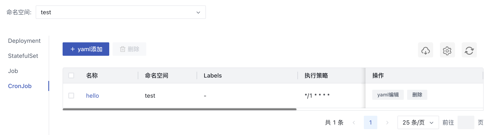


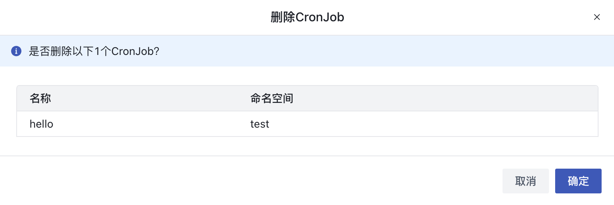

CronJob 模版

```
apiVersion: batch/v1
kind: CronJob
metadata:
  name: hello
spec:
  schedule: "*/1 * * * *"
  jobTemplate:
    spec:
      template:
        spec:
          containers:
          - name: hello
            image: 172.31.255.3:5000/busybox:latest
            command: ["echo", "Hello World"]
          restartPolicy: OnFailure  
```

### 36.6.5 工作负载详情页

通过点击工作负载名称进入工作负载详情页，详情页包括 Pod 管理和日志管理。

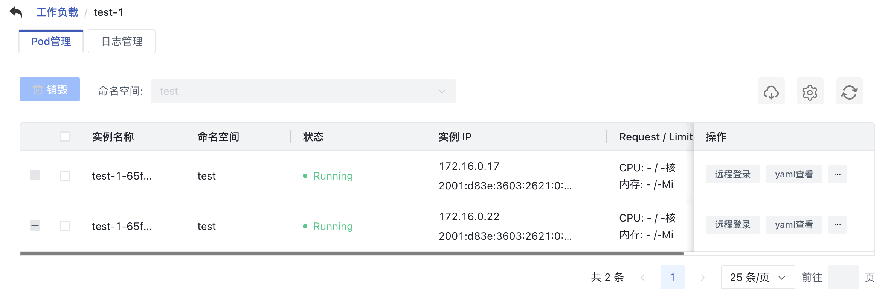

#### 36.6.5.1 Pod 管理

支持租户管理工作负载下的 Pod，销毁/批量销毁 Pod，查看 Pod 的 yaml 配置，远程登录 pod。远程登录时需选择容器名称，命令行模式。Pod 管理列表展示 Pod 实例名称，命名空间，状态，实例 IP，Request/Limits 资源用量配置，创建时间，操作（销毁，查看 yaml，远程登录）。

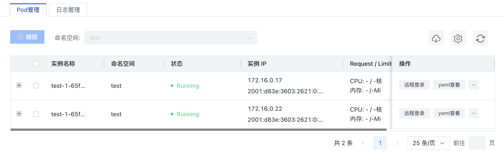


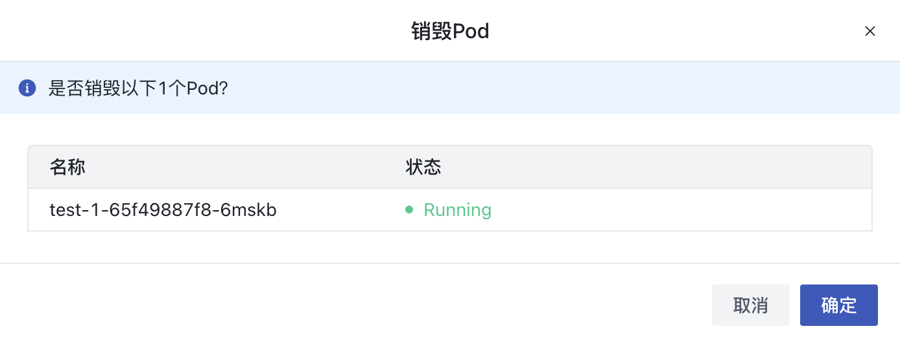

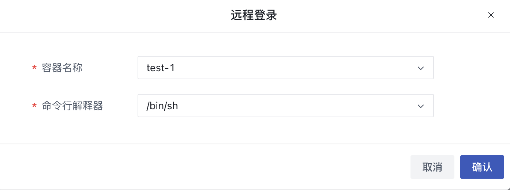

支持租户管理工作负载下 Pod 的容器，容器列表内容包括容器名称，镜像版本号，状态，CPU Request，CPU Limit，内存 Request，内存 Limit，重启次数，操作（远程登录）。

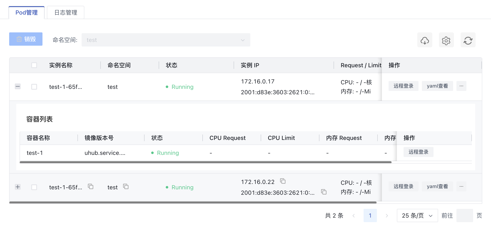

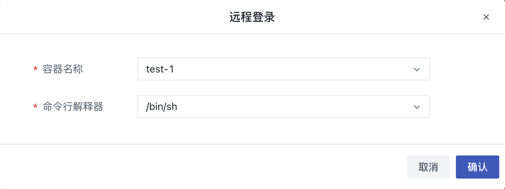

#### 36.6.5.2 日志管理

支持用户查询工作负载下日志信息，支持搜索项包括Pod，容器，数据条数，关键词，时间。日志内容支持开启自动刷新。

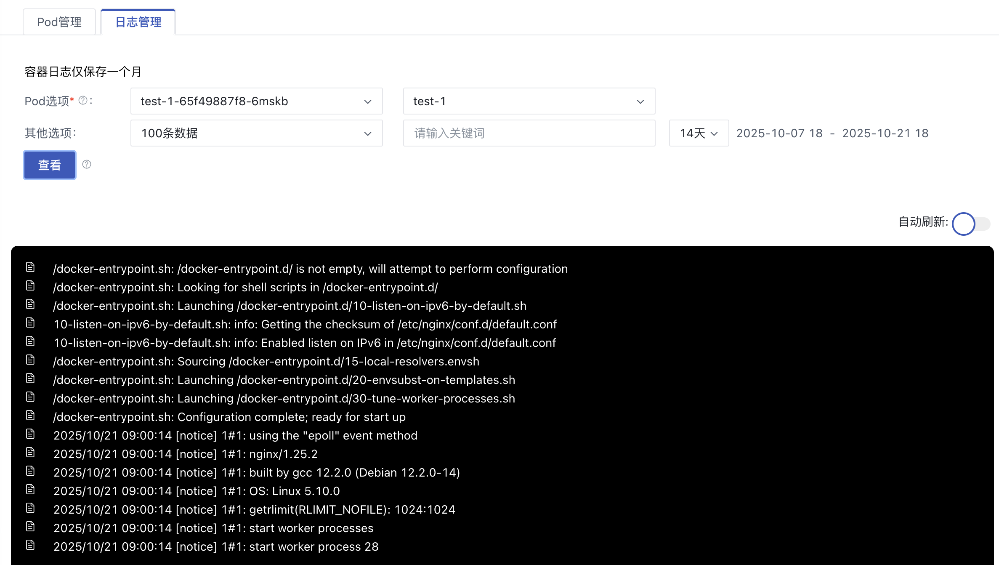

### 36.6.6 配置

#### 36.6.6.1 fsGroup

fsGroup 是 Kubernetes 中 Pod 的一个安全上下文字段，用于指定容器内运行的进程所属的组。当 fsGroup 被设置时，容器中的进程将以指定的组身份运行，而不是默认的组身份。通过设置 fsGroup，可以确保容器内的进程以特定组的身份访问文件系统资源，从而控制对这些资源的访问权限，提高容器的安全性。

示例

```
apiVersion: v1
kind: Pod
metadata:
  name: my-pod
spec:
  securityContext:
    fsGroup: 2000
  containers:
  - name: my-container
    image: nginx
    volumeMounts:
    - mountPath: /data
      name: my-volume
  volumes:
  - name: my-volume
    emptyDir: {}
```

在这个示例中，fsGroup: 2000 表示该 Pod 中所有容器的文件属组都将被设置为 2000。

#### 36.6.6.2 fieldPath: status.podIP

fieldRef 中的 fieldPath: status.podIP 是容器集群中的一种字段引用，用于在资源对象的配置中引用其他字段的值。在这种情况下，status.podIP 引用了 Pod 对象的 status 字段中的 podIP 字段，该字段包含分配给 Pod 的 IP 地址。

示例

```
apiVersion: v1
kind: Pod
metadata:
  name: my-pod
spec:
  containers:
    - name: my-container
      image: nginx
      env:
        - name: pod_ip
          valueFrom:
            fieldRef:
              fieldPath: status.podIP
```

在这个示例中，容器定义了一个名为 pod_ip 的环境变量，其值来自于 Pod 的 IP 地址。

## 36.7 服务路由

支持用户在控制台通过 yaml 配置创建，更新服务路由。服务路由包括 Service 和 Ingress，Service 和 Ingress 不能共用同一个负载均衡。

创建服务路由时，需要先选择命名空间，然后选择服务路由类型，点击添加 yaml，添加服务路由配置，创建服务路由。默认会显示服务路由的配置模版。服务路由包括：Service，Ingress。Service 支持通过表单创建。

### 36.7.1 Service

Service 是 Kubernetes 中的一种资源对象，用于提供稳定的网络访问和负载均衡，以将流量路由到运行在集群中的应用程序。

#### 36.7.1.1 yaml 创建 Service

支持租户通过 yaml 添加创建 Service。

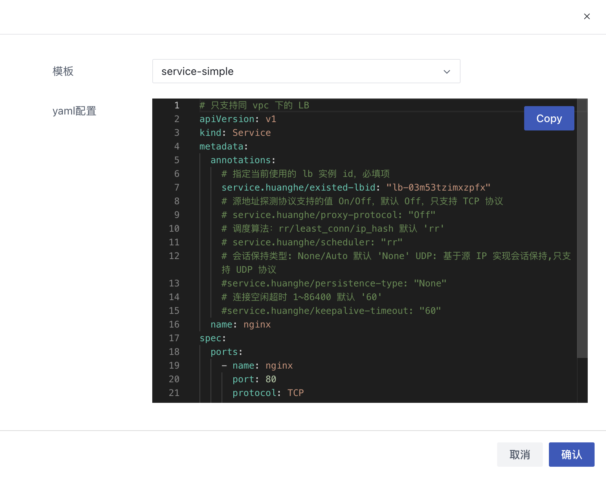

Service LoadBalancer 模版

```
apiVersion: v1
kind: Service
metadata:
  annotations:
    # 指定当前 service 使用的 lb，必填项
    service.huanghe/existed-lbid: "lb-03m53tzimxzpfx"
    # 源地址探测协议支持的值 On/Off，默认 Off，只支持 TCP 协议
    # service.huanghe/proxy-protocol: "Off"
    # 负载均衡调度算法: rr/least_conn/ip_hash, 默认 "rr"
    # service.huanghe/scheduler: "rr"
    # 会话保持类型: None/Auto 默认 "None" UDP: 基于源 IP 实现会话保持,只支持 UDP 协议
    #ingress.huanghe/persistence-type: "None"
    # 连接空闲超时 1~86400 默认 "60"
    #ingress.huanghe/keepalive-timeout: "60"
  name: nginx
spec:
  ports:
    - name: nginx
      port: 80
      protocol: TCP
      targetPort: 80
  selector:
    run: nginx
  type: LoadBalancer
```

Service ClusterIP 模版

```
apiVersion: v1
kind: Service
metadata:
  name: nginx
spec:
  clusterIP: None
  ports:
    - name: nginx
      port: 80
      protocol: TCP
      targetPort: 80
  selector:
    run: nginx
```

#### 36.7.1.2 表单创建 Service

支持租户通过表单创建 Service，服务类型选择 Load Balancer 时，支持选择已有负载均衡或新建负载均衡。

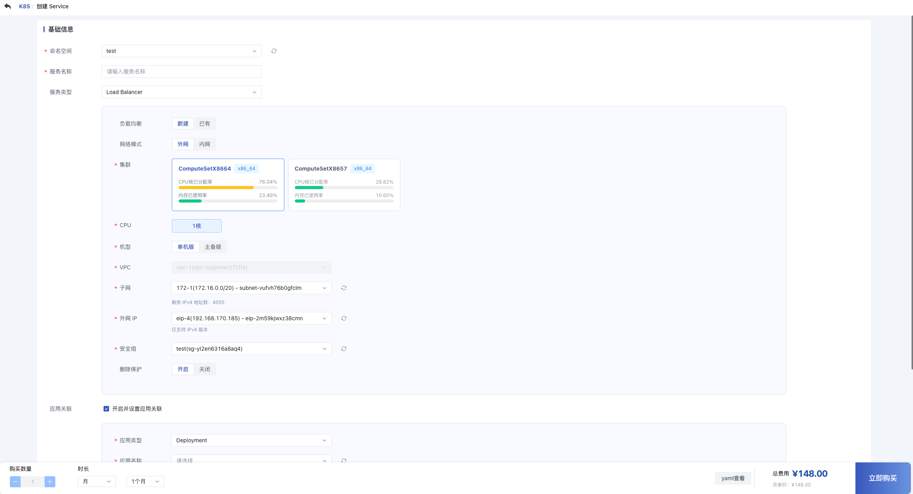

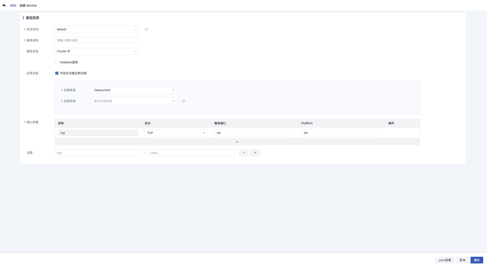

#### 36.7.1.3 查看 Service 列表

Service 列表展示 Service 的名称，命名空间，类型，Labels，Selector，访问入口，操作（编辑 yaml，删除）。

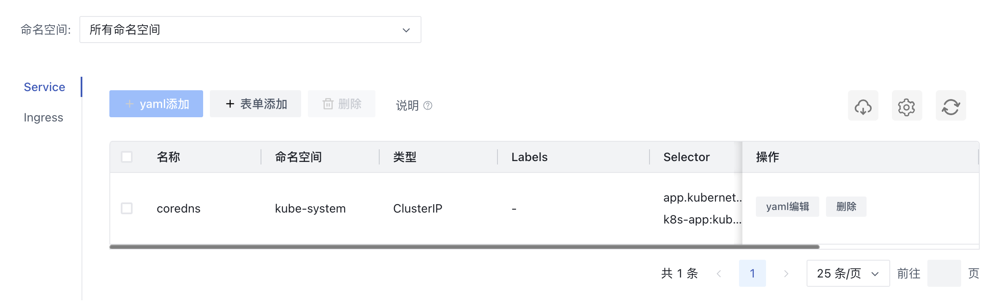

#### 36.7.1.4 编辑 Service

支持租户通过 yaml 编辑 Service。

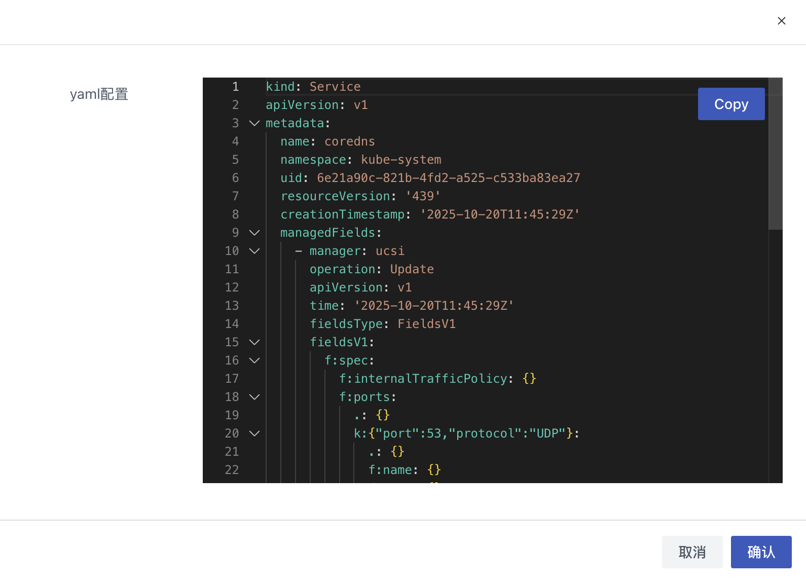

#### 36.7.1.5 删除 Service

支持租户删除/批量删除 Service，若 Service 服务类型为 Load Balancer，删除 Service，负载均衡相关联的 VServer 一同删除。

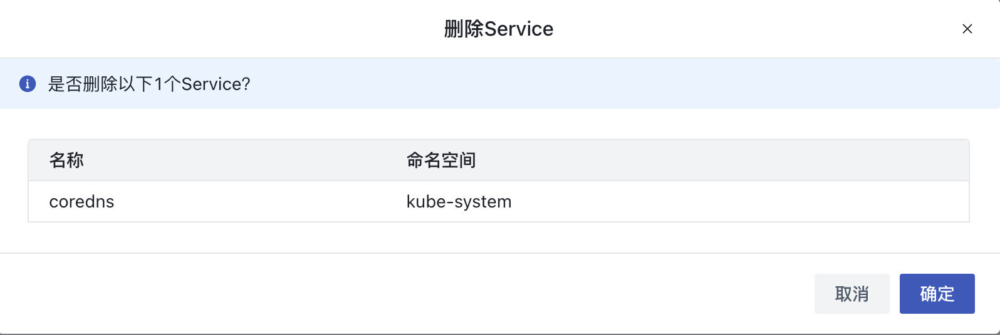

### 36.7.2 Ingress

Ingress 是 Kubernetes 中的一种资源对象，用于管理集群内部外部的 HTTP 和 HTTPS 路由。它充当了集群内部服务和外部世界之间的入口，允许外部流量流向不同的服务。

通过 Ingress，可以定义和配置 HTTP 和 HTTPS 的路由规则，将请求流量路由到集群内部的不同 Service 或 Pod。它提供了高级的负载均衡、SSL/TLS 终止和路径路由等功能，使集群内的服务能够以统一的方式对外提供访问。

Ingress 列表展示 Ingress 的名称，命名空间，转发规则，访问入口，创建时间，操作（编辑yaml，删除）。Ingress 和负载均衡一一对应，不能多个 Ingress 共用同一个负载均衡。

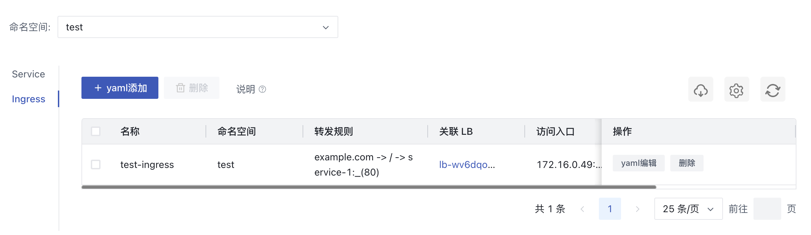

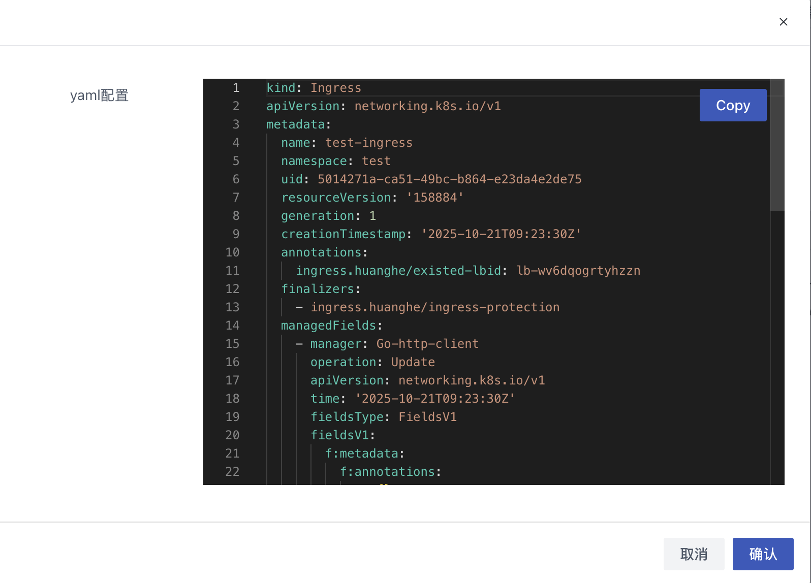


Ingress 模版

```
apiVersion: networking.k8s.io/v1
kind: Ingress
metadata:
  name: test-ingress
  annotations:
    # 指定当前使用的 lb 实例 id，必填项
    ingress.huanghe/existed-lbid: "lb-wgydl3b74jqlf5"
    # 调度算法：rr/least_conn/ip_hash 默认 "rr"
    #ingress.huanghe/scheduler: "rr"
    # 会话保持类型：None/Auto/Manual 默认 "None"
    #ingress.huanghe/persistence-type: "None"
    # 会话保持 Key：当会话保持模式是 Manual 时，可以设定此值 HTTP/HTTPS: 基于 cookie 实现会话保持
    #ingress.huanghe/persistence-key: ""
    # 连接空闲超时 1~86400 默认 "60"
    #ingress.huanghe/keepalive-timeout: "60"
    # ingress 选取后端服务的模式，支持的值 true/false 默认值 "true"
    #ingress.huanghe/direct-access: "true"
spec:
  ingressClassName: ingress-ulb
  rules:
  - host: example.com
    http:
      paths:
      - path: /
        pathType: Prefix
        backend:
          service:
            name: nginx
            port:
              number: 80
```

## 36.8 存储管理

### 36.8.1 StorageClass

StorageClass 是 Kubernetes 中用于管理存储资源的一种对象。它定义了如何动态地供应存储卷（Persistent Volumes），并提供了一种机制来描述存储的质量、类型和其他参数。

#### 36.8.1.1 yaml 添加

添加 yaml，创建 StorageClass

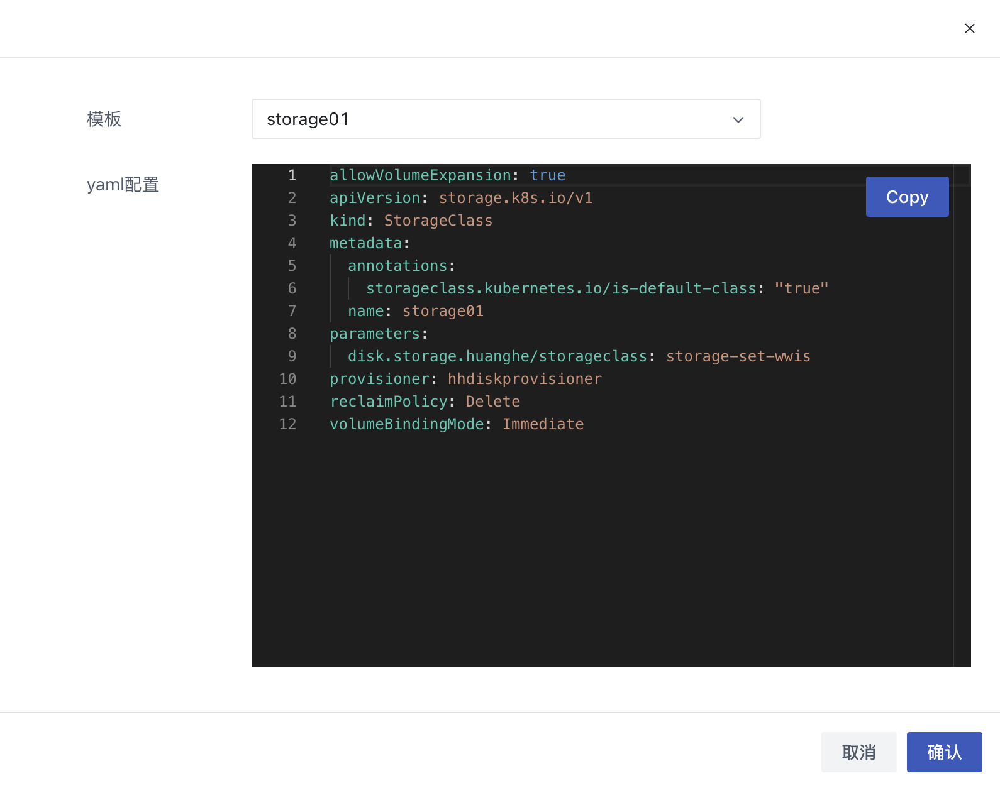

StorageClass 模版

```
allowVolumeExpansion: true
apiVersion: storage.k8s.io/v1
kind: StorageClass
metadata:
  annotations:
    storageclass.kubernetes.io/is-default-class: "true"
  name: storage01
parameters:
  disk.storage.huanghe/storageclass: storage-set-wwis
provisioner: disk.storage.huanghe
reclaimPolicy: Delete
volumeBindingMode: Immediate
```

#### 36.8.1.2 表单创建 StorageClass

支持用户通过表单创建 StorageClass，内容包括名称、存储集群、设置为默认存储类。


#### 36.8.1.3 查看 StorageClass 列表

StorageClass 列表展示 StorageClass 名称，是否为默认存储类，存储集群，存储已使用率。

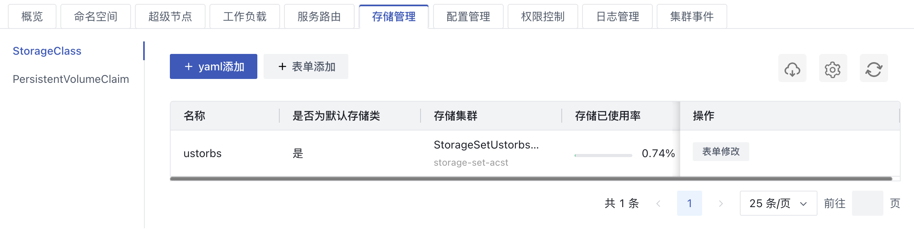

#### 36.8.1.4 表单修改 StorageClass

支持用户通过表单修改 StorageClass，仅支持修改设置为默认存储类。

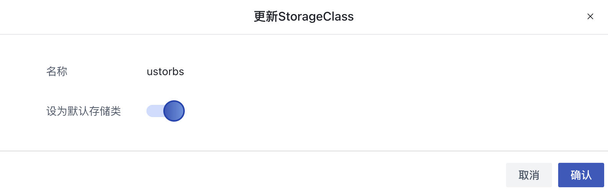

### 36.8.2 PVC

PersistentVolumeClaim（PVC）是 Kubernetes 中用于声明持久化存储资源的对象。它允许应用程序声明对持久卷（ PersistentVolume ）的需求，并提供了一种与持久化存储进行交互的机制。当前版本只支持平台内的分布式存储集群。

#### 36.8.2.1 yaml 添加

选择命名空间后，添加 yaml，创建 PVC。

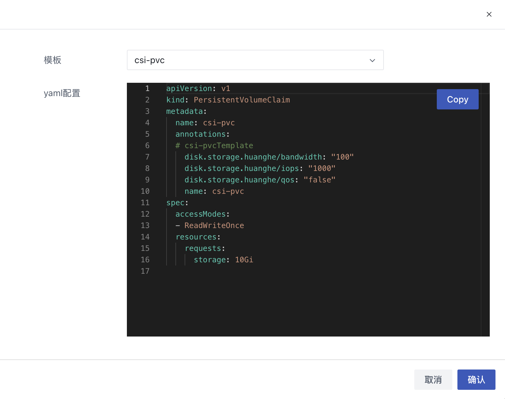

PVC 模版

```
apiVersion: v1
kind: PersistentVolumeClaim
metadata:
  name: csi-pvc
  annotations:
  # csi-pvcTemplate
    disk.storage.huanghe/bandwidth: "100"
    disk.storage.huanghe/iops: "1000"
    disk.storage.huanghe/qos: "false"
    name: csi-pvc
spec:
  accessModes:
  - ReadWriteOnce
  resources:
    requests:
      storage: 10Gi
```

从 PVC 克隆模版

```
apiVersion: v1
kind: PersistentVolumeClaim
metadata:
  name: csi-pvc-clone
spec:
  storageClassName: hh-storage
  dataSource:
    name: csi-pvc
    kind: PersistentVolumeClaim
    apiGroup: ""
  accessModes:
  - ReadWriteOnce
  resources:
    requests:
      storage: 1Gi
```

从 PVC 创建快照模版

```
apiVersion: snapshot.storage.k8s.io/v1
kind: VolumeSnapshot
metadata:
  name: csi-pvc-snapshot
spec:
  volumeSnapshotClassName: hh-snapclass
  source:
    persistentVolumeClaimName: csi-pvc
```

从快照创建 PVC 模版

```
apiVersion: v1
kind: PersistentVolumeClaim
metadata:
  name: restored-pvc
spec:
  storageClassName: hh-storage
  dataSource:
    name: csi-pvc-snapshot
    kind: VolumeSnapshot
    apiGroup: snapshot.storage.k8s.io
  accessModes:
    - ReadWriteOnce
  resources:
    requests:
      storage: 1Gi
```

#### 36.8.2.2 表单创建 PVC

支持租户通过表单创建 PVC，创建内容包括名称，命名空间，存储类型，分配模式，存储容量，访问模式，StorageClass。

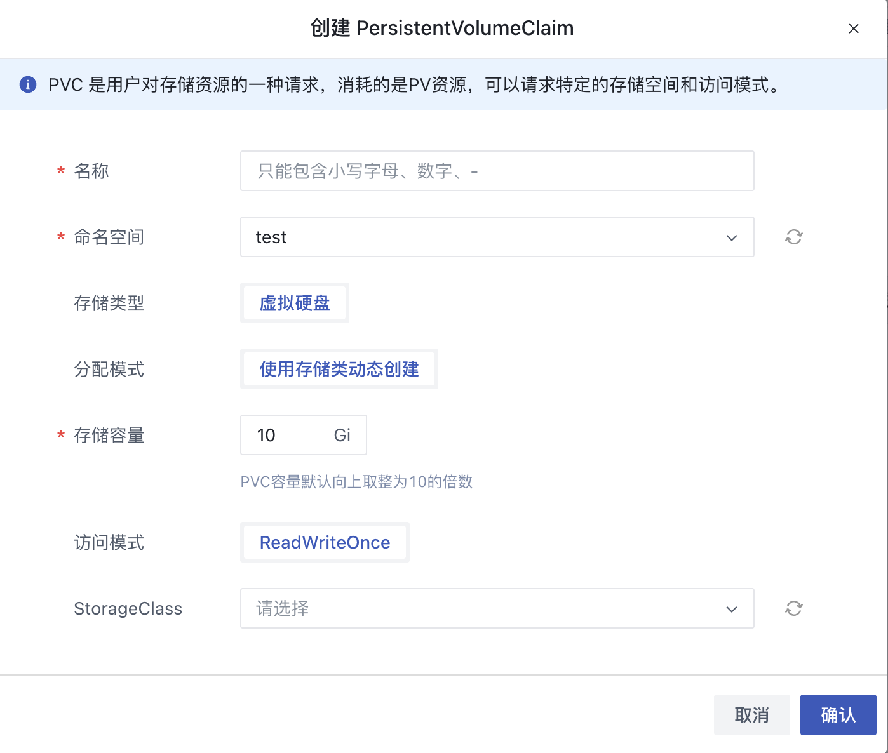

#### 36.8.2.3 查看 PVC 列表

PVC 列表展示 PVC 名称，命名空间，状态，容量，访问权限，StorageClass，操作（编辑 yaml，表单修改，删除）。

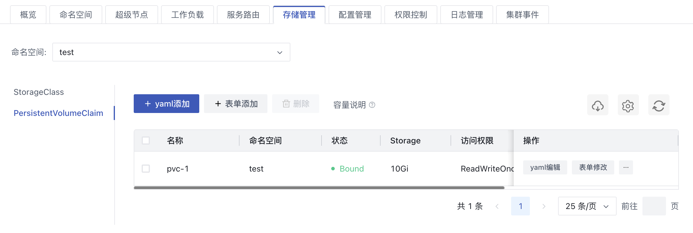

#### 36.8.2.4 yaml 编辑 PVC

支持用户修改 PVC 的 yaml 配置。

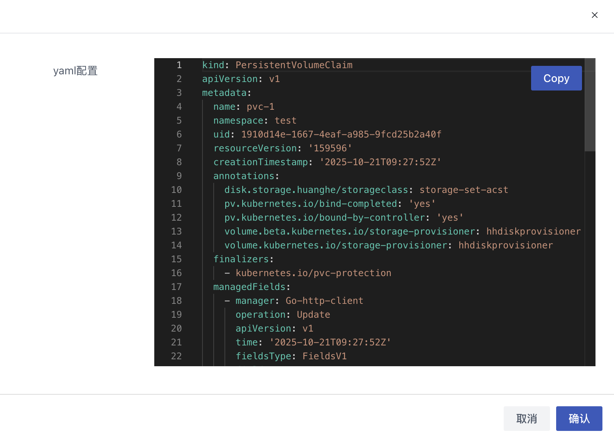

#### 36.8.2.5 表单修改 PVC

支持用户通过表单修改 PVC，仅支持修改存储容量。

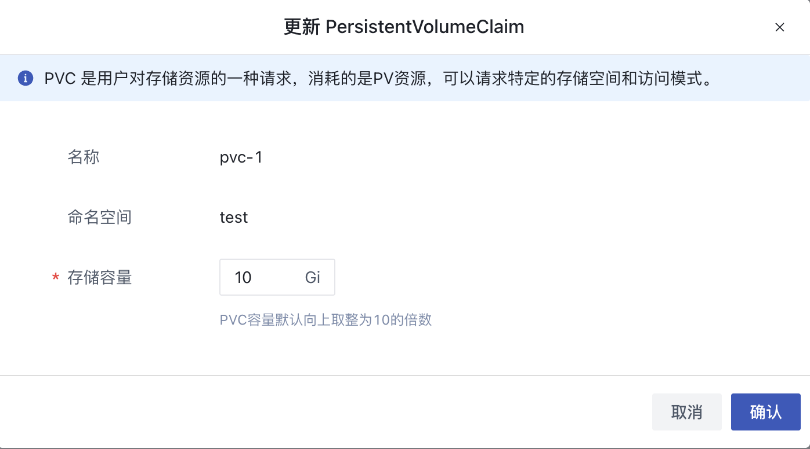

#### 36.8.2.6 删除 PVC

支持用户删除/批量删除 PVC。

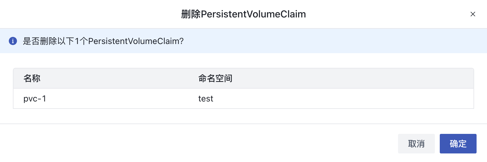

## 36.9 配置管理

支持用户在控制台通过 yaml 创建，更新配置资源。创建配置资源时，需要先选择命名空间，然后选择配置资源类型，点击添加 yaml，添加配置内容，创建配置资源。默认会显示配置管理的资源模版。配置管理包括：ConfigMap，Secret。

### 36.9.1 ConfigMap

ConfigMap 是 Kubernetes 中用于存储配置数据的一种资源对象。它允许将配置数据（如环境变量、命令行参数、配置文件等）与应用程序分开管理，并将其注入到容器中。

支持租户查看 ConfigMap 列表，列表信息包括名称，命名空间，Labels，创建时间，操作（ yaml 编辑、删除）。


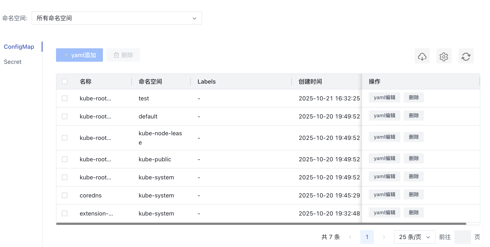

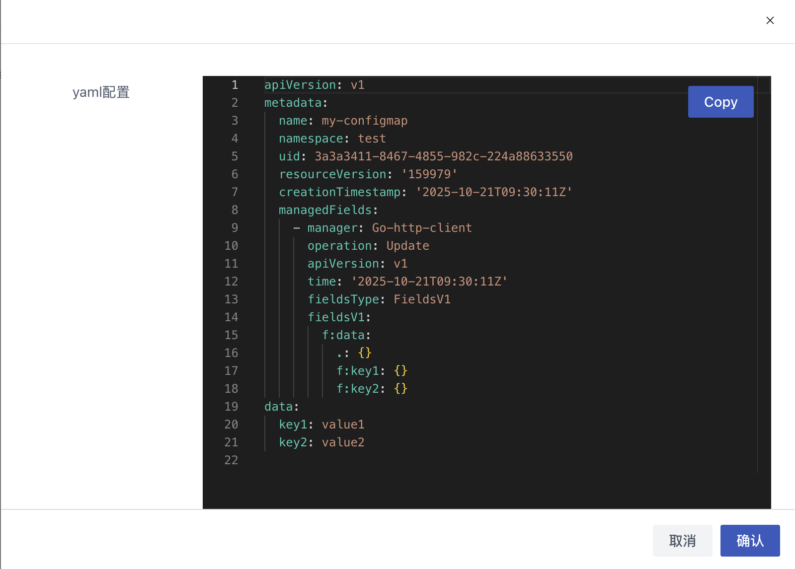

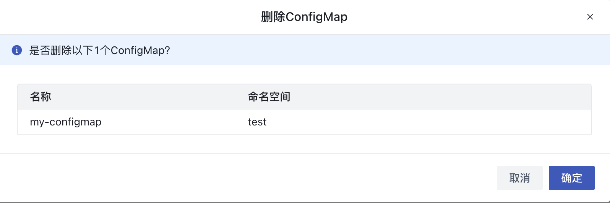

ConfigMap 模版

```
apiVersion: v1
kind: ConfigMap
metadata:
  name: my-configmap
data:
  key1: value1
  key2: value2
```

### 36.9.2 Secret

Secret 是 Kubernetes 中用于存储敏感数据的一种资源对象。它可以用来保存密码、API 密钥、证书等敏感信息，确保这些信息在集群中的存储和传输过程中得到保护。

支持租户查看 Secret 列表，列表信息包括名称，命名空间，类型，创建时间，操作（ yaml 编辑、删除）。

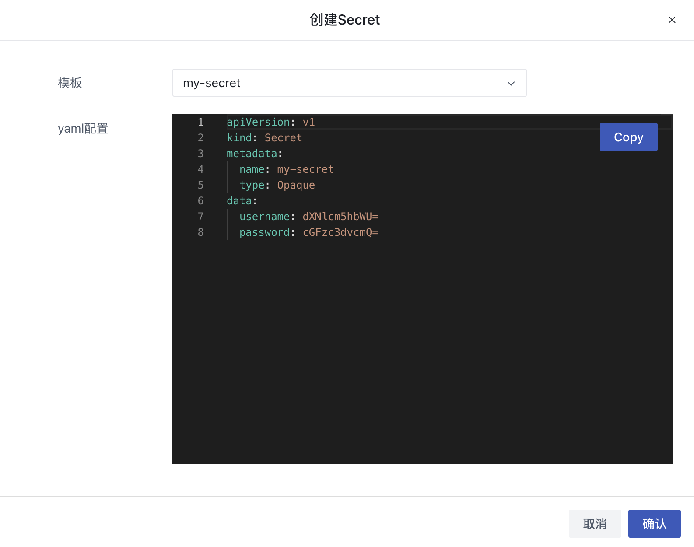

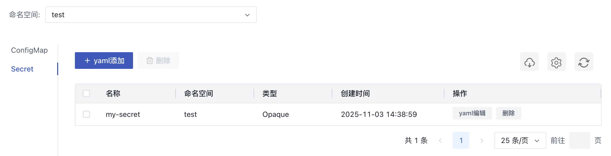

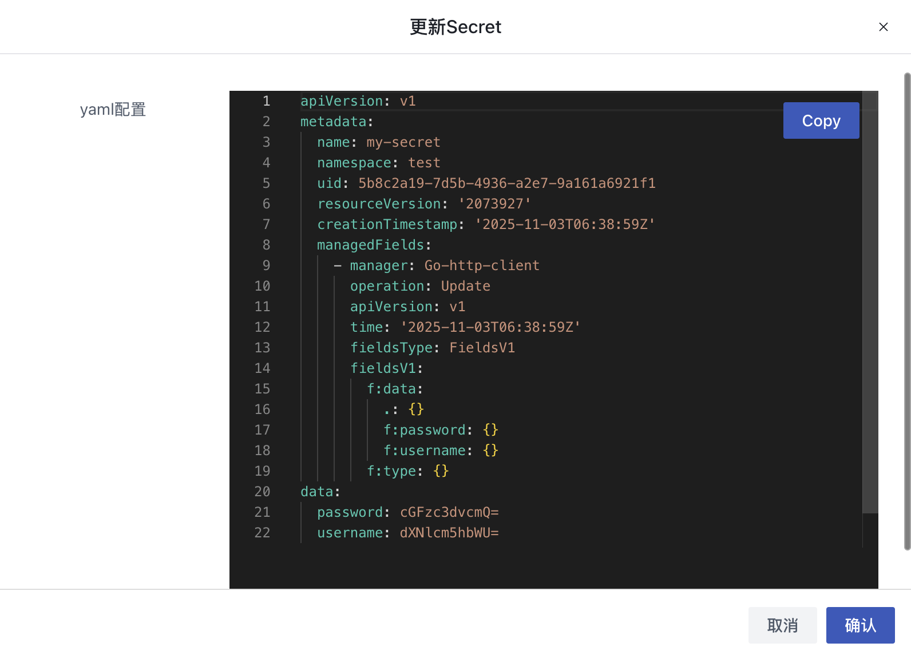

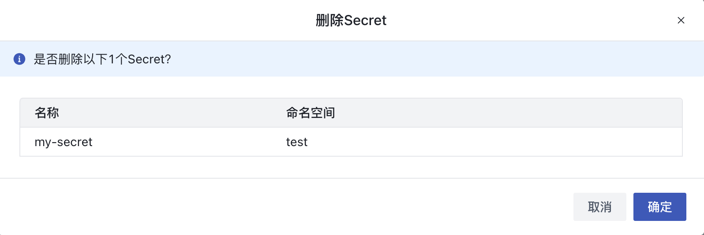

Secret 模版

```
apiVersion: v1
kind: Secret
metadata:
  name: my-secret
  type: Opaque
data:
  username: dXNlcm5hbWU=
  password: cGFzc3dvcmQ=
```

## 36.10 权限控制

支持用户在控制台通过 yaml 创建，更新授权资源。创建授权资源时，需要先选择命名空间，然后选择授权资源类型，点击添加 yaml，添加授权配置，创建授权资源。默认会显示权限控制的资源模版。权限控制包括：ClusterRole，ClusterRoleBinding，Role，RoleBinding，ServiceAccount。

### 36.10.1 ClusterRole

ClusterRole 是 Kubernetes 中的一种授权机制，用于定义集群级别的角色和权限。它允许用户在整个集群范围内授予或限制对各种资源和操作的访问权限。

支持用户查看 ClusterRole，列表内容包括名称，Labels，创建时间，操作（ yaml 编辑、删除）。

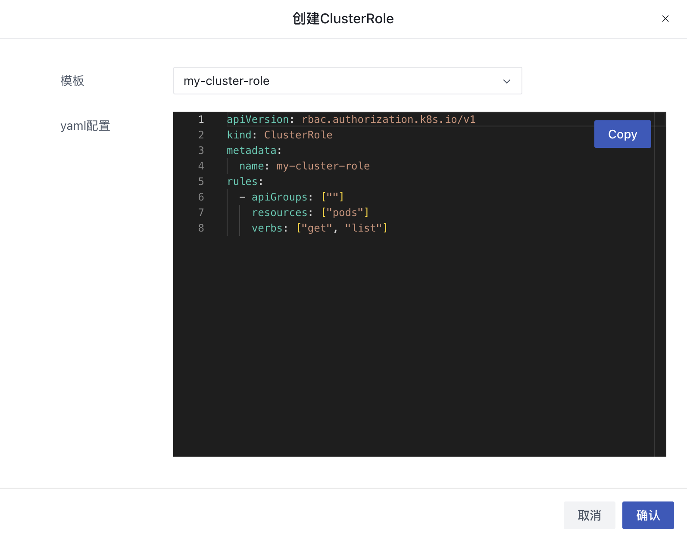

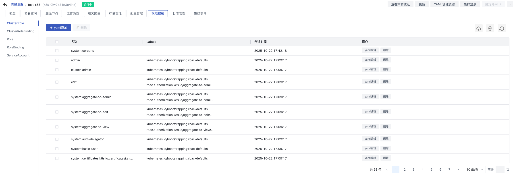

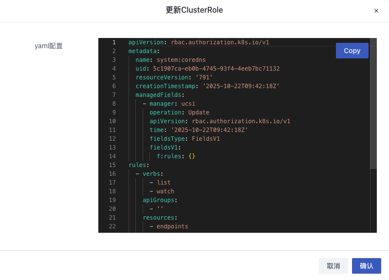

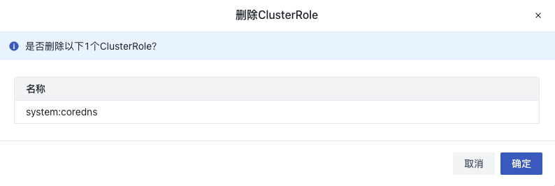

ClusterRole 模版

```
apiVersion: rbac.authorization.k8s.io/v1
kind: ClusterRole
metadata:
  name: my-cluster-role
rules:
  - apiGroups: [""]
    resources: ["pods"]
    verbs: ["get", "list"]
```

### 36.10.2 ClusterRoleBinding

ClusterRoleBinding 是 Kubernetes 中的一种资源对象，用于将一个集群角色（ ClusterRole ）与一个主体（用户、组或服务账户）进行绑定，以授予该主体在整个集群范围内的权限。

支持租户查看 ClusterRoleBinding 列表，列表内容包括名称，Labels，用户名称，创建时间，操作（ yaml 编辑、删除）。

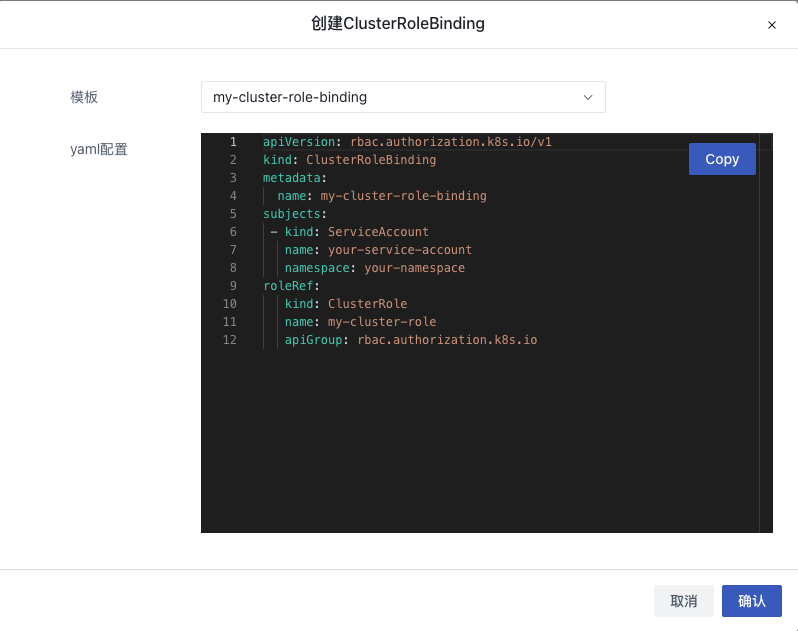

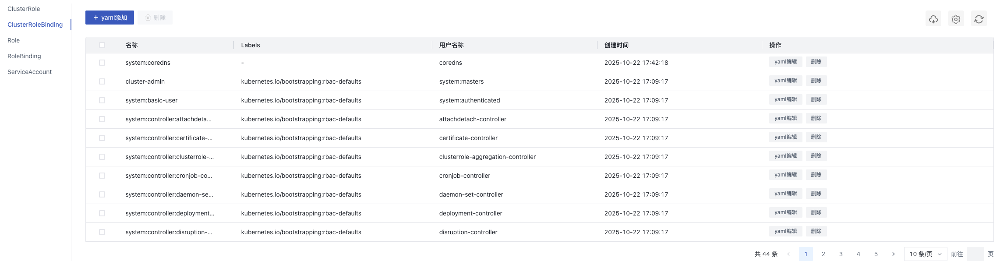

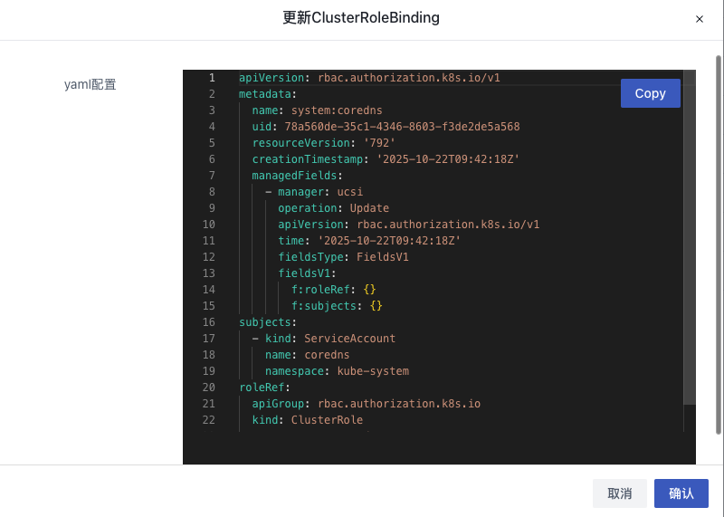

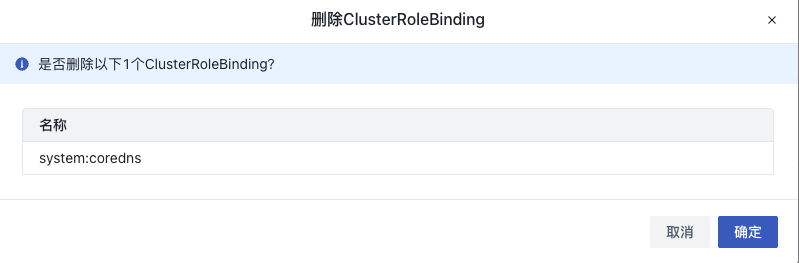

ClusterRoleBinding 模版

```
apiVersion: rbac.authorization.k8s.io/v1
kind: ClusterRoleBinding
metadata:
  name: my-cluster-role-binding
subjects:
 - kind: ServiceAccount
   name: your-service-account
   namespace: your-namespace
roleRef:
   kind: ClusterRole
   name: my-cluster-role
   apiGroup: rbac.authorization.k8s.io
```

### 36.10.3 Role

Role 是 Kubernetes 中一种授权机制，用于定义命名空间级别的角色和权限。它允许用户在特定命名空间范围内授予或限制对各种资源和操作的访问权限。

支持租户查看 Role 列表，列表信息包括名称，命名空间，Labels，创建时间，操作（ yaml 编辑、删除）。


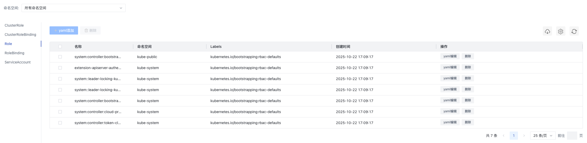


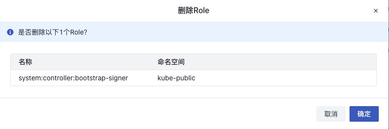

Role 模版

```
apiVersion: rbac.authorization.k8s.io/v1
kind: Role
metadata:
  name: my-role
rules:
    - apiGroups: [""]
      resources: ["pods"]
      verbs: ["get", "list"]
```

### 36.10.4 RoleBinding

RoleBinding 是 Kubernetes 中的一种授权机制，用于将 Role 或 ClusterRole 与用户、组或 ServiceAccount 进行绑定，从而赋予它们在特定命名空间或整个集群内的权限。

支持用户查看 RoleBinding 列表，列表内容包括名称，命名空间，Labels，创建时间，操作（ yaml 编辑、删除）。


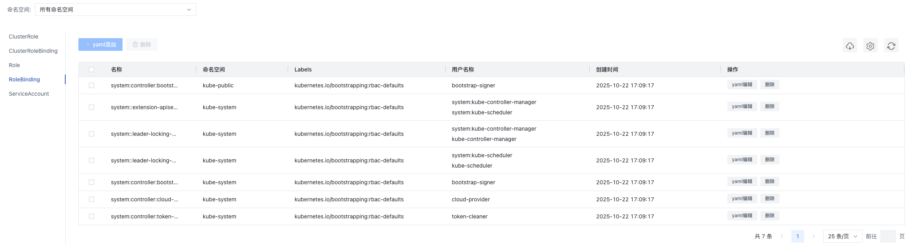

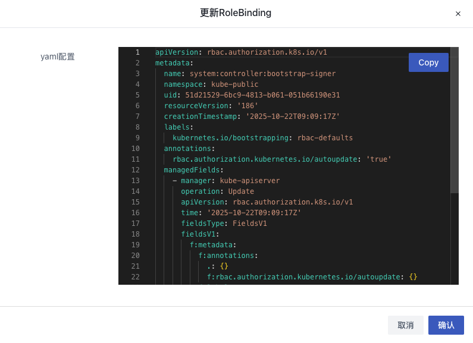


RoleBinding 模版

```
apiVersion: rbac.authorization.k8s.io/v1
kind: RoleBinding
metadata:
  name: my-role-binding
subjects:
    - kind: ServiceAccount
      name: your-service-account
      namespace: your-namespace
roleRef:
      kind: Role
      name: my-role
      apiGroup: rbac.authorization.k8s.io
```

### 36.10.5 ServiceAccount

ServiceAccount 是 Kubernetes 中的一种身份验证实体，用于标识和验证运行在集群中的应用程序或服务。每个 Pod 都会自动关联一个 ServiceAccount，用于在 Pod 内部进行身份验证和授权。

支持用户查看 ServiceAccount 列表，列表内容包括名称，命名空间，Labels，创建时间，操作（ yaml 编辑、删除）。


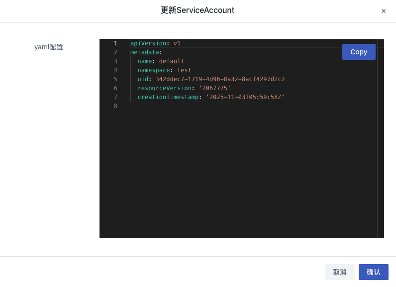


ServiceAccount 模版

```
apiVersion: v1
kind: ServiceAccount
metadata:
  name: your-service-account
```

## 36.11 日志管理

日志管理用于收集、存储和分析容器和应用程序生成的日志数据，支持用户查询容器的日志信息，支持搜索项包括命名空间，工作负载类型，工作负载，Pod，容器，数据条数，关键词，时间。日志内容支持开启自动刷新。

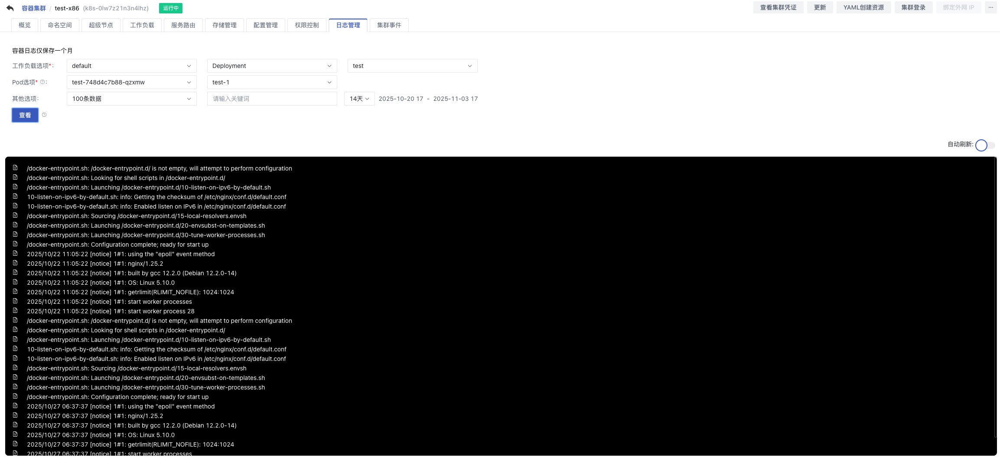

## 36.12 容器集群事件

支持用户查看容器集群事件，支持按时间筛选，展示事件类型，事件等级，事件内容，事件发生次数，开始时间，更新时间。

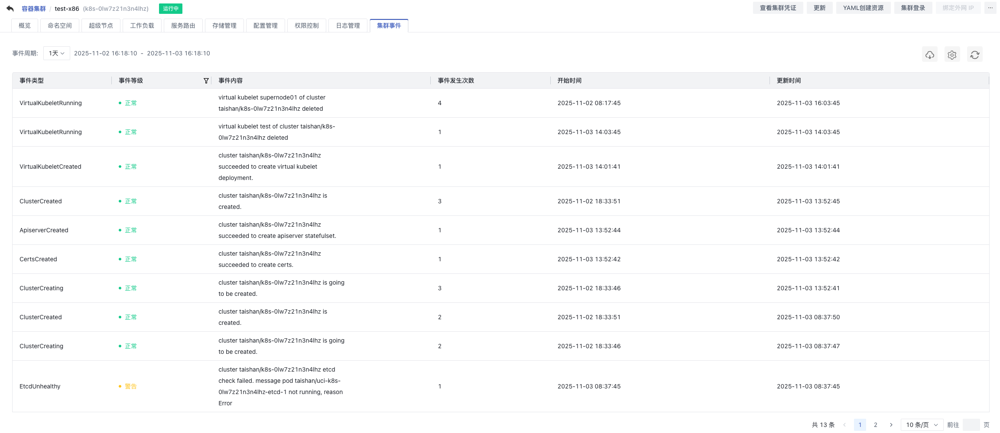

## 36.13  版本说明

当前版本与标准 Kubernetes 能力对比：

* 1.暂不支持 hostNetwork
* 2.暂不支持与实际物理机亲和，反亲和
* 3.暂不支持 NetworkPolicy
* 4.暂不支持 HPA
* 5.QosClass 不受限的情况下会分配一个默认值
* 6.暂不支持 windows Pod
* 7.暂不支持 PDB (Pod中断预算)
* 8.service loadbalance 类型暂不支持 DNS 域名访问
