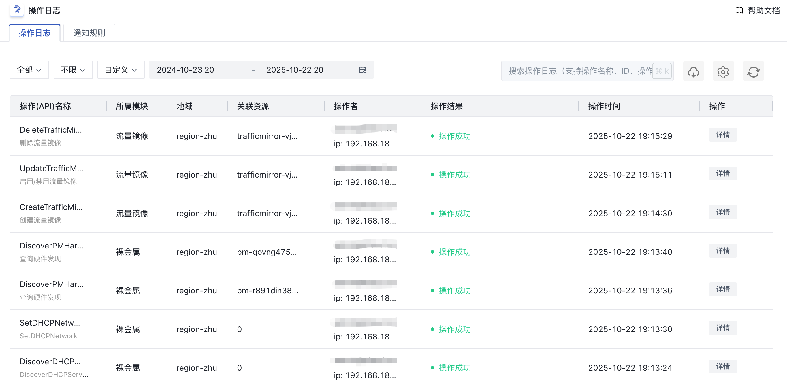
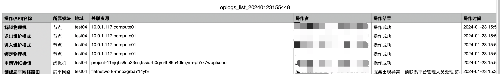
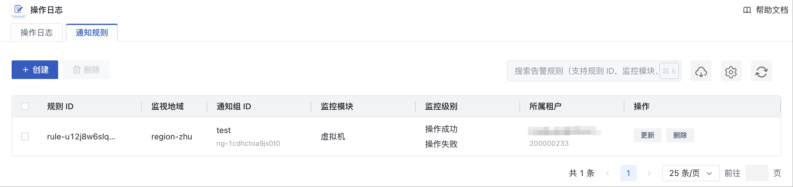
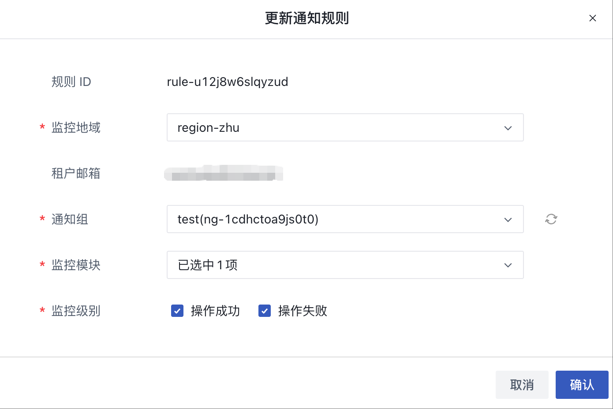
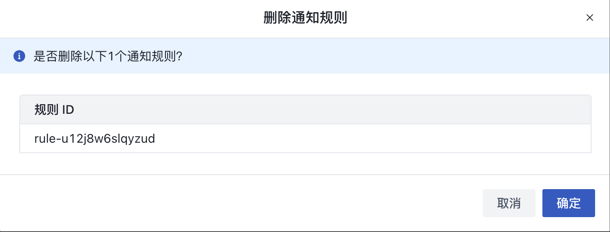

# 20 操作日志

## 20.1 操作日志

操作日志是指用户在控制台或 API 对资源进行的操作行为及登录登出平台的审计信息。操作日志会记录用户在平台中的所有资源操作，提供操作记录查询及筛选，通过操作日志可实现安全分析、资源变更追踪以及合规性审计。

租户通过操作日志控制台可查看整个平台属于用户所有的资源操作及平台登录登出审计日志等，同时也可通过 API 查询租户内所有资源的操作日志及审计信息。支持查看 1 天、3 天、7 天、14 天及自定义时间的日志信息，最长可查询 12 个月的操作日志信息。具体信息包括操作（API）名称、所属模块、地域、关联资源、操作者、操作结果及操作时间，如下图所示：

* 操作（API）名称：指操作日志的操作名称，包括调用 API 的接口名称及操作的界面展示名称，如调整带宽；
* 所属模块：指操作日志操作的资源类型，包括虚拟机、镜像、VPC、虚拟硬盘、网卡、快照、外网 IP、负载均衡、资源模版、安全组、NAT 网关、Redis、MySQL、对象存储、文件存储、备份服务、开放API、VPN 网关、弹性伸缩、外置存储、VIP、裸金属、USB、监控告警、组播、隔离组、容器集群、一键巡检等；
* 可以切换地域，查看不同地域下的日志信息；
* 关联资源：操作日志对应的资源标识符，并可查看一个操作中所有关联的资；
* 操作结果：操作日志的结果，如操作成功、操作失败、参数异常、存储集群物理资源不足等；
* 操作时间：操作日志的操作时间。

**为方便用户便捷的查看操作审计日志，控制台支持日志的筛选和搜索检索，同时支持对导出用户的操作审计日志为本地 Excel 表格，方便账户管理和运营。**

操作日志查询筛选功能可支持所属模块、操作状态及查询时间范围等纬度。所属模块支持所有产品模块的筛选，同时支持查看全部资源的日志及审计信息，即不对所属模块进行筛选；操作状态支持状态为成功、失败的日志筛选，同时也支持查看全部状态的日志和审计信息；查询时间范围支持 1 天、3 天、7 天、14 天及自定义时间的日志筛选，最长可查询 12 个月的操作日志。

> **操作日志不记录用户在虚拟机内部进行的操作和审计**。

## 20.2 通知规则

通过创建通知规则，对操作日志进行监控并通过邮件通知通知人，可通过选择监控地域、通知组、监控模块及监控级别设置通知规则，该租户及子用户操作资源产生的操作日志符合通知规则要求时，会发送监控邮件到通知组内的成员。

### 20.2.1 创建通知规则

用户可通过通知规则页面的“创建”按钮创建通知规则，创建通知规则时需指定监控地域、租户邮箱、通知组、监控模块及监控级别。如下图所示：

* 监控地域：通知规则的地域信息；
* 租户邮箱：通知规则的租户邮箱；
* 通知组：邮件通知的通知组信息，仅支持选择一个通知组；仅支持邮件通知，通知组内配置的 Webhook 通知不支持；
* 监控模块：监控的资源模块内容，例如虚拟机、虚拟硬盘，支持选择多个模块；
* 监控级别：操作日志的操作结果，包括操作成功、操作失败，支持多选。

### 20.2.2 查看通知规则

支持用户查看账号下的通知规则信息，包括监控地域、通知组、监控模块及监控级别，如下图所示：

### 20.2.3 更新通知规则

支持用户更新账号下的通知规则，包括监控地域、通知组、监控模块及监控级别。如下图所示：

### 20.2.4 删除通知规则

支持用户删除账号下的通知规则，规则删除后即直接销毁，如下图所示：

