# 47 服务器迁移中心

## 47.1 概述

服务器迁移中心（SMC————Server Migration Center），是一款协助用户将位于 IDC 的物理服务器、虚拟机、及其它云平台的云主机迁移到本平台中的产品。

## 47.2 上报迁移任务

服务器迁移中心页面展示了 Linux 和 Windows 的 agent 下载地址，需要先在准备迁移的源虚拟机内下载对应操作系统的 agent。如下图所示：


服务器迁移只支持 X86 架构，不支持 ARM 架构。

### 47.2.1 Linux 源虚拟机上报迁移任务

#### 47.2.1.1 下载 agent

```
下载agent：
curl -O https://ucloudstack.cn-sh2.ufileos.com/smc/smc-agent_Linux_amd64_v1_0_0.tar.gz
或
wget https://ucloudstack.cn-sh2.ufileos.com/smc/smc-agent_Linux_amd64_v1_0_0.tar.gz

解压agent：
tar -zvxf smc-agent_Linux_amd64_v1_0_0.tar.gz

安装rsync插件：
yum install rsync
```

#### 47.2.1.2 执行 agent

```
cd smc-agent_Linux_amd64
 ./go2cloud.sh
```

输入迁移到目标虚拟机的环境及账号信息。如下图所示：

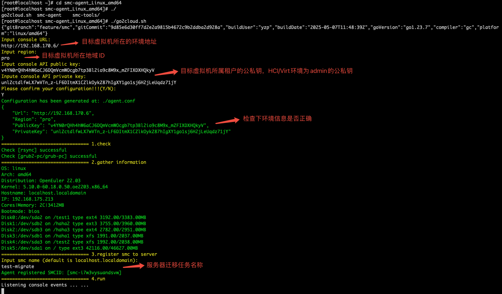

执行完成后，平台服务器迁移中心新增一条状态为在线的迁移任务，如下图所示：

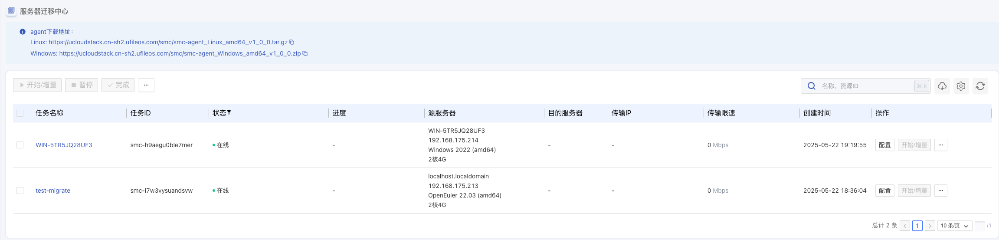

### 47.2.2 Windows 源虚拟机上报迁移任务

#### 47.2.2.1 下载 agent

源虚拟机登录控制台后，在浏览器中通过访问 agent 下载地址下载agent。下载完成后如下图所示：

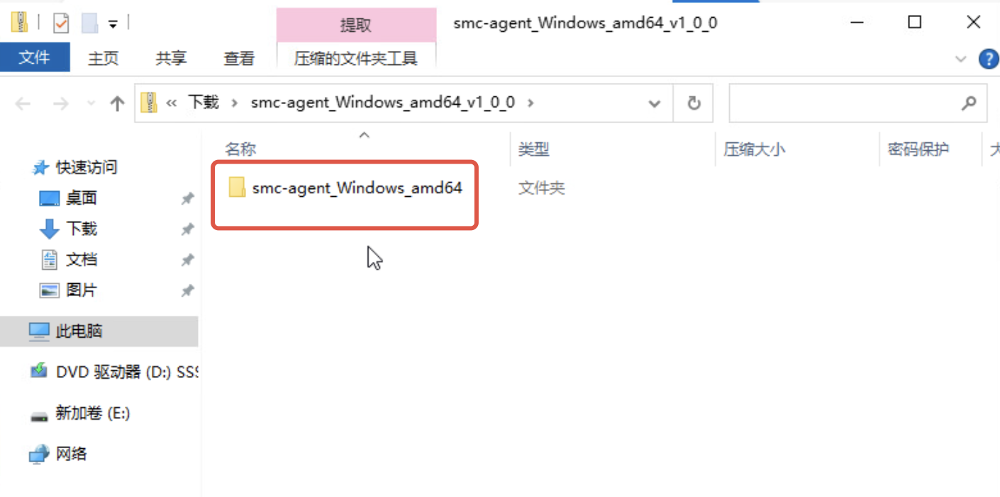

#### 47.2.2.2 执行 agent

进入 smc-agent_Windows_d64 文件夹内，执行 go2cloud 文件并解压。如下图所示：

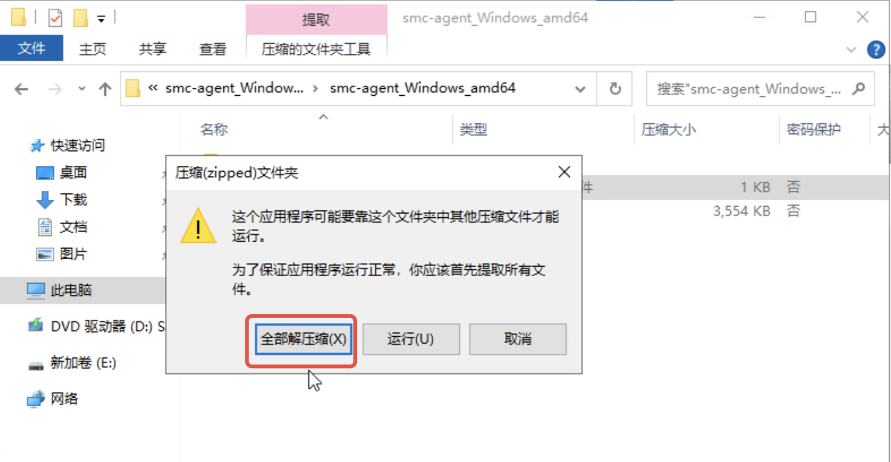

进入解压后的 smc-agent_Windows_d64 文件夹内，执行 go2cloud 文件。如下图所示：

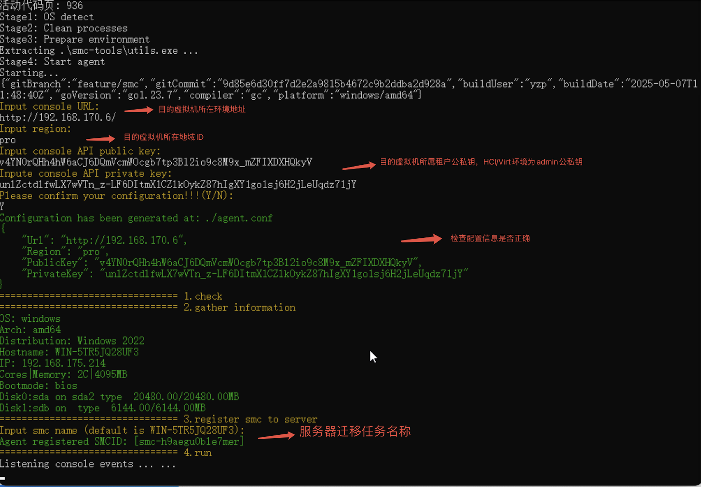

执行完成后，平台服务器迁移中心新增一条状态为在线的迁移任务，如下图所示：


### 47.2.3 同一源虚拟机多次上报迁移任务

源虚拟机已有迁移任务的情况下，支持再次上报迁移任务。如下图所示：

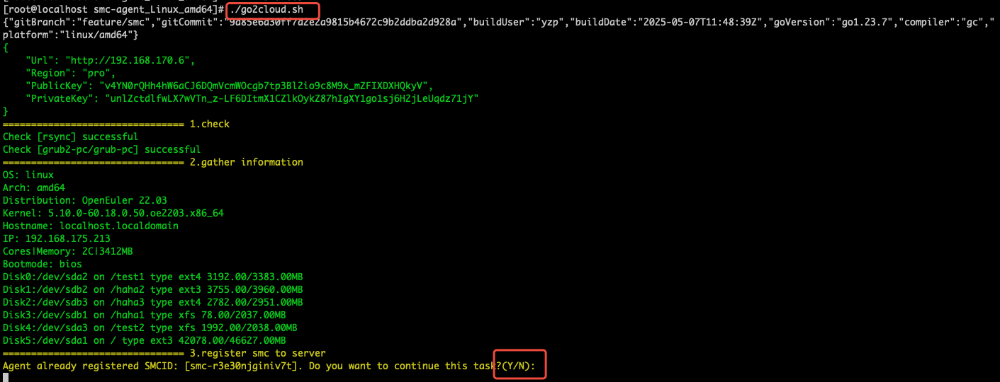

* 输入“Y”：不生成新的迁移任务，继续已有的迁移任务执行；
* 输入“N”：生成新的迁移任务，已有的迁移任务状态变为离线，不再执行；

## 47.3 目标虚拟机准备

### 47.3.1 Linux 目标虚拟机安装插件

Linux 目标机器需要安装rsync、parted，如果镜像内没有，需要自行下载，如下：

```
yum install rsync
yum install parted
```

### 47.3.2 Windows 目的虚拟机安装插件

Windows 目标虚拟机需要安装 Cygwin，在内部运行 rsync、ssh 命令。

1.目标虚拟机可以通过访问 Cygwin 官方网站(https://www.cygwin.com/)下载 Cygwin 安装程序。如下图所示：

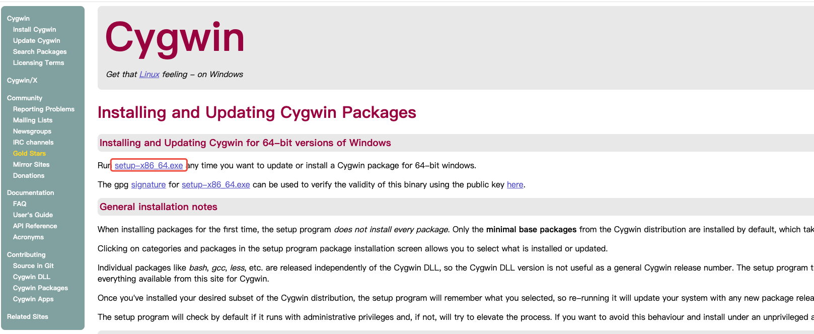

2.下载完成后，双击安装包进行安装。

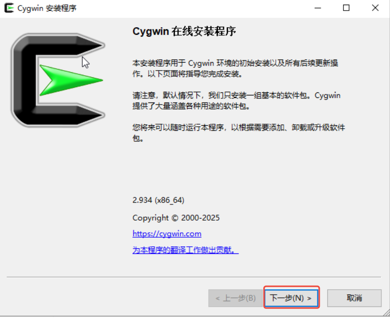

3.选择从互联网安装，并点击“下一步”。

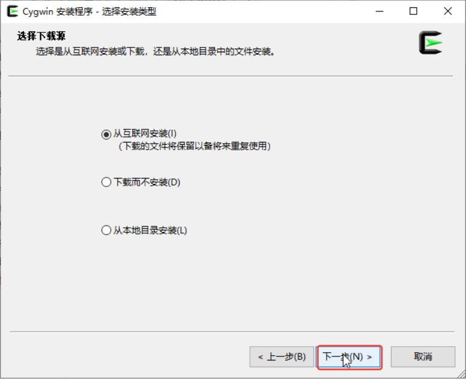

4.选择根安装目录，并点击“下一步”。

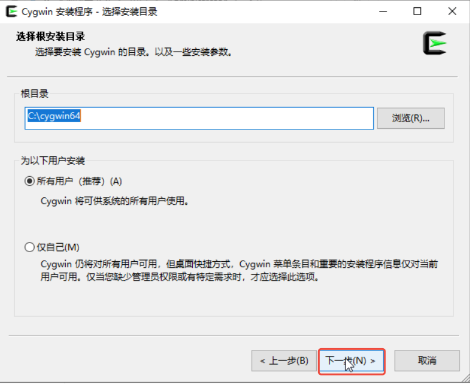

5.选择本地软件包目录，并点击“下一步”。

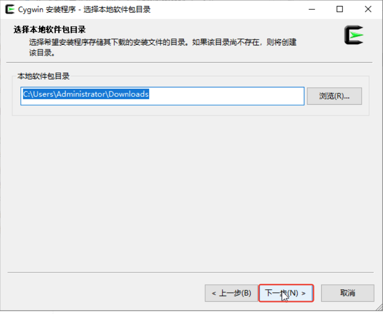

6.选择使用系统代理设置，并点击“下一步”。

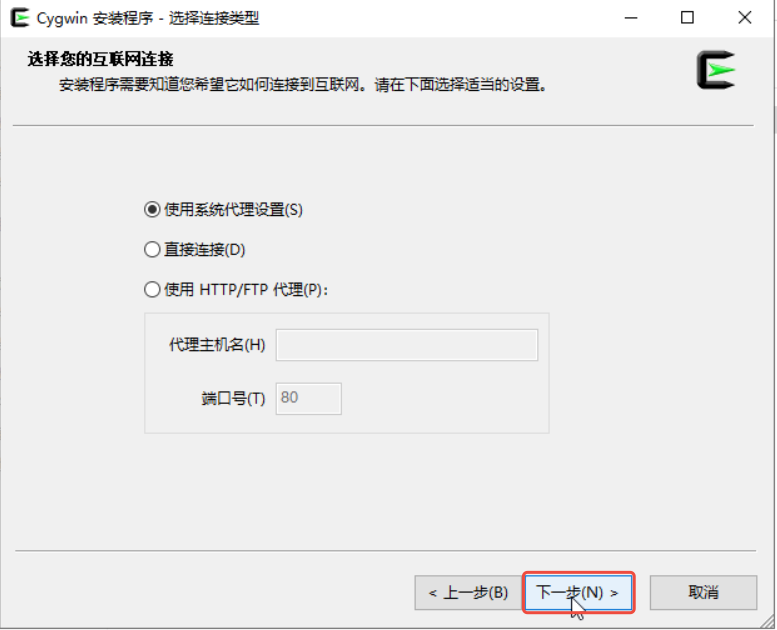

7.选择一个站点，并点击“下一步”。

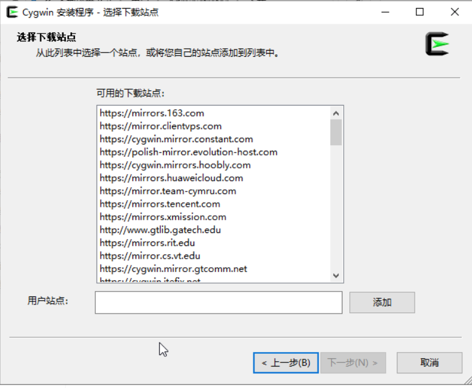

8.选择 rsync 和 ssh 软件包，并点击“下一步”。

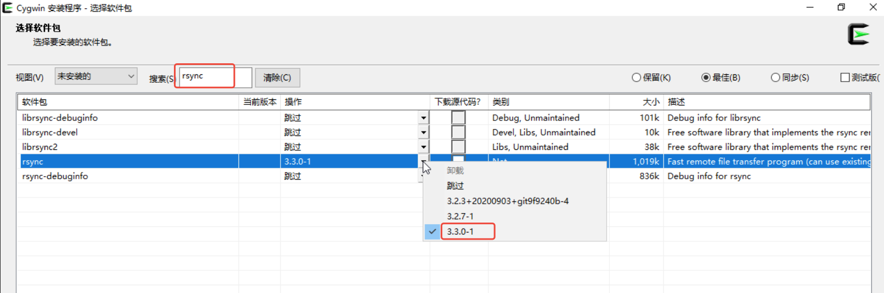

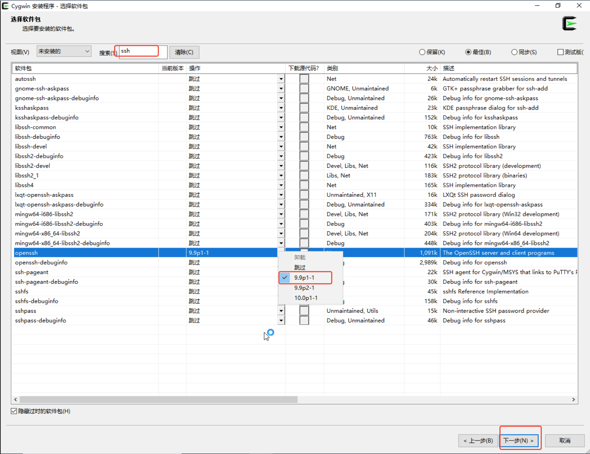

9.确认安装包，并点击“下一步”。

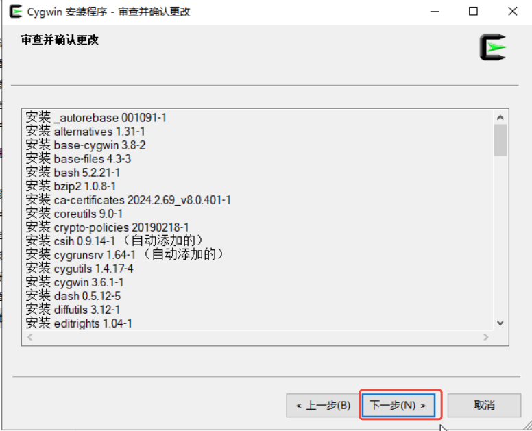

10.点击“完成”，完成安装。

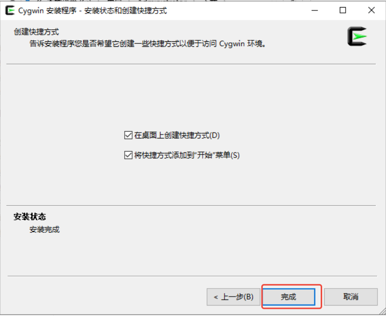

11.安装完成后，双击打开 Cygwin，配置 ssh 密钥，启动 ssh 服务。

```
# 配置ssh密钥
ssh-host-config
 
# 启动ssh服务：
net start cygsshd
```


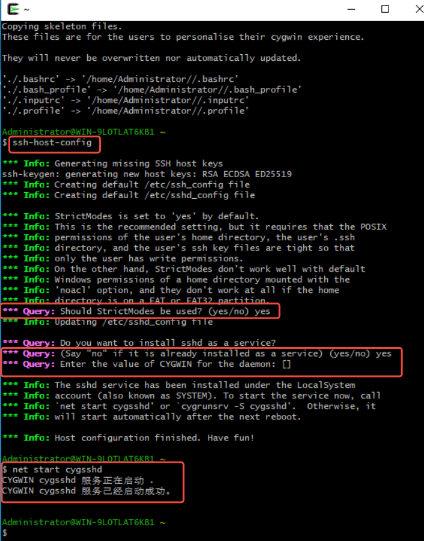

## 47.4 服务器迁移中心操作

### 47.4.1 查看列表信息

平台支持用户查看服务器迁移列表信息，包括任务名称、任务ID、状态、进度、源服务器、目的服务器、传输IP、传输限速、创建时间。如下图所示：


* 任务名称：服务器迁移任务的名称；
* 任务ID：服务器迁移任务的唯一标识；
* 状态：服务器迁移任务的状态，包括在线、准备中、同步中、已同步、停止中、完成中、已完成、离线、异常、失败等；
* 进度：服务器迁移任务同步中时的进度，进度记录已完成迁移的磁盘数量；
* 源服务器：服务器迁移任务的源服务器；
* 目的服务器：服务器迁移任务的目的服务器；
* 传输IP：目的服务器的外网或内网IP，需与源服务器网络联通；
* 传输限速：服务器迁移任务的传输IP限速；
* 创建时间：服务器迁移任务的上报时间；

### 47.4.2 配置

支持用户对未开始迁移且状态为在线的迁移任务配置目标虚拟机相关信息，包括目标虚拟机、目标网络、传输限速、磁盘映射。如下图所示：

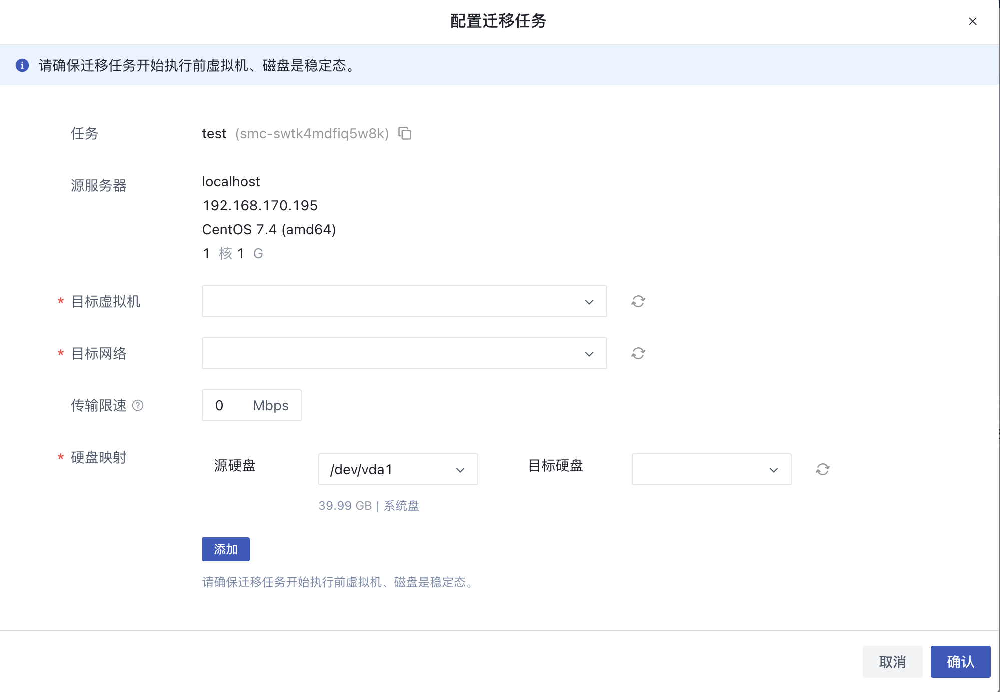

* 目标虚拟机：源服务器准备迁移到的虚拟机；
* 目标网络：支持内/外网，源服务器需要与目标网络联通，才可以迁移；
* 传输限速：支持0-1000Mbps；
* 硬盘映射：源硬盘一个分区对应一个目标硬盘，源服务器的根目录所在分区必选，目标硬盘不可选目标虚拟机的系统盘；

迁移任务未开始迁移前，支持修改配置信息，包括目标虚拟机、目标网络、传输限速、磁盘映射。

### 47.4.3 查看任务详情

平台支持用户查看服务器迁移任务的详情信息，包括概览、操作日志、事件。如下图所示：

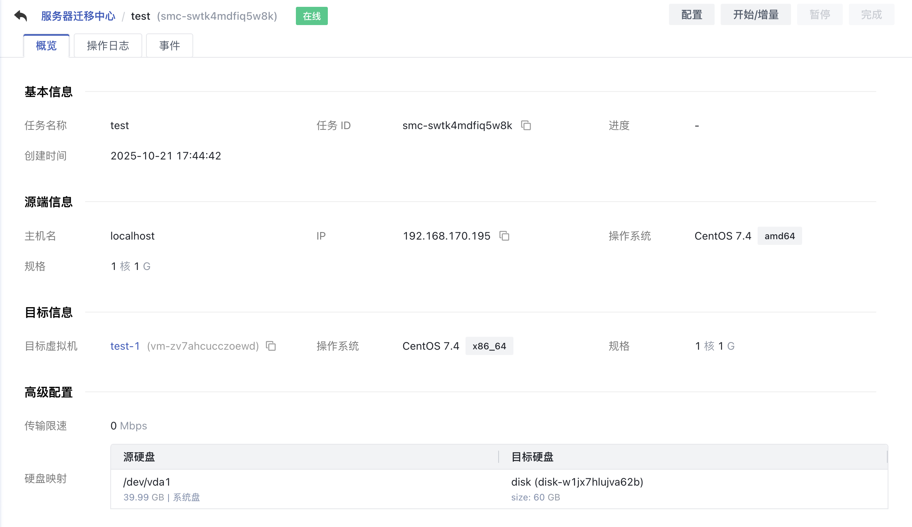

#### 47.4.3.1 概览

支持用户查看服务器迁移任务的概览信息，包括基本信息、源端信息、目标信息、高级配置。

基础信息包括任务名称、任务ID、进度、创建时间，如下图所示：


源端信息包括主机名、IP、操作系统、规格，如下图所示：


目标信息包括目标虚拟机、操作系统、规格，如下图所示：


高级配置包括传输限速、硬盘映射，如下图所示：

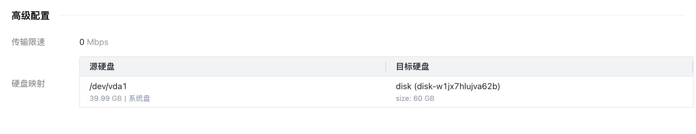

#### 47.4.3.2 操作日志

支持用户查看服务器迁移任务的操作日志，包括操作(API)名称、所属模块、地域、关联资源、操作者、操作结果、操作时间等，如下图所示：

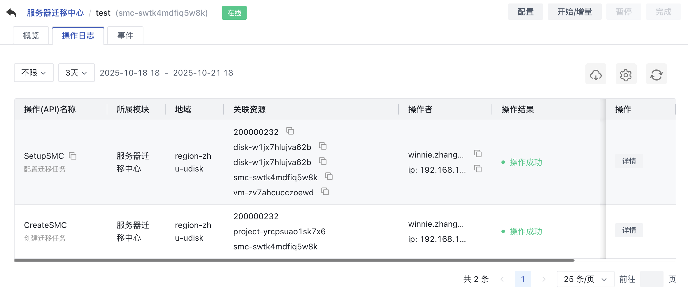

#### 47.4.3.3 事件

支持用户查看服务器迁移任务的事件，包括事件类型、事件等级、事件内容、事件发生次数、开始时间、更新时间等，如下图所示：

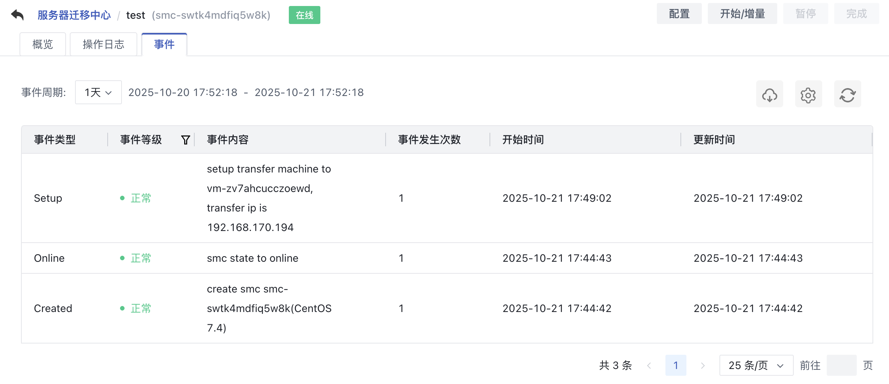

### 47.4.4 开始迁移

支持用户对已配置目的虚拟机信息的迁移任务操作开始迁移，点击“开始/增量”按钮开始迁移，迁移任务经过三个状态：准备中、同步中、已同步，状态为已同步时，表示迁移任务中源虚拟机数据同步完成。如下图所示：

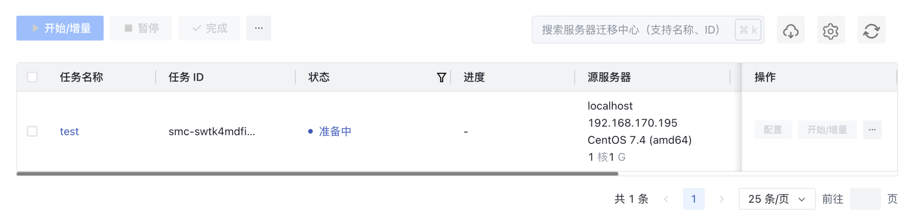

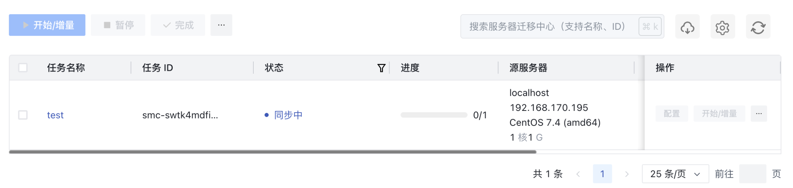


Windows源虚拟机在线迁移时，磁盘会按照容量大小而非实际数据大小去迁移，所以磁盘容量越大，迁移越慢。

### 47.4.5 增量

支持用户对状态为已同步的迁移任务操作增量迁移，点击“开始/增量”按钮执行增量迁移，迁移任务经过三个状态：准备中、同步中、已同步，状态为已同步时，表示迁移任务中源虚拟机数据增量同步完成。如下图所示：

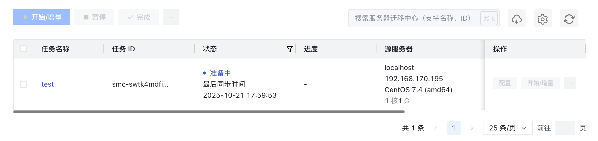

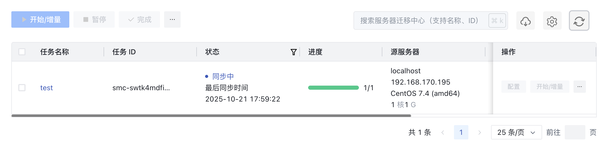

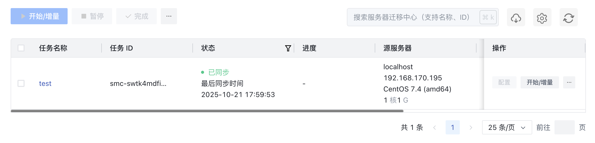

### 47.4.6 暂停

支持用户对状态为同步中的迁移任务操作暂停迁移，点击“暂停”按钮执行暂停迁移，迁移任务经过两个状态：暂停中、在线，状态为在线时，表示迁移任务暂停完成。如下图所示：

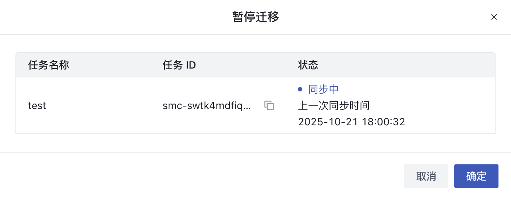

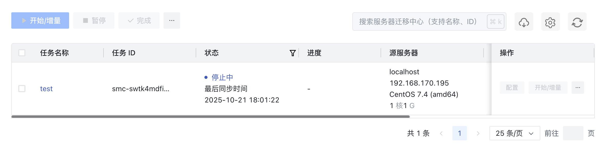


暂停后可以点击“开始/增量”按钮，会从暂停时的进度继续执行开始/增量迁移任务。

### 47.4.7 完成

支持用户对状态为已同步的迁移任务操作完成迁移，点击“完成”按钮执行完全迁移，迁移任务经过两个状态：完成中、已完成，状态为已完成时，表示整个服务器迁移周期完成。如下图所示：

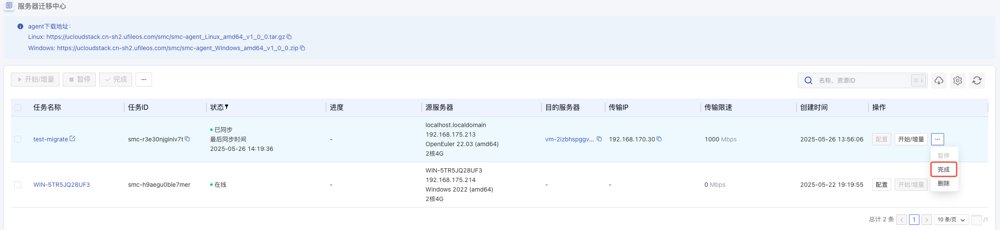


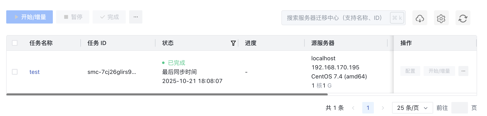

状态为已完成的迁移任务，仅支持删除。

### 47.4.8 删除

支持用户对任意状态的迁移任务操作删除，点击“删除”按钮执行删除迁移任务，迁移任务状态为删除中，删除完成后，该迁移任务在任务列表中删除。如下图所示：

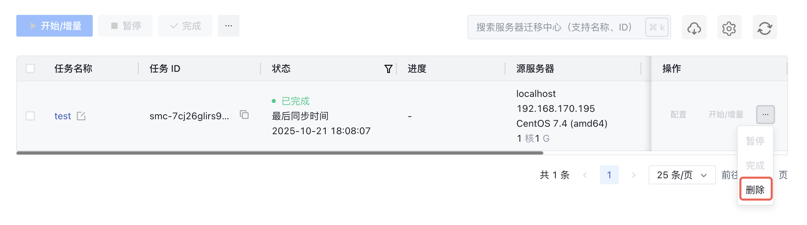

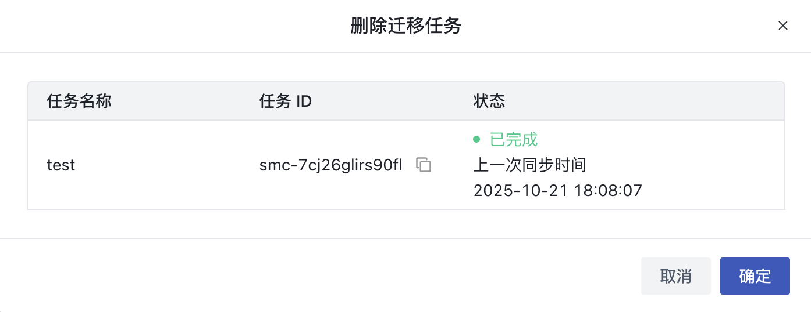

## 47.5 操作系统一览

**已验证操作系统如下：**

**Linux**

| 源系统版本      | 源系统架构 | 源系统引导方式 |
|:----------------|:-----------|:---------------|
| CentOS-7.4      | x86        | BIOS、UEFI     |
| CentOS-7.9      | x86        | BIOS           |
| openEuler 22.03 | x86        | BIOS、UEFI     |
| Ubuntu-14.04    | x86        | BIOS           |
| Ubuntu-16.04    | x86        | BIOS           |
| Ubuntu-18.04    | x86        | BIOS           |
| Ubuntu-22.04    | x86        | BIOS、UEFI     |
| Debian-10.12    | x86        | BIOS           |
| Debian-12.5     | x86        | UEFI           |
| Kylin v10-SP3   | x86        | BIOS           |

**Windows**

| 源系统版本                 | 源系统架构 | 源系统引导方式 |
|:---------------------------|:-----------|:---------------|
| Windows 2008 R2 Datacenter | x86        | BIOS           |
| Windows 2012 R2 Datacenter | x86        | BIOS           |
| Windows 2012 R2 Datacenter | x86        | BIOS           |
| Windows 2019  Datacenter   | x86        | BIOS、UEFI     |
| Windows 2022  Datacenter   | x86        | BIOS、UEFI     |
| Windows 2025  Standard     | x86        | BIOS           |

## 47.6 常见问题

1. **windows2019迁移完成后，发现系统有问题（蓝屏），怎么处理？**

尝试将目标虚拟机的CPU模式改为直通，再关机并重新开启看下。

2. **windwos迁移完成后，发现磁盘处于脱机状态**

Windows操作系统SAN策略分为三种类型，包括OnlineAll、OfflineShared和OfflineInternal，如果windows实例是OfflineShared模式，即默认挂载新云盘后是脱机状态。迁移完成后手动操作磁盘联机下即可。

3. **引导方式为UEFI的Linux源虚拟机迁移完成后，发现引导方式变为了BIOS**

Linux系统的源虚拟机，无论引导方式为UEFI或BIOS，迁移完成后的目标虚拟机引导方式都更改为BIOS。
Windows系统的虚拟机，迁移过程不会更改引导方式，迁移完成后的目标虚拟机与源虚拟机引导方式一致。
