# 5 网卡

网卡（ Elastic Network Interface, ENI ）是一种可随时附加到虚拟机的弹性网络接口，支持绑定和解绑，可在多个虚拟机间灵活迁移，为虚拟机提供高可用集群搭建能力，同时可实现精细化网络管理及廉价故障转移方案。

网卡与虚拟机自带的默认网卡（一个内网网卡和一个外网网卡）均是为虚拟机提供网络传输的虚拟网络设备，分为内网网卡和外网网卡两种类型，同时均会从所属网络中分配  IP 地址、网关、子网掩码及路由相关网络信息。

* 内网类型的网卡所属网络为 VPC 和子网，同时从 VPC 中自动或手动分配 IP 地址。
* 外网类型的网卡所属网络为外网网段，同时会从外网网段中自动或手动分配 IP 地址，且分配的 IP 地址与网卡生命周期一致，仅支持随网卡销毁而释放。
* 当网卡类型为外网时，网卡会根据所选外网 IP 的带宽规格进行计费，用户可根据业务需要，选择适合的付费方式和购买时长。

网卡具有独立的生命周期，支持绑定和解绑管理，可在多个虚拟机间自由迁移；虚拟机被销毁时，网卡将自动解绑，可绑定至另一台虚拟机使用。

网卡具有地域（数据中心）属性，仅支持绑定相同数据中心的虚拟机。**一块网卡仅支持绑定至一个虚拟机，x86 架构虚拟机最多支持绑定 6 块网卡，ARM 架构虚拟机最多支持绑定 3 块网卡**。外网网卡被绑定至虚拟机后，不影响虚拟机默认网络出口策略，包含虚拟机上网卡绑定的外网 IP 在内，以第一个有默认路由的 IP 作为虚拟机的默认网络出口，用户可设置某一个有默认路由的外网 IP 为虚拟机默认网络出口。

每块网卡仅支持分配一个 IP 地址，并可根据需要绑定一个安全组，用于控制进出网卡的流量，实现精细化网络安全管控；如无需对网卡的流量进行管控，可将网卡的安全组置空。

用户可通过平台自定义创建网卡，并对网卡进行绑定、解绑及修改安全组等相关操作，对于外网网卡还可进行【调整带宽】操作，用于调整外网网卡上的外网 IP 地址的带宽上限。

## 5.1 创建网卡

云平台用户可通过 API 接口或控制台创建一块网卡，用于扩展虚拟机的网络接口。创建网卡前需保证账户至少拥有一个 VPC 网络和子网或外网网段。通过导航栏进入虚拟机控制台，切换至【网卡】网卡管理页面，点击“**创建**”按钮进入创建网卡向导页，如下分别是创建内网类型和外网类型的示意图：

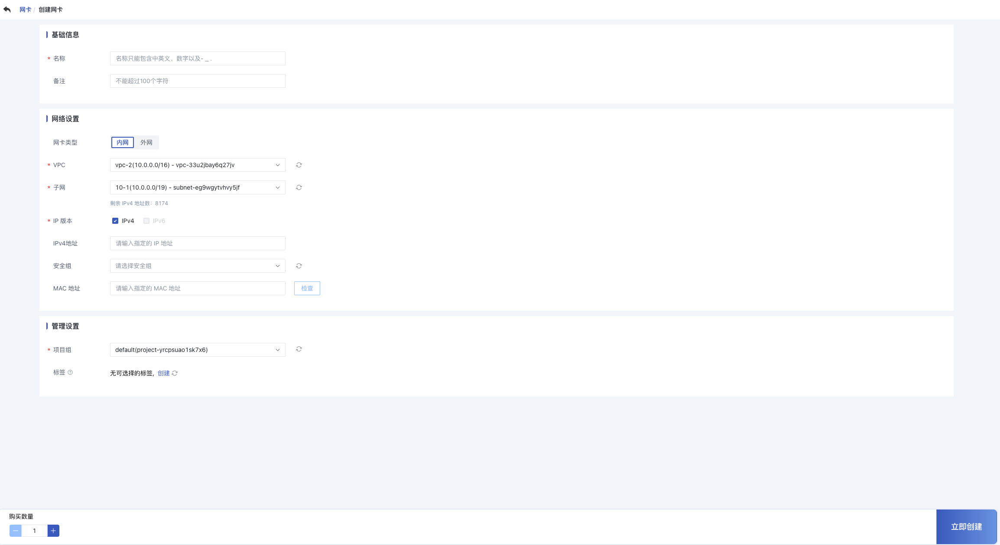

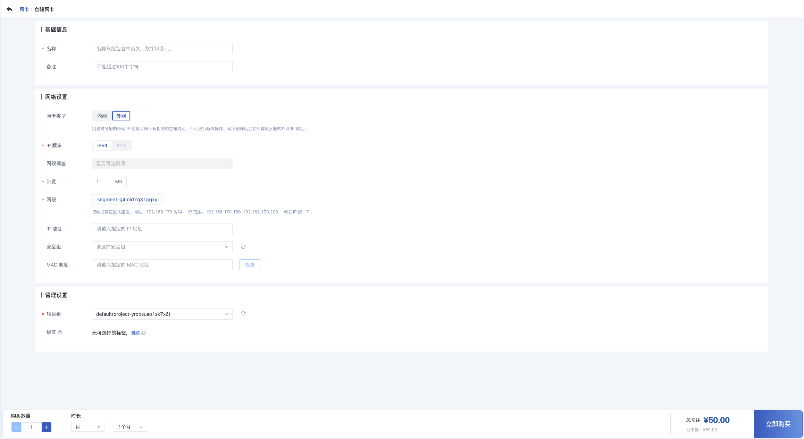

* 名称：当前需要创建网卡的名称及标识；
* 网卡类型：网卡的类型，包括内网网卡和外网网卡，分别从 VPC 和外网网段中分配 IP 地址。
* 所属网络：网卡的所属网络，创建时必须指定。
  * 内网类型的网卡所属网络为 VPC 和子网，同时从 VPC 中自动或手动分配 IP 地址，创建时需指定可用 IP 数量充足的子网。
  * 外网类型的网卡所属网络为外网网段，同时会从外网网段中自动或手动分配 IP 地址，创建时需指定可用 IP 数量充足的外网网段，并配置外网 IP 地址的带宽上限。
* IP 版本：内网网卡支持 IPv4 版本，外网网卡支持 IPv4 和 IPv6 版本。
* IP 地址：当前网卡的 IP 地址，默认会从所属网络的 IP 地址段中自动分配 IP 地址，如需自定义 IP 地址，可在 IP 地址栏中输入指定的 IP 地址。若手动指定的 IP 地址已被使用，则会弹出占用提示。
* 安全组：当前网卡需要绑定的安全组，用于管控进出网卡的网络流量；支持暂不绑定操作，即当前网卡暂不绑定安全组。

> 网卡绑定的安全组与虚拟机绑定的内/外网安全组互不影响，网卡的绑定的安全组仅对关联的网卡流量进行安全管控。

创建外网网卡时，会根据外网 IP 的带宽规格进行计费，用户可根据需要选择适合的付费方式和购买时长。网卡创建时状态为“创建中”，待状态转换为“未绑定” 时，即代表网卡创建成功，可进行绑定虚拟机操作，同时可修改网卡的安全组。

**HCI 版和 Virt 版创建网卡**

通过导航栏进入网卡列表页，点击“**创建**”按钮进入创建网卡向导页：

- 名称/备注：网卡的名称及备注，名称不能超过 30 个字符，备注不能超过 100 个字符。
- IP 版本：支持创建未开启 IP 地址管理/IPv4/IPv6 版本的网卡。
- 网卡类型：HCI 版和 Virt 版支持的网卡类型是扁平网络。
- 扁平网络：网卡所属的扁平网络，根据 IP 版本筛选出对应类型的扁平网络。
  - 展示扁平网络是否开启 IP 地址管理，已开启 IP 地址管理的扁平网络会展示网段及 IP 范围。
  - 展示扁平网络是否存在默认路由。
- IP 地址：未开启 IP 地址管理的扁平网络不支持指定 IP 地址；创建单个 IPv4/IPv6 地址支持指定 IP 地址，批量创建不支持指定 IP 地址。
- 安全组：支持为网卡绑定安全组。

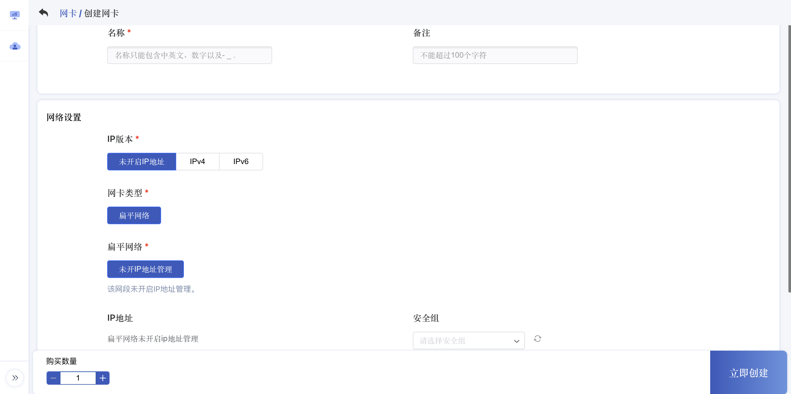

## 5.2 查看网卡

通过导航栏进入虚拟机控制台，切换至网卡管理页面可查看网卡资源的列表及相关信息，包括网卡的名称、资源 ID、状态、网卡类型、所属网络、IP 地址、绑定资源、安全组、项目组、创建时间及操作项等，如下图所示：

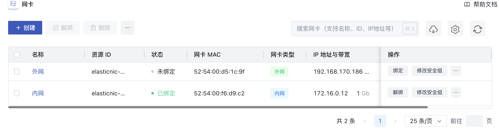

* 名称/资源 ID：网卡的名称及全局唯一标识符。
* 网卡类型：网卡的类型，包括内网网卡和外网网卡两种类型，分别对应 VPC 网络和外网网络，**HCI 版和 Virt 版的网卡类型为扁平**。
* 所属网络：网卡的所属网络，内网类型时所属网络为指定的 VPC 和子网，外网类型时所属网络为指定的外网网络和网段，**HCI 版和 Virt 版的所属网络为扁平网络 ID 和网段**。
* IP 地址：当前网卡从所属网络中分配的 IP 地址，同时也是绑定至虚拟机后网卡上所配置的 IP 地址；若网卡为外网类型，在 IP 地址后会展示该 IP 地址的带宽上限。
* 绑定资源：网卡已绑定的虚拟机资源名称和 ID ，若未指定则为空。
* 修改告警模版：支持更新告警模版，可以为空。
* 安全组：网卡绑定的安全组名称或 ID，若未指定则为空，可通过修改安全组绑定安全组。
* 创建时间：当前网卡的创建时间。
* 项目组：当前网卡的项目组信息，**HCI 版和 Virt 版无项目组功能**。
* 状态：网卡的当前状态，包括创建中、未绑定、已绑定、删除中等状态。

列表上的操作项是指对单块网卡的操作，包括绑定、解绑、修改告警模版、修改安全组、调整带宽及删除等，可通过搜索框对网卡列表进行搜索和筛选，支持模糊搜索。

为方便租户对网卡资源的统计及维护，平台支持下载当前用户所拥有的所有网卡资源列表信息为 Excel  表格；同时支持对网卡进行批量解绑和批量删除操作。

## 5.3 绑定网卡

绑定网卡是指将一块网卡绑定至一台虚拟机，用于扩展虚拟机的网络接口。

* 一块网卡仅支持绑定至一个虚拟机，仅支持绑定相同数据中心且处于关机或运行中状态的虚拟机；支持无 QGA 虚拟机绑定外网 IP ，但实际 IP 下发需手动进入虚拟机配置。
* **X86 架构虚拟机最多可绑定 6 块网卡，ARM 架构虚拟机最多支持绑定 3 块网卡；**

可通过网卡资源列表操作项的“**绑定**”按钮，进行虚拟机绑定操作，如下图所示：

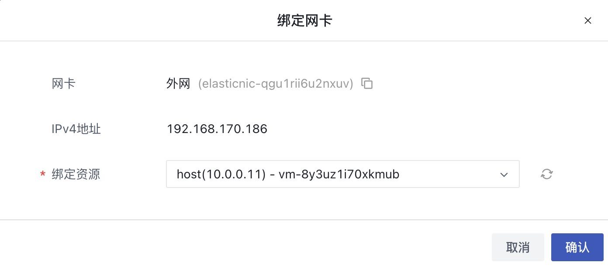

绑定时需选择需要绑定网卡的虚拟机，状态变更为“**已绑定**”即代表绑定成功，用户也可通过虚拟机的网络信息查看已绑定的网卡资源及信息。绑定成功后，虚拟机的操作系统中即会增加一块网卡，并配置网卡上所分配的 IP 地址及相关信息，同时会在操作系统中下发所属网络的路由信息。

## 5.4 解绑网卡

解绑网卡是指将网卡从虚拟机上分离出来，并可重新绑定至其它虚拟机，仅支持解绑已绑定状态的网卡资源。用户可通过网卡列表或已绑定虚拟机详情网络页面进行网卡的解绑操作，如下图所示：

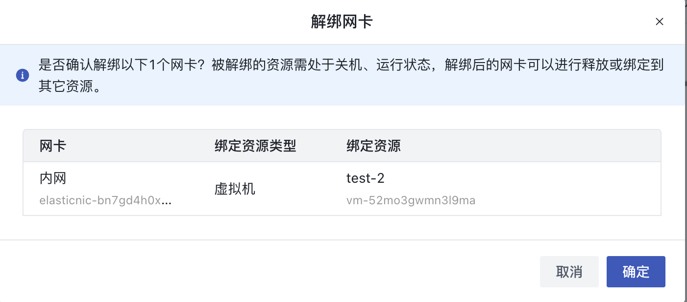

解绑时，虚拟机的状态必须处于关机或运行中状态。网卡状态转换为“未绑定”，即代表解绑成功。解绑后网卡的 IP 地址及安全组信息保持不变，可将网卡绑定至其它虚拟机。

解绑成功后，虚拟机的操作系统中原有的网卡信息将会自动被清除，若解绑前网卡为当前虚拟机的默认网络出口，解绑后虚拟机将会从虚拟机已绑定的外网 IP 中自动选择一个有默认路由的外网 IP 作为虚拟机的默认网络出口。

## 5.5 调整 QoS

调整网卡 QoS 是指为网卡设置带宽限制，以实现网络流量的精确控制。启用 QoS 后，用户可以分别配置网卡的入带宽和出带宽，带宽范围可根据规格配置进行调整。用户可通过网卡列表页面进行 QoS 的启用或调整操作，如下图所示：

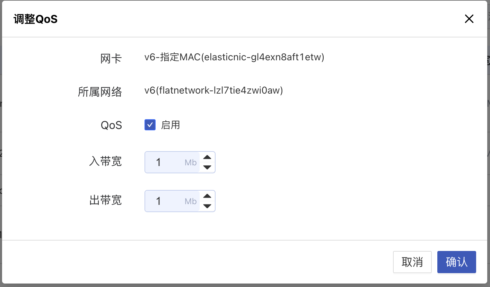

在启用网卡 QoS 时，网卡不允许同时开启网卡网络加速模式。启用 QoS 后，用户可以灵活调整网卡的带宽设置，以满足不同应用场景的需求；若禁用 QoS ，网卡的网络流量将不受带宽限制。成功调整网卡 QoS 后，网卡的网络性能配置将立即生效，并影响虚拟机的网络流量策略。

> Pro 版网卡不支持调整 QoS 功能。

## 5.6 修改 MAC 地址

修改网卡 MAC 地址是指对网卡的物理地址进行重新设置，仅支持以下场景：

* 未绑定状态的网卡。
* 绑定至关机状态的虚拟机的网卡。

用户可通过网卡列表页面或已绑定虚拟机的详情网络页面进行 MAC 地址的修改操作，如下图所示：

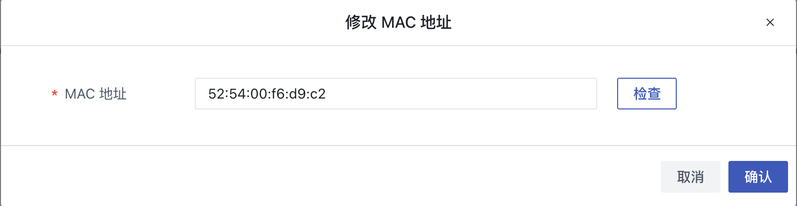

在创建虚拟机或网卡时，用户还可以检查并指定网卡的 MAC 地址，确保网络配置满足特定需求。

**操作说明：**

1. 修改MAC地址时，需确保网卡状态符合上述支持的场景。
2. 修改成功后，网卡的新MAC地址将立即生效，并在网络配置中更新。
3. 修改MAC地址可能会影响已绑定虚拟机的网络连接，建议在关机状态下进行操作。
4. 某些网络环境可能对MAC地址的变化有严格要求，请确保在修改前了解具体网络配置需求。

## 5.7 修改 SR-IOV 网卡型号

修改SR-IOV网卡型号功能支持用户根据业务需求启用、停用或更新绑定到关机虚拟机上的网卡的SR-IOV模式，从而灵活调整网卡性能及功能适配。

用户可通过网卡列表页面或虚拟机的网络详情页面进行操作，如下图所示：

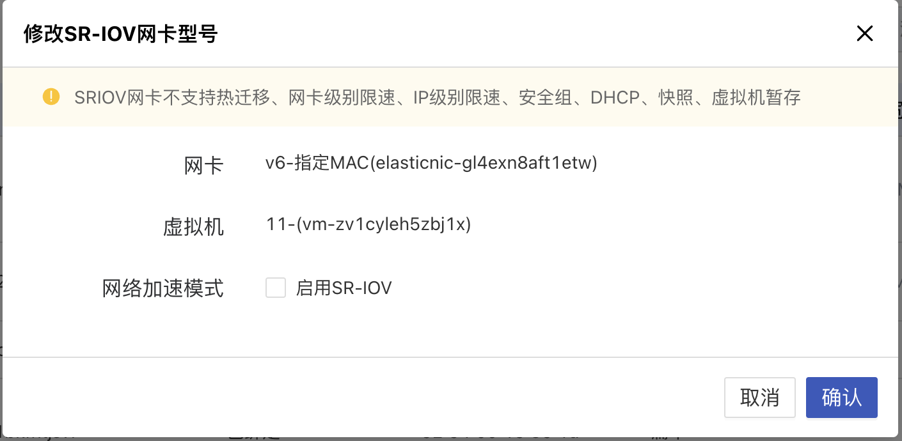

* **SR-IOV简介**
  * **SR-IOV** （Single Root I/O Virtualization）是一种网络虚拟化技术，可显著提升网络性能和资源隔离能力。启用SR-IOV模式后，网卡可直通至虚拟机，减少网络延迟和CPU开销。
* **支持操作**
  * **启用** ：将普通网卡切换为SR-IOV模式，提升网卡性能。
  * **停用** ：将SR-IOV网卡切换为普通模式，适用于对直通性能要求不高的场景。
  * **更新** ：更改SR-IOV网卡型号以匹配新的硬件资源或性能需求。
* **适用场景**
  * 高性能计算、实时通信等对网络延迟和吞吐量要求较高的业务。
  * 网络负载较低或普通业务无需SR-IOV支持时，可切换回普通模式以节省资源。

> Pro 版网卡不支持调整 SR-IOV 功能。

**注意事项：**

* **虚拟机状态要求** ：绑定至虚拟机的网卡仅支持关机状态修改SR-IOV网卡型号，启用或停用操作均需在虚拟机关机时进行。
* **硬件支持要求** ：启用SR-IOV模式需确保物理机硬件和网卡驱动支持SR-IOV功能。
* **网络配置同步** ：更新网卡型号后，请检查相关网络配置是否需同步调整。
* **生效范围** ：调整完成后，SR-IOV模式将在虚拟机启动后正式生效。
* 网卡启动 SR-IOV 之后，不支持对网卡的各个指标进行监控。

## 5.8 修改安全组

支持在网卡的视角修改网卡的安全组，同时支持配置 “无安全组”用于解绑安全组。安全组作用的最小单位是网卡，若网卡被绑定至虚拟机，网卡的安全组策略仅对当前网卡的流量出入进行限制，不影响虚拟机默认网卡及其它网卡的流量出入。

用户可通过网卡管理控制台列表上的“修改安全组”进行修改，如下图所示：

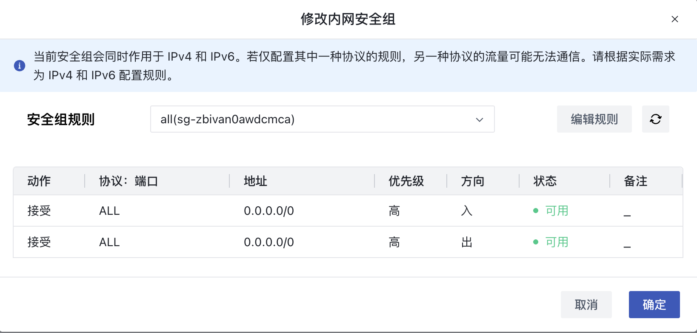

一块网卡仅支持绑定一个安全组，修改成功后用户可通过网卡列表信息查看已修改的安全组信息。

> 仅当网卡已绑定安全组时，才可通过“无安全组“解绑已绑定的安全组。

## 5.9 删除网卡

支持用户删除未绑定状态的网卡资源，即仅支持删除【未绑定】状态的网卡。删除网卡后，会自动解绑与之关联的安全组。用户可通过网卡列表进行网卡的删除操作，支持批量删除。

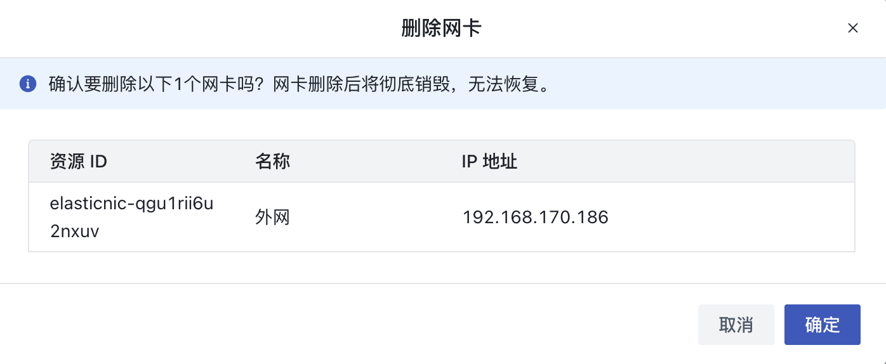

## 5.10 修改名称和备注

修改网卡的名称和备注，在任何状态下均可进行操作。可通过网卡列表页面每个网卡名称右侧的“编辑”按钮进行修改。

## 5.11 调整 IP 带宽

支持用户调整外网网卡的 IP 带宽，可通过网卡列表操作项中的【调整 IP 带宽】进行操作，如下图所示：

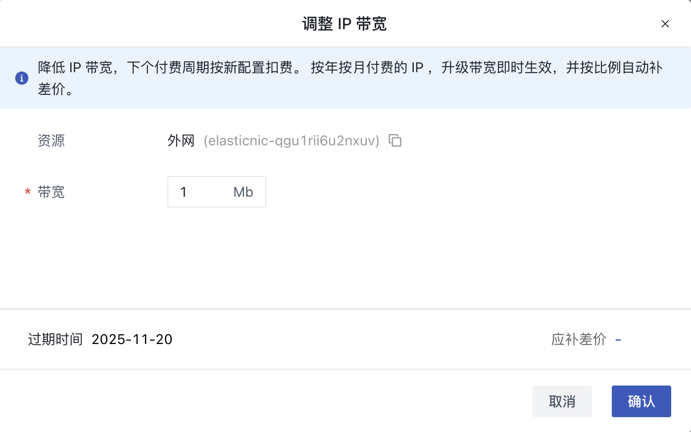

仅支持外网类型的网卡进行带宽调整操作，同时会根据 IP 带宽进行计费，需确保账户余额充足。

    HCI 版和 Virt 版网卡同样可支持调整 IP 带宽功能且没有带宽计费功能，调整 IP 带宽可以适应业务对带宽的不同需求。值得注意的是，如果网卡所属的扁平网络未开启IP地址管理，则这类网卡不允许调整 IP 带宽。

## 5.12 续费

支持用户手动对外网网卡进行续费，续费操作只针对资源本身，不对资源额外关联的资源进行续费。额外关联的资源到期后，会自动解绑，为保证业务正常使用，需及时对相关资源进行续费操作。

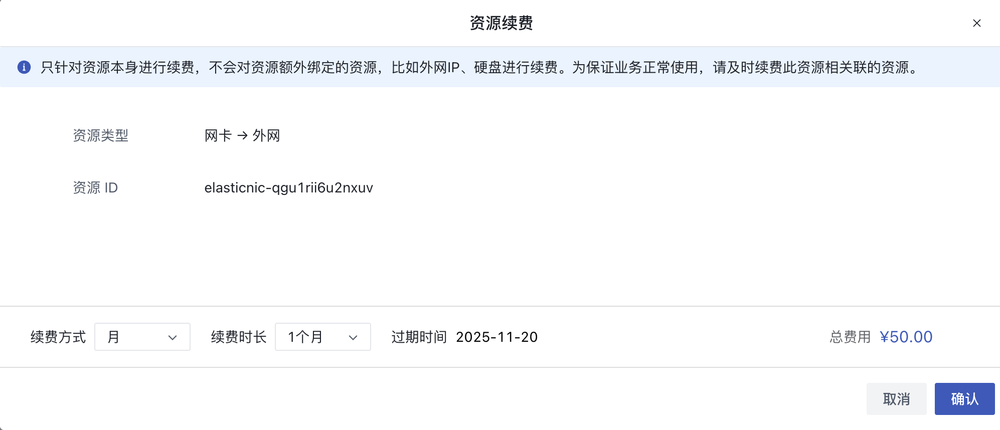

外网网卡续费时支持更改续费方式，只可由短周期改为长周期，例如按月的续费方式可更改为按月、按年。

外网网卡续费时会按照续费时长收取费用，续费时长与资源的计费方式相匹配，计费方式为【小时】，则续费时长指定为 1 小时；计费方式为【按月】，则续费时长可选择 1 至 11 月；计费方式为【按年】，则续费时长为 1 至 5 年。

> **HCI 版和 Virt 版网卡不支持续费功能。**

## 5.13 修改告警模版

支持用户修改网卡告警模板。

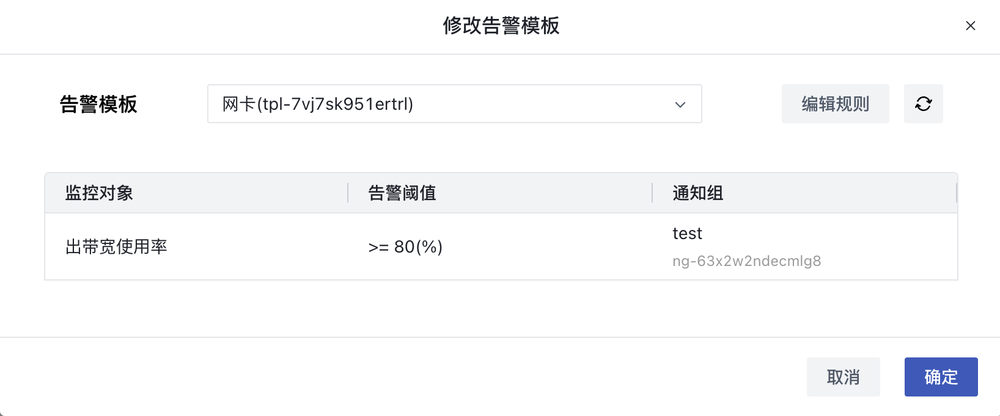
