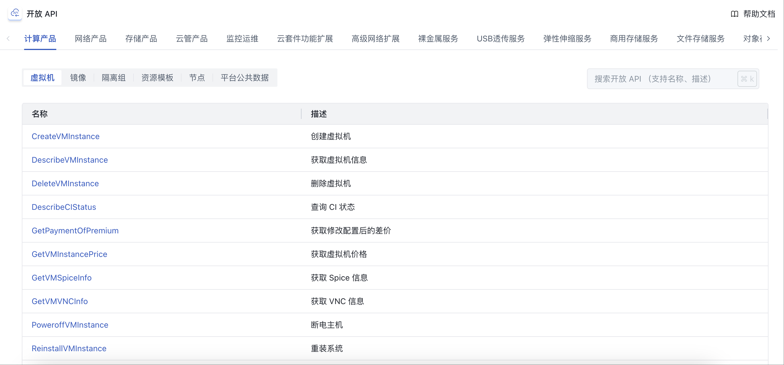
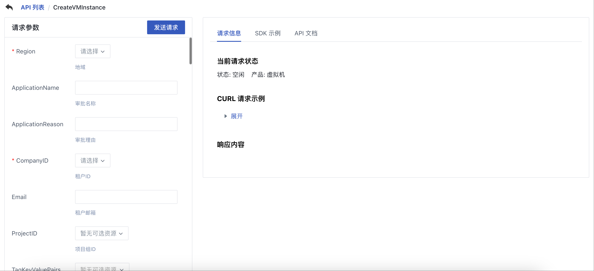
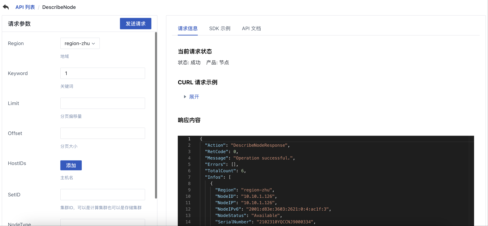
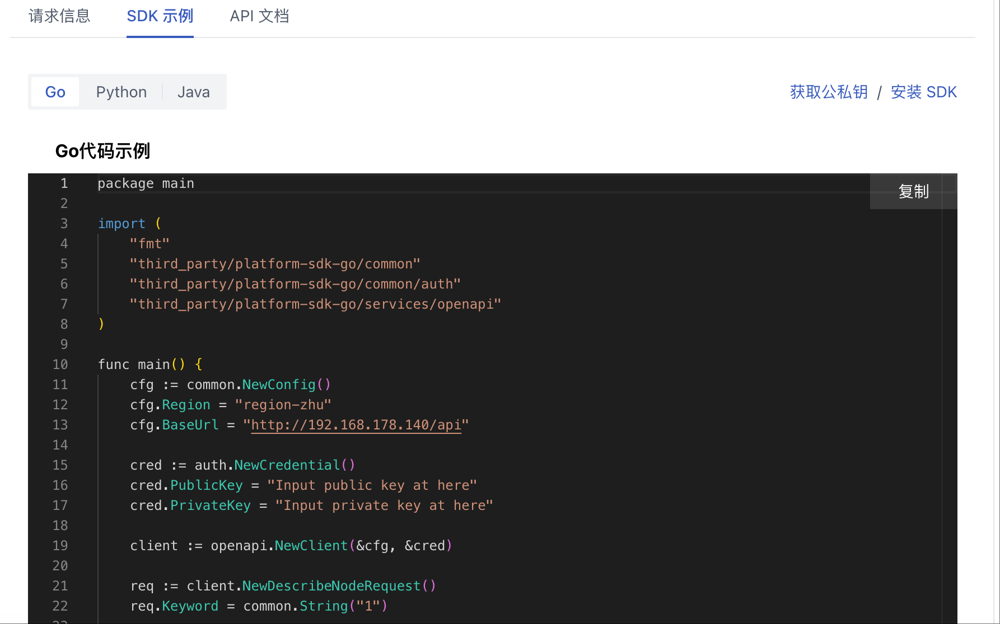
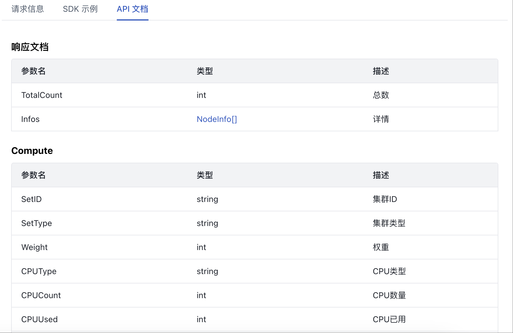

# 35 开放 API

## 35.1 概述

云平台 API 接口文档，提供对云平台 API 的调用和参数的解释说明。按照租户权限展示可以调用的 API 列表。租户可以在页面添加请求参数，发送请求对当前账号的线上资源操作，请求发送成功后会在请求信息中展示当前请求状态，请求内容，以及响应结果，在 API 文档中展示响应文档，展示响应值的参数，类型，及对应描述。

## 35.2 查看 API 列表

在开发 API 列表中，租户可以按照产品模块查看对应产品子模块的 API 列表，例如下图所示，计算产品，虚拟机的相关 API 信息。支持按照 API 名称和描述进行模糊搜索。

## 35.3 查看 API 详情

点击 API 操作栏“详情”按钮，跳转至 API 详情页，如下图所示:

## 35.4 发送请求

添加请求参数后点击发送请求，返回请求信息，包含当前请求状态，请求内容，响应信息，如下图所示:

## 35.5 查看 SDK 示例

SDK 示例，展示通过 API 方式调用接口的样例，目前支持展示 Go、Python、Java 语言样例。点击获取公私钥，可以获取租户的密钥，替换样例中的 PublicKey、PrivateKey 值。点击安装 SDK，可以获取 SDK 的离线包，根据下载包内 README.md 文件，进行 SDK 的使用。

## 35.6 查看 API 文档

API 文档中展示响应文档，包含参数名，类型，描述。如下图所示：

