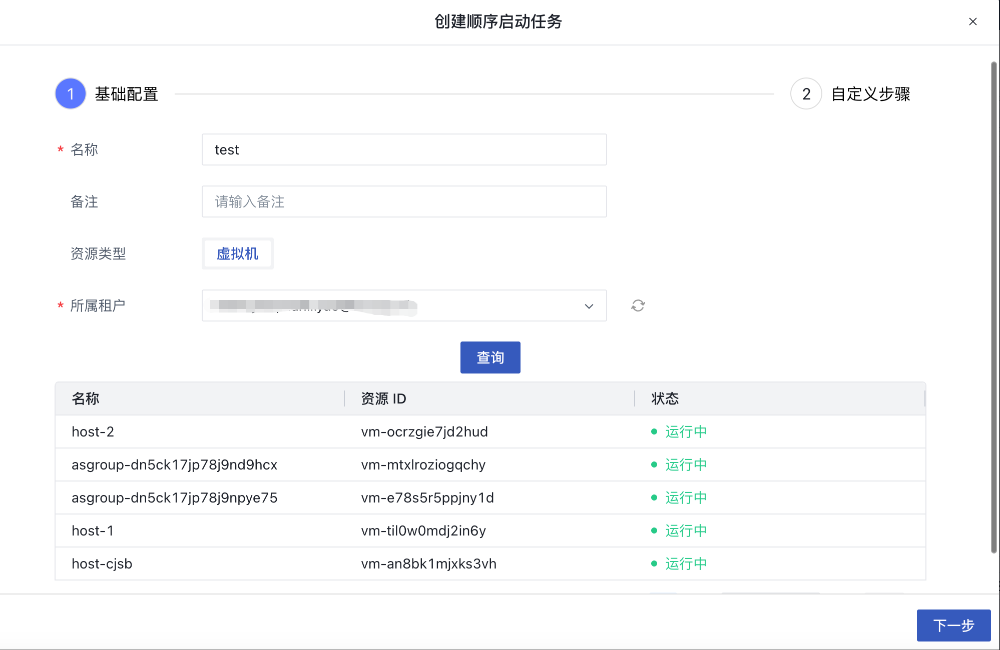
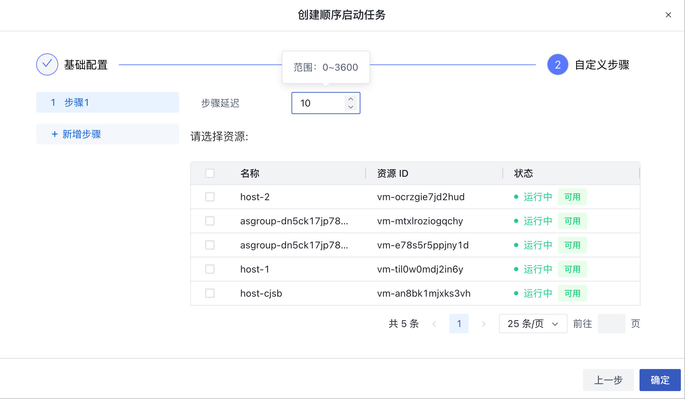
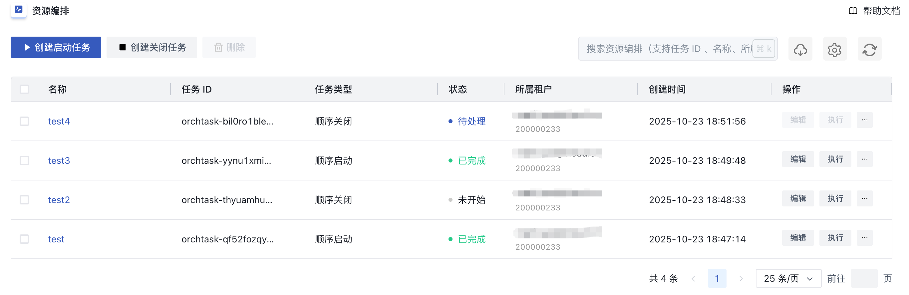
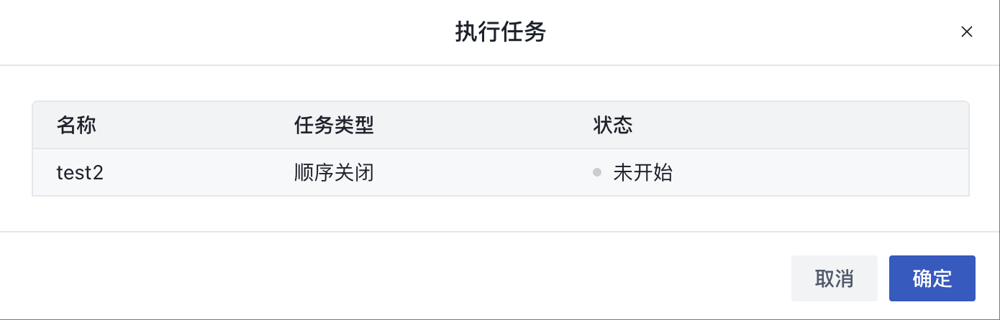
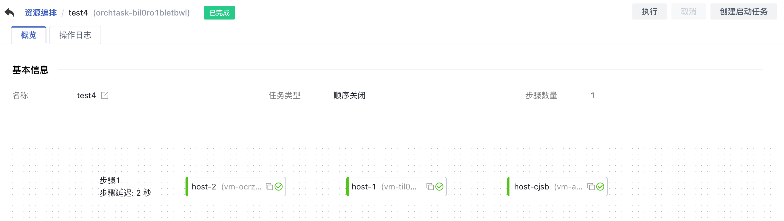
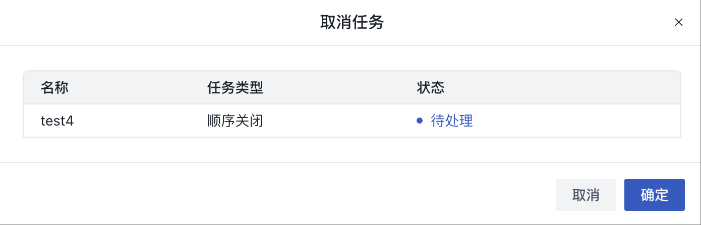
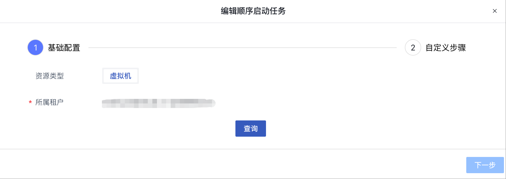
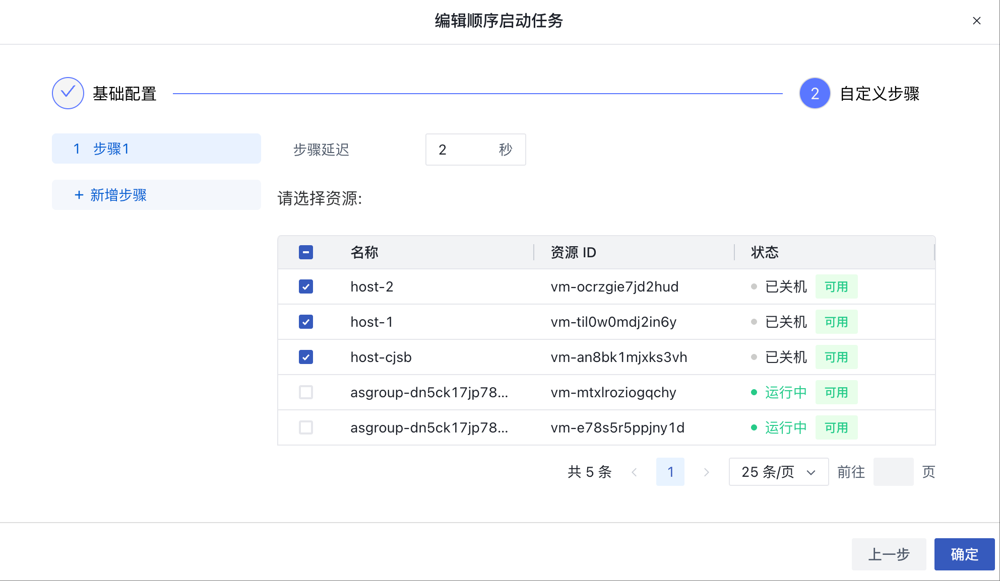
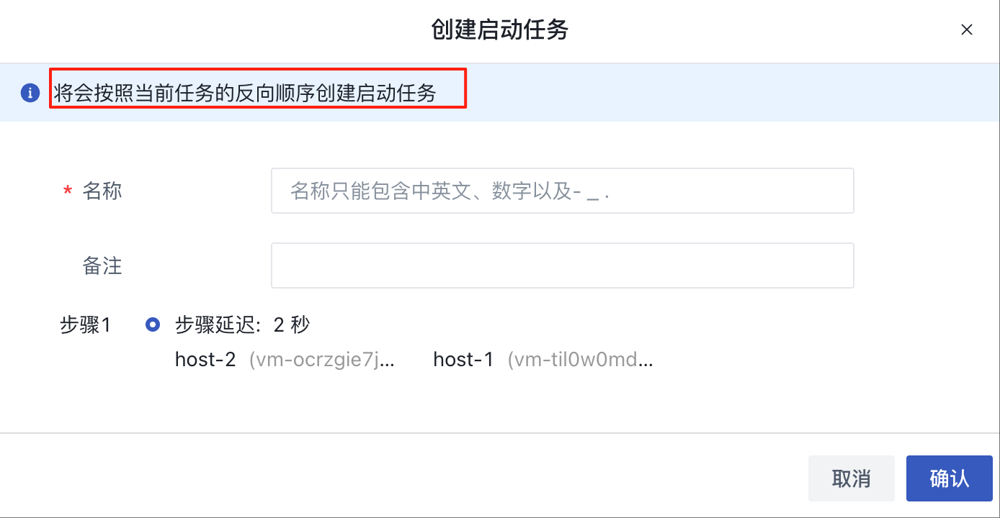
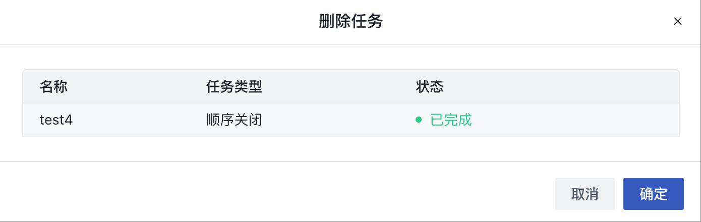

# 46 资源编排

## 46.1 概述

**资源编排**功能允许用户通过创建自动化任务，批量执行一组虚拟机的启动或关机操作。该功能特别适用于定期维护、性能优化及灾难恢复等场景，能够提升运维效率并优化资源利用。

## 46.2 功能说明

### 46.2.1 创建任务
用户可以创建 启动/关闭任务，以对一组虚拟机执行批量的 开机/关机 操作。在页面顶部，选择“创建启动任务”或“创建关闭任务”按钮，根据需要创建不同类型的任务。创建操作分为两步：

1. **基础配置**：首先用户需要查询名下所有的虚拟机：

2. **自定义步骤**：用户可以根据需求增加或减少步骤，设置每个步骤的延迟时间（0-3600秒），并选择要操作的虚拟机。每台虚拟机只能被选择一次，不能重复出现在多个步骤中：

### 46.2.2 任务列表

任务列表页面显示了所有已创建的任务，包括任务的名称、ID、类型、状态、所属租户、创建时间和可执行的操作。

- 名称: 任务的描述性名称，用户可以根据需要修改；
- 任务 ID: 系统为每个任务分配的唯一标识符；
- 任务类型: 任务的类型，例如“顺序关闭”或“顺序启动”；
- 状态: 显示任务的当前状态，如“已完成”、“处理中”和“未开始”等；
- 所属租户: 任务所属的租户信息，包括租户的邮箱和租户 ID；
- 创建时间: 任务创建的日期；
- 操作: 提供了对任务执行、取消、编辑和删除的选项。

### 46.2.3 执行/取消 任务

1. 执行任务可将任务中定义的步骤依次执行，直到所有步骤都执行完毕。在任务列表页面，点击“执行”按钮，确认后即可执行，如下图所示：

> **若任务中存在错误，系统会提示错误信息，并停止执行**

2. 任务执行过程中，用户可以点击任务名称查看详情页，了解任务的执行进度、步骤延迟时间及执行结果等信息：

3. 若需要取消正在执行的任务，点击“取消”按钮，确认后即可取消，如下图所示：

### 46.2.4 编辑任务

若需要修改任务，点击“编辑”按钮，进入任务编辑页面：

正在运行的任务无法编辑。编辑流程与创建任务类似，用户需重新查询租户下的虚拟机，并在第二步中对任务进行编辑。可修改的内容包括：增加或减少步骤、调整延迟时间、选择不同的虚拟机：	

### 46.2.5 创建反向任务

用户可以基于现有任务一键创建反向任务。例如，若已有关闭虚拟机任务，用户可以创建一个反向顺序的虚拟机启动任务：

### 46.2.6 删除任务

如需删除任务，点击“删除”按钮，确认后即可删除，如下图所示：

