# 26 对象存储

## 26.1 对象存储概述

对象存储服务OSS（Object Storage Service），兼容亚马逊云的 S3 API（接口协议），仅需在私有云平台上创建对象存储实例，便可以在任何应用、任何时间、任何地点通过存储和访问任意类型的数据。对象存储为云原生设计，即使在高负载的情况下也可以高效利用CPU和内存资源，适合私有云场景。

## 26.2 创建对象存储

云平台用户可以通过指定计算集群、存储集群、容量、VPC、子网、外网IP、外网安全组、项目组、对象存储名称等相关基础信息创建对象存储。

可通过导航栏进入【对象存储】资源控制台，通过 “**创建**” 进入向导页面，如下图所示：

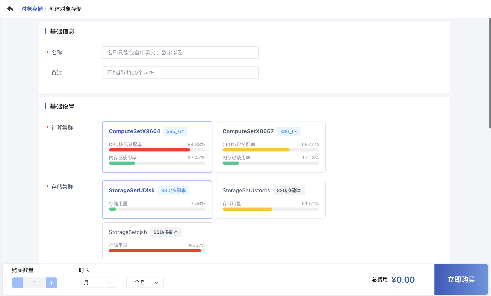

1. 选择并配置对象存储的基础配置、网络设置及管理配置信息：

* 名称/备注：申请对象存储的名称和备注，申请时必须指定名称；
* 计算集群：创建对象存储的计算集群信息，支持选择X86和Aarch集群，并展示所选计算集群的CPU和内存使用率；
* 存储集群：创建对象存储的的存储集群信息，并展示所选存储集群的存储用量；
* 容量：支持的容量范围为 100~64000 GB；
* VPC/子网：创建对象存储时必须选择 VPC 网络和所属子网，即选择要加入的网络及 IP 网段；
* 外网IP ：为对象存储提供外网访问服务，支持创建对象存储时申请并绑定一个外网 IP 作为外网访问地址。对象存储支持 IPv4/IPv6  双栈网络，也可在对象存储创建成功后绑定外网 IP ，每个对象存储仅支持绑定一个外网IP。

2. 选择购买数量和付费方式，确认订单金额并点击“立即购买” 进行对象存储的创建：

- 购买数量：默认支持创建 1 个对象存储；
- 付费方式：选择对象存储的计费方式，支持按月、按年、按时三种方式，可根据需求选择合适的付费方式；
- 总费用：用户选择对象存储资源按照付费方式的总费用展示；
- 立即购买：点击立即购买后，会返回对象存储资源列表页，在列表页可查看对象存储的创建过程，通常会先显示“启动中”的状态，转换为“可用”状态后，即代表创建成功。

### 26.2.1 通过内网配置对象存储

用户可通过对象存储列表的内网域名，在同VPC的虚拟机中配置对象存储服务：

```
wget -c https://dl.min.io/client/mc/release/linux-amd64/mc
chmod +x mc
./mc alias set <名称> <内网域名> admin <密码>
```

### 26.2.2 通过外网配置对象存储

用户可通过对象存储列表的外网域名，配置对象存储服务：

```
wget -c https://dl.min.io/client/mc/release/linux-amd64/mc
chmod +x mc
./mc alias set <名称> <外网域名> admin <密码>
```

## 26.3 对象存储列表

通过导航栏进入对象存储控制台，可查看对象存储资源列表。

对象存储列表可查看当前账户下所有对象存储资源的列表信息，包括名称、资源 ID、状态、集群、存储类型、存储容量、域名、VPC、子网、安全组、项目组、计费方式、创建时间、过期时间及操作项，如下图所示：

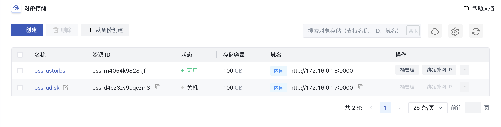

- 名称：对象存储资源的名称；
- 资源 ID：对象存储的资源ID，作为全局唯一标识符；
- 状态：对象存储资源的状态，包括启动中、可用、删除中 等状态；
- 集群：对象存储所属的计算集群；
- 存储类型：计算集群的存储类型；
- 存储容量：对象存储的磁盘容量，容量范围为 100~64000 GB；
- 域名：可通过 内网/外网域名 配置对象存储服务；
- VPC/子网：对象存储创建时所指定的 VPC 网络和子网，即对象存储内网 IP 所在的 VPC 网络和子网信息；
- 计费方式：对象存储的付费方式，包括按时、按年、按月；
- 项目组：对象存储创建时所绑定的项目组；
- 创建时间/过期时间：对象存储资源的创建时间和费用过期时间；
- 操作：列表上的操作项是对单个对象存储的操作，包括桶管理、扩容、绑定、解绑、续费及删除等。

## 26.4 修改配置

平台支持用户对对象存储进行在线配置升级操作，适应于业务发生变化需要扩容的场景，包括CPU规格和数据盘容量更改。平台仅支持对象存储容量的扩容，不支持对象存储容量的缩容。可点击对象存储列表中操作项的“**修改配置**”按钮进行操作，如下图所示：

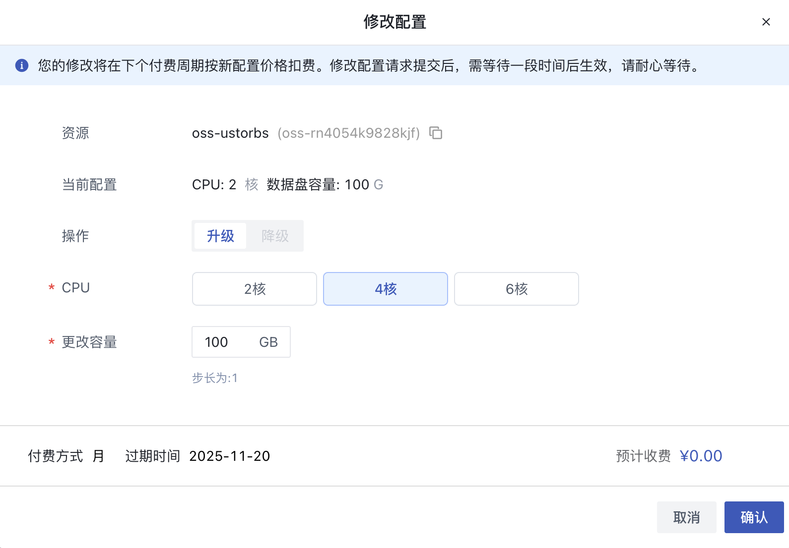

平台支持 对象存储 实例离线配置升降级，可在实例关机后，同步完成CPU规格与数据盘容量的升级，也可单独执行CPU规格降级。点击对象存储列表中操作项的“**修改配置**”按钮进行操作，如下图所示：

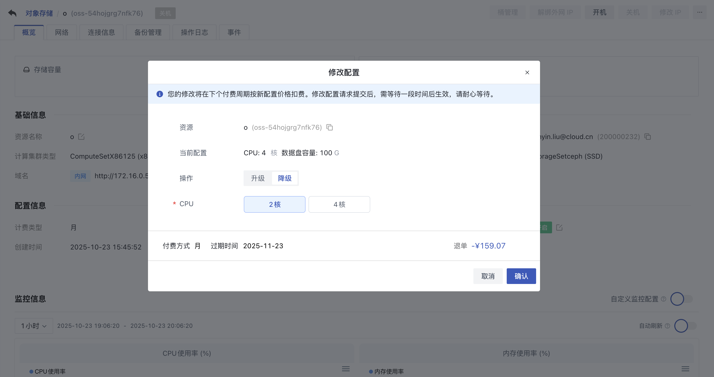

注意事项：
* 对象存储 ARM版本不支持在线升级CPU规格

扩容对象存储会对费用产生影响：

- 按小时付费的硬盘，扩容容量即时生效，在下个付费周期按新容量扣费；
- 按年按月付费的硬盘，扩容容量即时生效，同时按比例自动补差价。

## 26.5 绑定外网 IP

绑定外网 IP 是指将 EIP 地址绑定至对象存储，用户可通过外网访问地址来使用对象存储服务。

用户可通过对象存储资源列表操作项的 “**绑定**” 按钮进行EIP资源绑定操作，如下图所示：

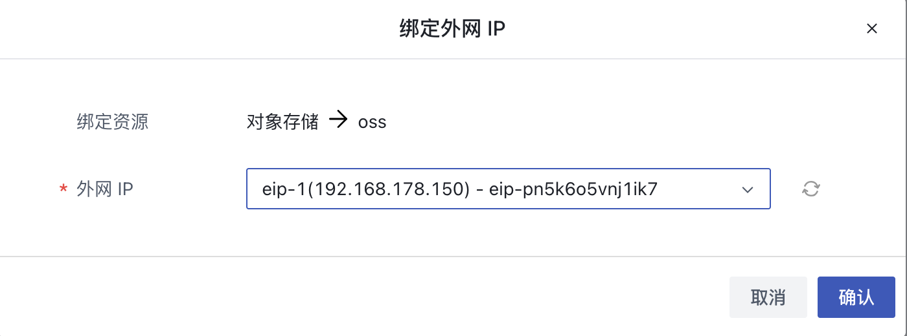

绑定时需选择弹性IP，绑定成功后，对象存储列表的访问地址会新增外网访问地址。

## 26.6 解绑外网 IP

解绑外网 IP 是指将 EIP 地址从一个对象存储资源上分离出来，并可重新绑定至其它虚拟资源。用户可通过对象存储资源列表操作项的 “**解绑**” 按钮进行资源解绑操作，如下图所示：

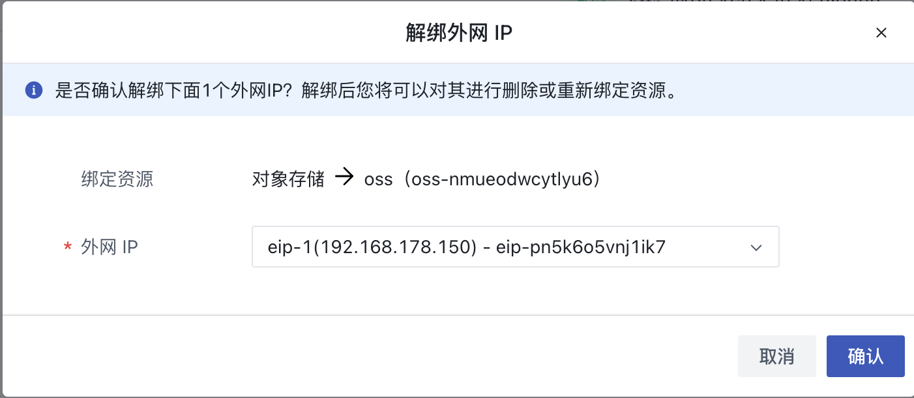

## 26.7 续费

支持用户手动进行续费。

对象存储续费时支持更改续费方式，只可由短周期改为长周期，例如按月的续费方式可更改为按月、按年。

对象存储续费时会按照续费时长收取费用，续费时长与资源的计费方式相匹配，当对象存储的计费方式为【小时】，则续费时长指定为 1 小时；当对象存储的计费方式为【按月】，则续费时长可选择 1 至 11 月；当对象存储的计费方式为【按年】，则续费时长为 1 至 5 年。可通过对象存储列表操作项中的 “**续费**” 按钮进行操作，如下图所示：

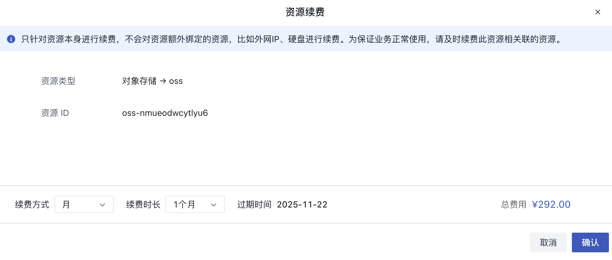

## 26.8 重置密码

支持用户重置对象存储密码，可通过对象存储列表操作项中的 “**重置密码**”按钮 操作，如下图所示：

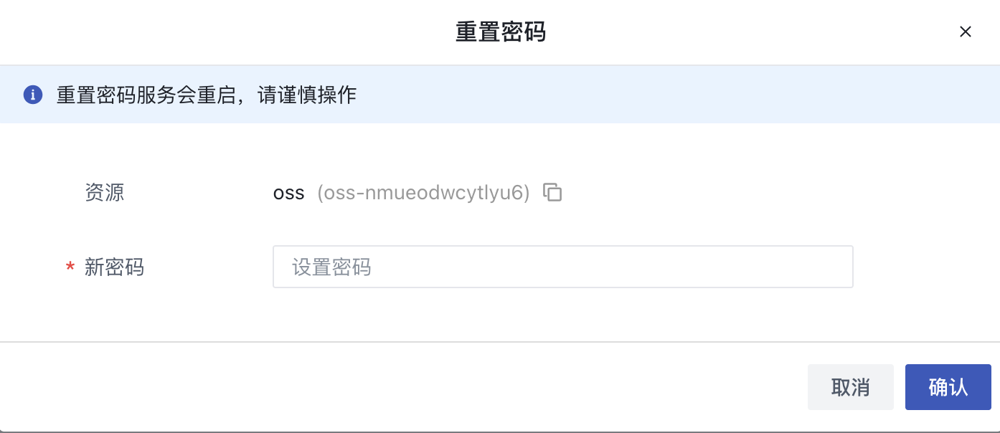

用户可通过命令行工具在client端重新设置密码

```
./mc alias set <名称> <外网域名> admin <新密码>
```

## 26.9 删除对象存储

用户可在控制台删除账户内对象存储，支持对对象存储进行批量删除操作。可通过对象存储列表操作项中的 “**删除**” 按钮进行操作，如下图所示：

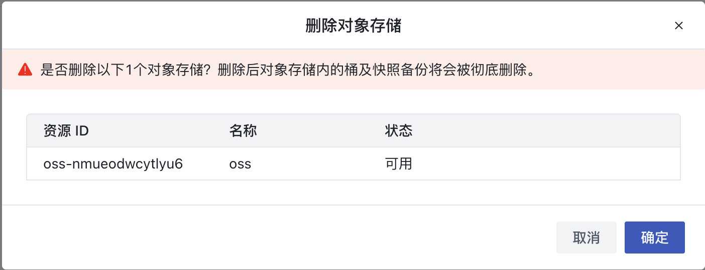

## 26.10 搜索对象存储

用户可通过搜索框对对象存储列表进行搜索和筛选，支持从名称、备注、资源ID、域名进行模糊搜索，如下图所示：

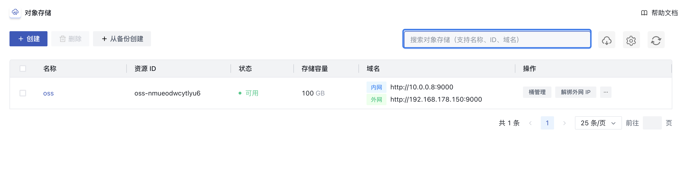

## 26.11 修改名称与备注

可通过点击对象存储列表名称右侧的 “编辑” 按钮进行修改，如下图所示：

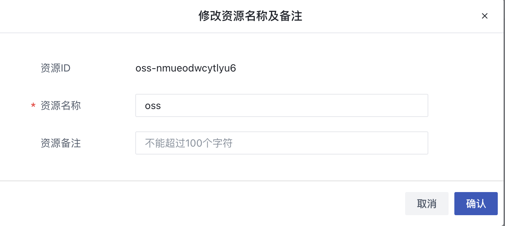

## 26.12 监控页面

用户可通过点击对象存储的名称，进入对象存储的监控页面，如下图所示：

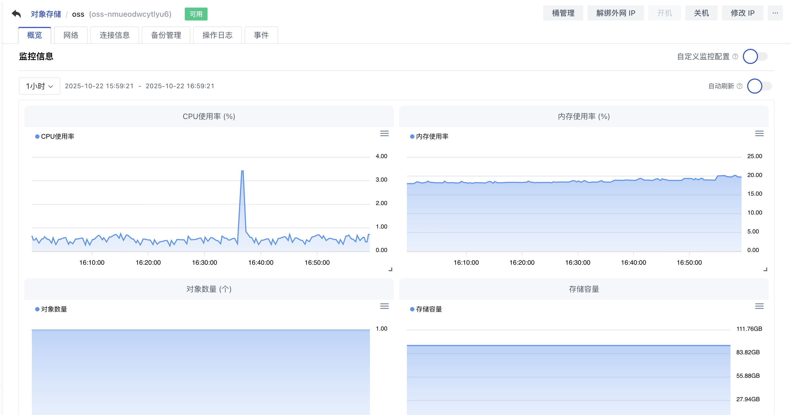

通过点击告警模版的修改按钮来修改告警模版，如下图所示：

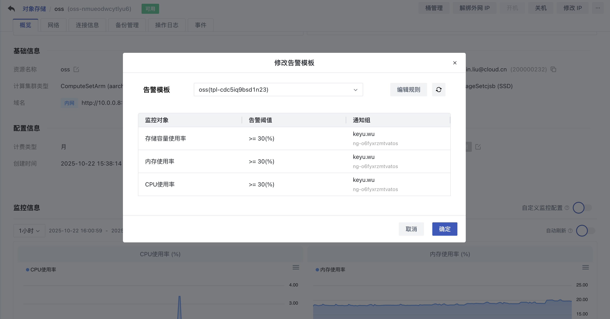

## 26.13 修改外网安全组

用户可通过点击对象存储列表操作项中的 “**修改外网安全组**”按钮，对外网做网络安全策略，如下图所示：

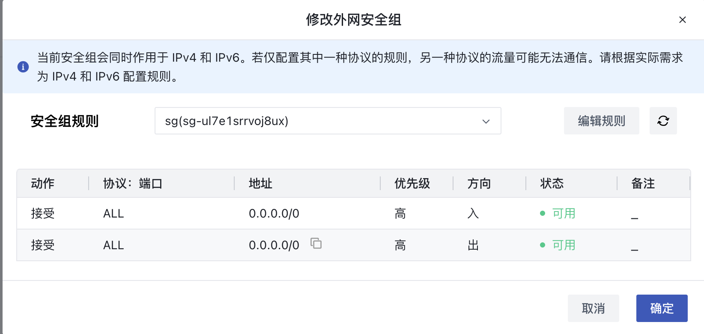


## 26.14 修改IP

支持用户修改对象存储的内网IP地址，可通过点击对象存储列表操作项中的 “**修改IP**”按钮，如下图所示：


## 26.15 从备份创建

用户可以通过备份创建对象存储，从备份创建对象存储时，会展示备份的ID，如下图所示：


## 26.16 MinIO Client常用命令
```

mc version                          输出mc版本

mc ls play                          列出所有https://play.min.io上的存储桶

mc mb play/mybucket                 在https://play.min.io上创建一个名叫"mybucket"的存储桶

mc cat play/mybucket/myobject.txt   显示myobject.txt文件的内容

mc cp myobject.txt play/mybucket    拷贝一个文本文件到对象存储

mc rm play/mybucket/myobject.txt    删除一个对象

mc find s3/bucket --name "*.jpg" --watch --exec "mc cp {} play/bucket"    持续从s3存储桶中查找所有jpeg图像，并复制到minio "play/bucket"存储桶

```

## 26.17 桶管理

### 26.17.1 桶列表

用户点击对象存储列表页的“**桶管理**”操作按钮，即可进入桶管理页面。如下图所示：

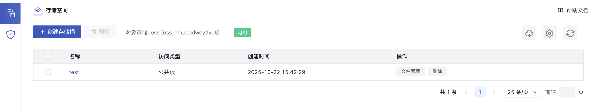

桶列表中每行表示一个存储桶，显示信息包括：

*	名称：存储桶的名称；
*	访问类型：私有、公共读、公共读写；
*	创建时间：桶的创建时间，格式：YYYY-MM-DD；
*	操作：支持文件管理和删除。

### 26.17.2 桶详情

在桶列表信息页面，选择某个桶，点击桶名称即可进入桶详情页。如下图所示：

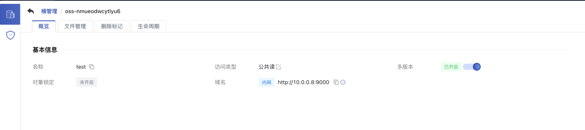

“**概览**”分页中显示的基本信息包括：

*	名称：存储桶的名称；
*	访问类型：包括私有、公共读、公共读写，默认创建桶时为私有，用户根据需要进行选择；
*	多版本：默认不开启；多版本功能只能暂停不能关闭；
*	对象锁定：默认不开启，开启后无法关闭。若开启，对象不能写入，只能读，例如：对象被删除后会进入删除标记，无法彻底删除。

“**文件管理**”分页信息，如下图所示：

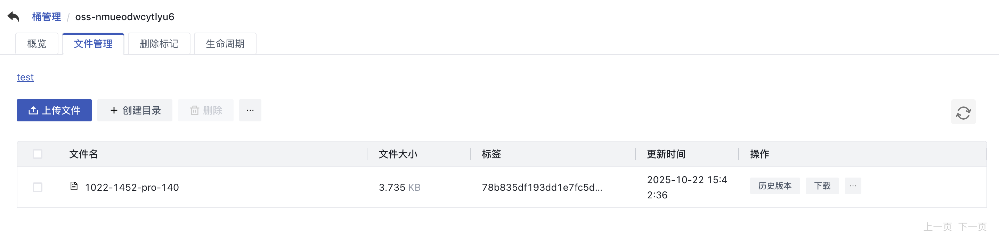

显示信息包括以下内容：

*   上传文件：将本地文件上传至对象存储
*   创建目录：创建文件目录
*   上传列表：支持把没有上传成功的文件记录下来，重新上传
*   清空当前桶：清空存储桶中的所有文件、历史版本、文件碎片，清空后数据不可恢复和访问
*	文件名：用户上传至对象存储中的文件名；
*	文件大小：上传文件的大小；
*	更新时间：文件上传时间；
*	操作：历史版本、下载和删除；

“**删除标记**”分页信息，如下图所示：


点击“**历史版本**”操作按钮，可以查看该对象的删除标记和历史版本，如下图所示：


上图所示的前两条数据都为该对象的**删除标记**，两条删除标记代表该对象被删除过两次；最后一条数据代表该文件本身的历史版本。

- 彻底删除：删除文件的历史版本和标记，彻底删除后不再展示该文件，并无法被恢复；
- 恢复：恢复文件至文件管理页面中。

“**生命周期**”分页信息，如下图所示：

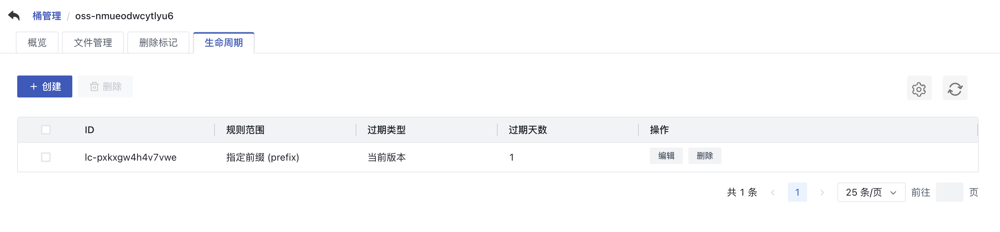

显示信息包括以下内容：

*   ID：生命周期规则的唯一标识符；
*   规则范围：生命周期规则的范围，包括整个存储桶和指定前缀；
*   过期类型：生命周期规则的过期类型，未开启多版本时，类型为当前版本；开启多版本时，类型为当前版本/非当前版本；
*   过期天数：生命周期规则的过期天数；
*   操作：支持编辑和删除生命周期规则。

### 26.17.3 桶的相关操作

桶的相关操作包括：

*	创建存储桶
*	开启对象锁定
*	删除存储桶
*	删除文件
*	恢复历史文件（多版本控制）
* 文件管理
* 删除标记
* 生命周期

#### 26.17.3.1 创建存储桶

在桶管理页面，点击“**创建存储桶**”按钮，弹出创建存储桶窗口，如下图所示：

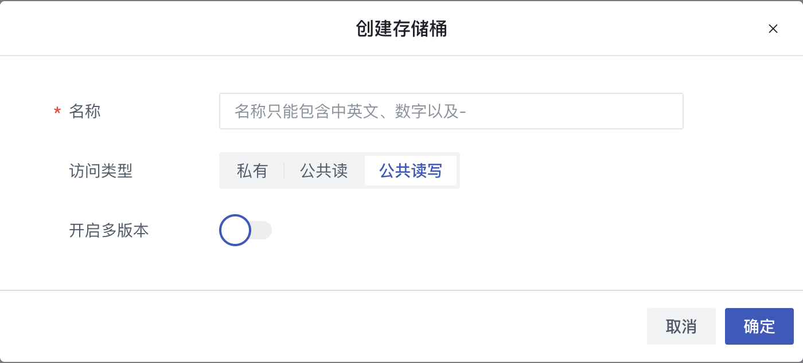

用户需要填写以下信息：

*	存储桶名称：填写存储桶名称；
*	访问类型：私有、公共读和公共读写，默认为私有；
* 是否开启多版本：默认不开启，开启后会出现是否开启对象锁定选项；多版本开启后只能暂停不能关闭；
*	是否开启对象锁定：用户选择开启或关闭（对象锁定依赖多版本功能，开启后无法关闭），默认关闭；
  - 对象锁定功能一旦开启，该桶只能上传文件，查询和读取，不能进行写操作，也不能彻底删除，适应于一次写多次读，以及安全、防护有要求的场景。
* 对象锁定天数：对象锁定开启后会出现设置锁定天数的选项，锁定功能不开启则不需要设置。

填写完成后，点击“确定”按钮，即可完成添加存储桶操作。

#### 26.17.3.2 对象锁定

开启对象锁定只能在创建桶时进行，桶创建以后无法开启锁定功能操作，并且对象锁定依赖多版本功能，开启后无法关闭。

进入创建存储桶页面，在“是否开启对象锁定”项中，用户点击开启（ON），弹出“对象锁定天数”设置项，用户输入锁定周期（周期可以是天、月、年维度），原则上周期不设上限。如下如图所示：

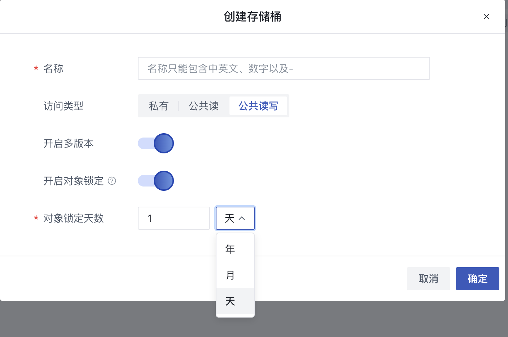

点击对话框“确定”按钮，开启对象锁定操作完成。

#### 26.17.3.3 删除存储桶

勾选存储空间列表中桶，点击菜单上方或右侧的“**删除**”按钮，确认删除信息后，即可完成删除存储桶操作。如下图所示：

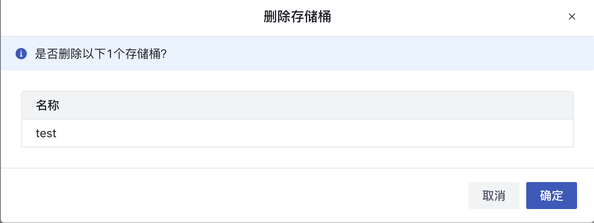

#### 26.17.3.4 删除文件

勾选列表中对象，点击菜单上方或右侧的“**删除**”按钮，确认删除信息后，即可完成删除存储文件操作。如下图所示：

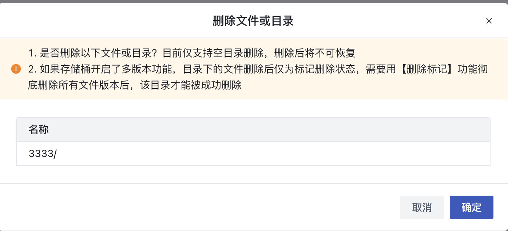

若桶开启了多版本功能，可以在文件管理页面，删除其历史版本文件，删除历史数据，对该文件的最新数据没有任何影响。如下图所示：

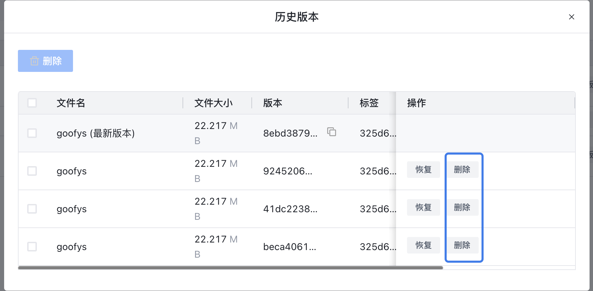

#### 26.17.3.5 恢复历史文件（多版本控制）

恢复历史文件的前提是开启桶的多版本控制，可通过点击文件管理页面或删除标记页面的“历史版本”按钮恢复对象的历史版本，如下图所示：

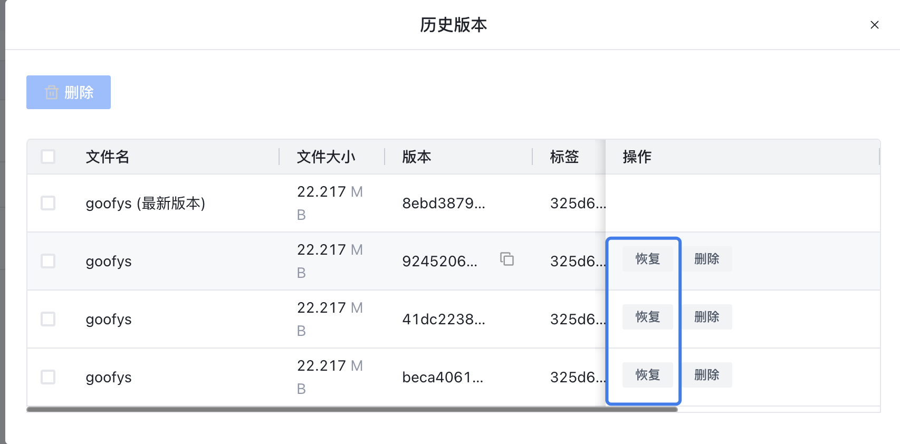

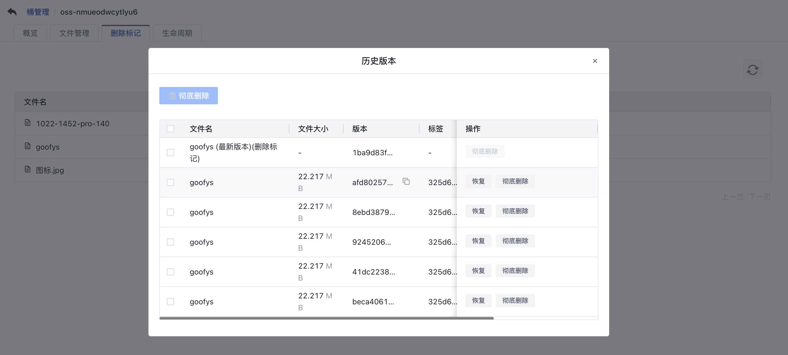

恢复后，该历史文件恢复为当前最新版本文件（之前最新的文件已变为历史文件）。

#### 26.17.3.6 文件管理

在“**文件管理**”分页，点击列表操作栏下的“**上传文件**”按钮，可以上传对象文件。如下图所示：

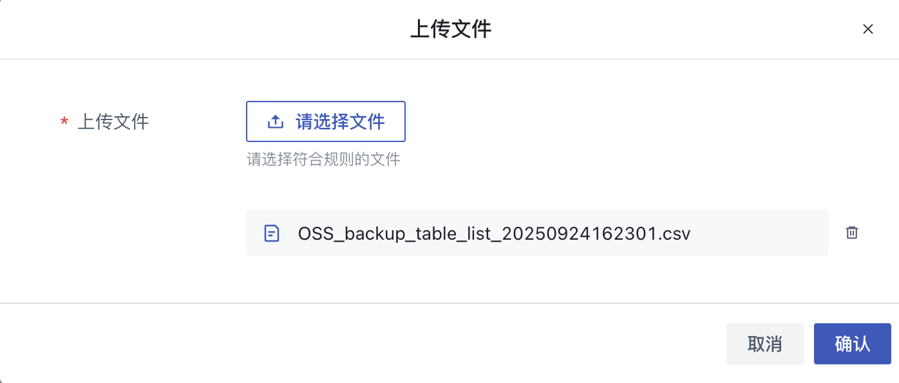

点击列表操作栏下的“**创建目录**”按钮，可以在文件管理页创建目录。如下图所示：

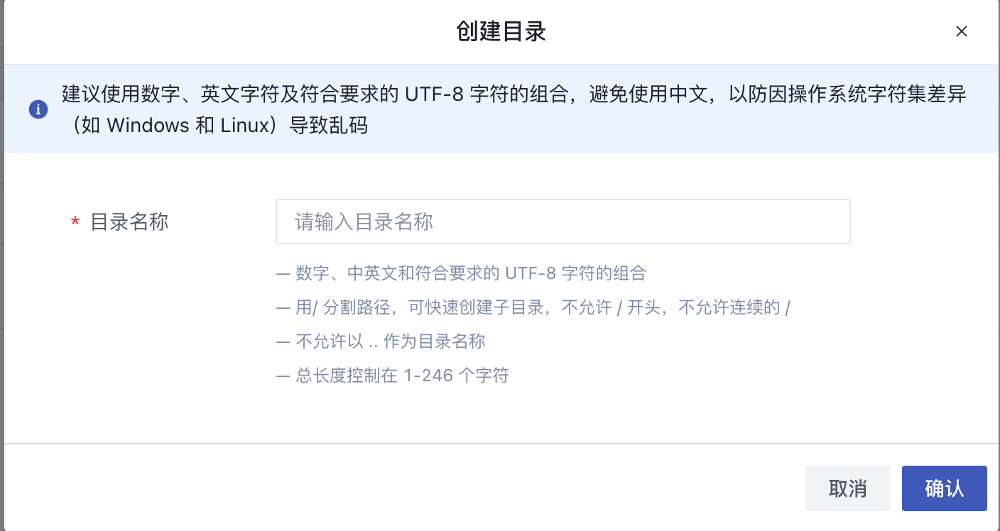

点击列表操作栏下的“**上传列表**”按钮，可以在文件管理页中没有上传成功的文件继续上传。如下图所示：

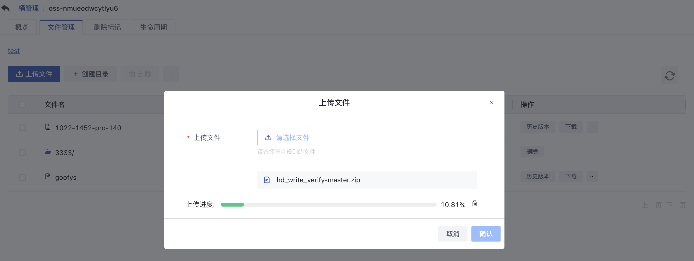

点击列表操作栏下的“**清空当前桶**”按钮，可以清空存储桶中的所有文件、历史版本、文件碎片，情况后数据不可恢复和访问。如下图所示：

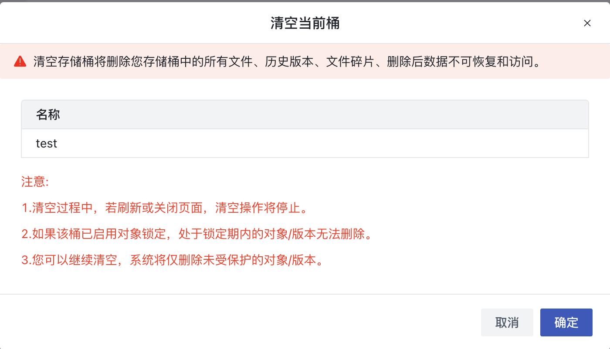

#### 26.17.3.7 删除标记

在“删除标记”分页，会展示已删除对象的历史版本。如下图所示：


#### 26.17.3.8 生命周期

支持用户为桶设置生命周期，生命周期扫描程序根据系统判断和负载情况自动启动，处理过期对象可能存在一定延迟。

生命周期规则列表页，如下图所示：


支持租户**创建生命周期规则**，支持设置整个存储桶/指定前缀。

- 未开多版本时，过期类型仅为当前版本，如下图所示：

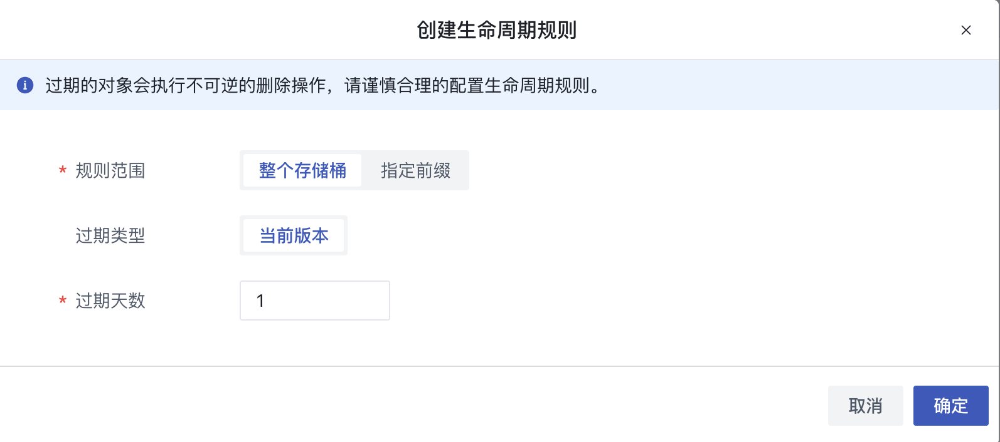


- 开启多版本时，过期类型为当前版本/非当前版本，如下图所示：

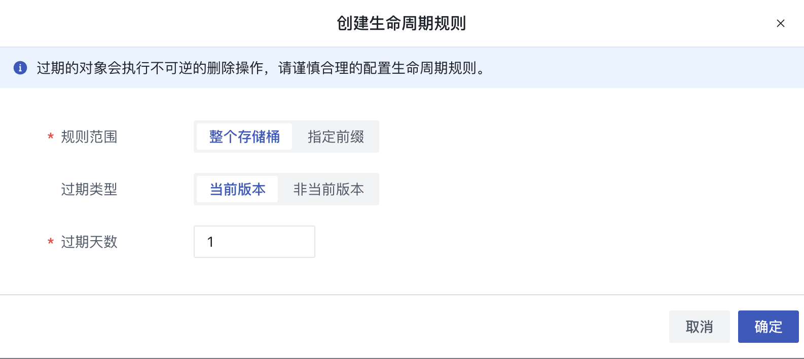

支持租户**编辑生命周期规则**，如下图所示：

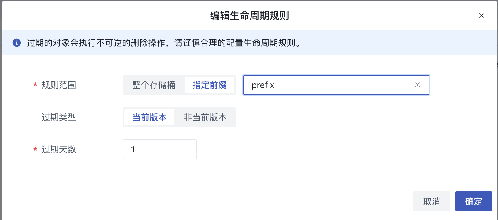

支持租户**删除生命周期规则**，如下图所示：

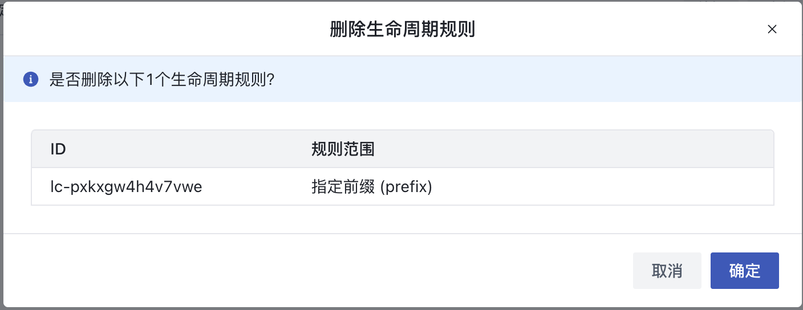

## 26.18 令牌管理

令牌管理可以根据用户的需求灵活的开放存储空间和文件管理权限。

一个令牌由一对特殊的公私钥组成。其中包括了：允许操作的存储空间列表、允许操作的文件前缀列表、操作权限和令牌过期时间等属性。

用户可以按需申请不同令牌来完成不同权限的管控。

### 26.18.1 令牌管理列表

在桶管理页面点击左侧菜单“**令牌管理**”，即可进入存储桶令牌管理列表。如下图所示：

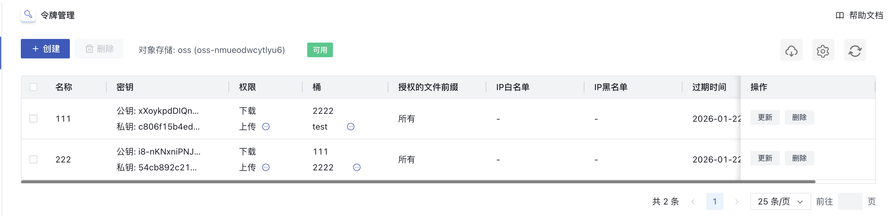

每行表示一个令牌，令牌管理列表中显示的信息包括：

*	名称：令牌名称；
*   公钥：公钥；
*   私钥：私钥；
*   权限：令牌的操作权限有上传、下载、删除、文件列表；
*   桶名称：桶名称；
*   授权的文件前缀：允许操作的文件前缀列表；
*   IP白名单：允许操作的客户端ip；
*   IP黑名单：不需要操作的客户端ip；
*   过期时间：令牌的过期时间，格式：YYYY-MM-DD；
*	操作：支持对令牌修改和删除操作。

### 26.18.2 令牌管理相关操作

存储用户相关操作包括：

*	创建令牌
*   修改令牌信息
*	删除和批量删除令牌

#### 26.18.2.1 创建令牌

点击管理菜单左上角“创建”按钮，弹出创建令牌对话框。如下图所示：

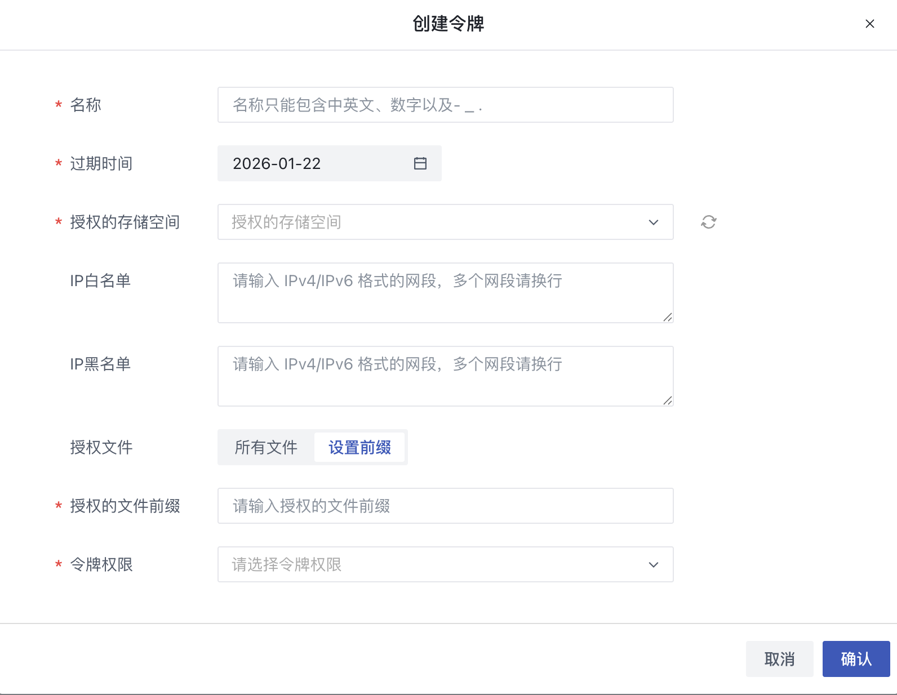

用户需要填写以下信息：

*	令牌名称：创建的令牌名，必填；
*   过期时间：令牌的过期时间，格式：YYYY-MM-DD；
*   授权的存储空间：可选择该对象存储中的一个或多个桶；
*   IP白名单：允许操作的客户端IP；
*   IP黑名单：不允许操作的客户端IP；
*   授权的文件前缀：允许操作的文件前缀；
*	令牌权限：令牌的操作权限有上传、下载、删除、文件列表。

填写完成后，点击“确定”按钮，即可完成对象存储令牌的创建。

#### 26.18.2.2 修改令牌

点击令牌管理操作栏的“**修改**”按钮，可修改令牌信息，如下图所示：

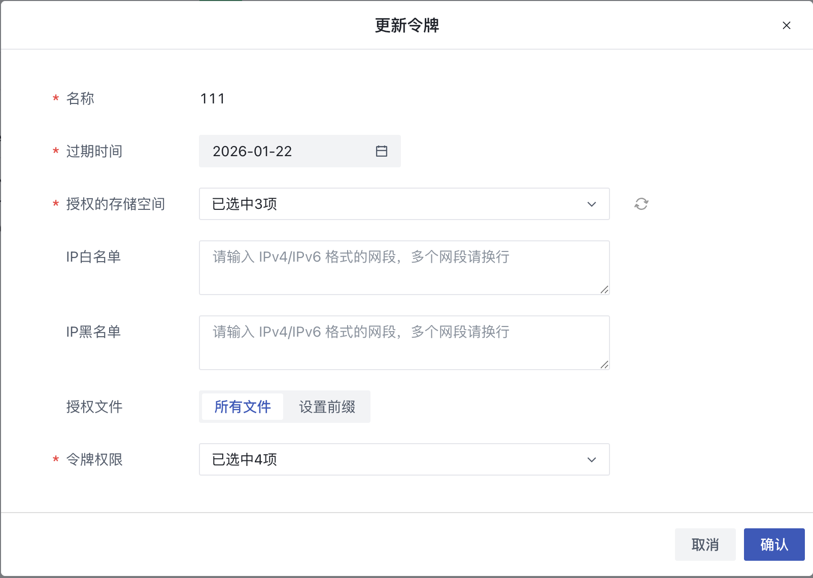

可修改令牌的以下信息：

*	过期时间：令牌的过期时间，格式：YYYY-MM-DD；
*	授权的存储空间：可选择该对象存储中的一个或多个桶；
*	IP白名单：允许操作的客户端IP；
*	IP黑名单：不允许操作的客户端IP；
*	授权的文件前缀：允许操作的文件前缀；
*	令牌权限：令牌的操作权限有上传、下载、删除、文件列表。

#### 26.18.2.3 删除令牌

点击操作栏“**删除**”按钮，可删除令牌，如下图所示：

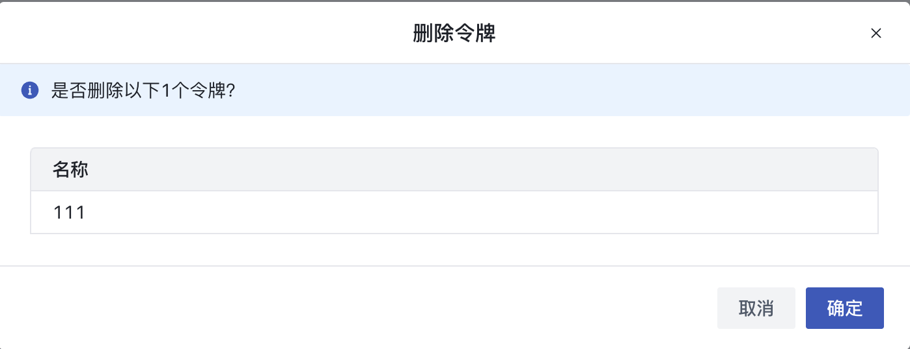

点击“确定”按钮，即可完成对象存储令牌的删除。

## 26.19 对象存储 删除保护

支持用户开启删除保护功能，用于防止对象存储产品被误删除释放，在创建时增加「删除保护」选项，如下图所示：

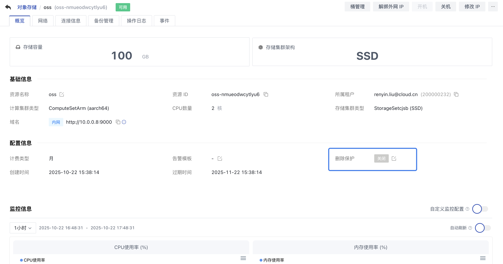

删除资源时需要将此选项关闭才可以进行删除，如下图所示：

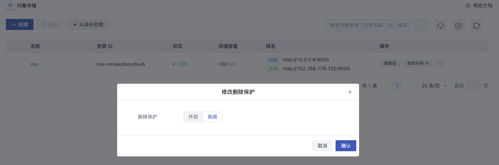

## 26.20 对象存储 连接信息

支持展示对象存储产品客户端连接的网络信息，内网访问支持展示请求地址机器名称，外网仅支持展示请求地址，如下图所示：

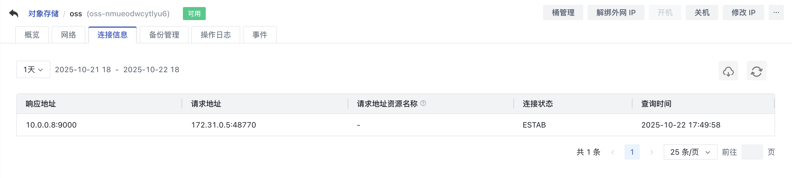

## 26.21 对象存储 关机开机

对象存储 支持实例开关机操作，便于用户做离线配置升降级等操作，如下图所示：

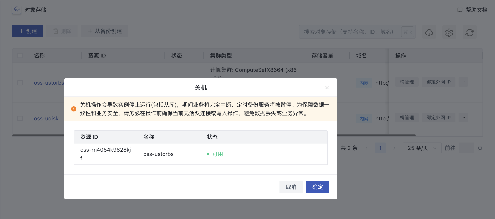

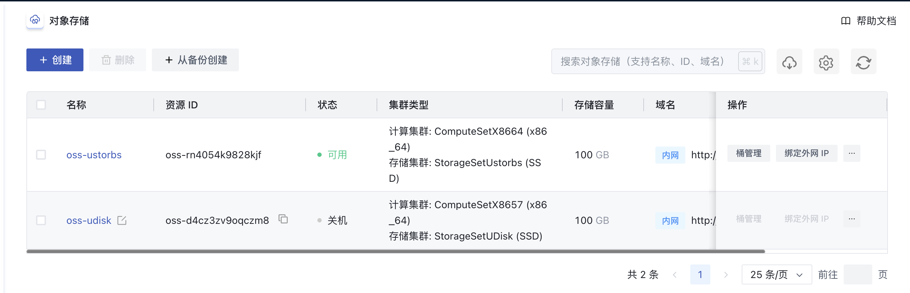

注意事项：
* 对象存储的备份任务非可用状态，对象存储无法关机
* 对象存储的备份任务是可用状态，对象存储关机，定时备份计划会自动暂停，对象存储开机后会自动恢复
* 对象存储绑定存储池后对象存储关机，存储池会变为离线状态，与存储池相关联的定时备份计划会自动暂停，对象存储开机后，存储池与备份计划会自动恢复
* 对象存储被负载均衡日志管理绑定后对象存储关机，负载均衡日志管理服务会变为离线状态，对象存储开机后，负载均衡日志管理服务会自动恢复


