# 17 裸金属

## 17.1 裸金属简介

### 17.1.1 概述

裸金属为用户提供统一纳管存量裸金属能力的服务，用户在控制台即可对已纳管的裸金属进行电源管理、访问远程控制台和查看硬件监控等基础运维操作，开启 PXE 装机服务之后，可以对纳管的裸金属，进行硬件采集，安装操作系统。裸金属仅在云平台 Pro 版本中支持。

### 17.1.2 使用流程

在使用裸金属服务前，必须提前准备好裸金属设备，并根据需求将裸金属服务器的 IPMI 网络及业务网络与平台网络进行打通，再通过平台录入设备信息，将设备添加给租户管理。具体如下：

1. **硬件环境装备**

   准备好硬件环境，配置物理网络交换机及服务器 IPMI 网络，使平台物理网络与 IPMI 网络可互相通信。
   
2. **为租户添加裸金属**

   由【平台管理员】为租户添加裸金属信息，包括服务器的名称、IPMI IP、IPMI User、IPMI PassWord、机架位置、标签及租户邮箱，支持批量导入裸金属信息。
   
3. **裸金属纳管操作**

   由【平台租户】对已申请的裸金属进行生命周期管理，支持对已纳管的裸金属进行电源管理、访问远程控制台和查看硬件监控等基础运维操作。
   
4. **安装操作系统**

   由【平台管理员】开启 PXE 装机服务，对纳管状态裸金属进行采集硬件信息操作，采集成功后成为可用状态。

   可用状态的裸金属、分配给对应租户、并且平台开启 PXE 装机服务，即可由【平台租户】对裸金属进行装机，可以使用平台镜像，也可以使用 Kickstart 模板安装想要的操作系统。

   

## 17.2 裸金属管理

### 17.2.1 添加裸金属服务器

在平台已提供裸金属服务时，平台管理员可以在平台上添加裸金属进行管理。访问控制台，通过控制台导航栏【裸金属管理】中的添加裸金属服务器操作进入向导页面，如下图所示：

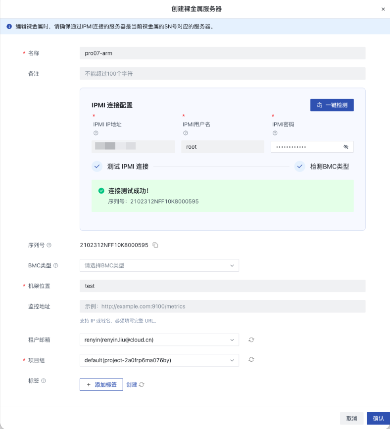

* 名称：指裸金属在平台的名称标识，添加时必须指定。
* 备注：裸金属备注信息。
* IPMI 连接配置 - IPMI IP 地址：裸金属的 IPMI IP 地址，添加时必须指定，IP 地址必须从平台可达。
* IPMI 连接配置 - IPMI IP 用户名：裸金属的 IPMI 登录用户名，常见默认值：root、admin，添加时必须指定。
* IPMI 连接配置 - IPMI IP 密码：裸金属的 IPMI 密码，添加时必须指定。
* 序列号：服务器序列号，一键检测后自动填充。
* BMC 类型：裸金属的 BMC 类型，一键检测后会获取服务器的产品名称，自动匹配平台 BMC 类型管理内存在的BMC类型；如果没有匹配到，可以自行选择，但请根据服务器品牌选择合适的BMC类型，影响KVM等功能的兼容性；如果没有对应的 BMC类型，可以在平台创建适配新的 BMC类型，具体操作查看下面的[BMC 类型管理](#_177-BMC-类型管理)。
* 机架位置：裸金属所处的机架位置，添加时必须指定。
* 监控地址：支持添加纳管的物理机的node_exporter地址获取监控信息。例如：http://x.x.x.x:9100/metrics
* 租户邮箱：添加的时候可以选择分配租户或者暂不绑定，分配租户后，可以设置裸金属的项目组、标签。
* 项目组：裸金属的项目组。
* 标签：裸金属的标签。

填写 IPMI 连接配置信息后，点击一键检测按钮，检测通过，才能确认进行添加。租户添加提交后列表将生成一条【已纳管】的裸金属信息，此时租户可对裸金属进行管理。

### 17.2.2 批量导入裸金属

平台支持批量导入裸金属，可以从平台下载裸金属导入示例，仅支持 CSV 格式且按照平台规范的文件，可参考【裸金属列表示例】文件进行表格制作，表格中的信息包括 Name、IPMIIP、IPMIUser、IPMIPassword、SN、Hostname、BMCTypeName、RackLocation及Description ，分别代表物理机名称、IPMI IP 地址、IPMI 用户名、IPMI 密码、序列号、名称、BMC 类型、机架位置及备注。对已通过 IPMI 测试的资源进行录入。导入成功的裸金属状态将变成【已纳管】。

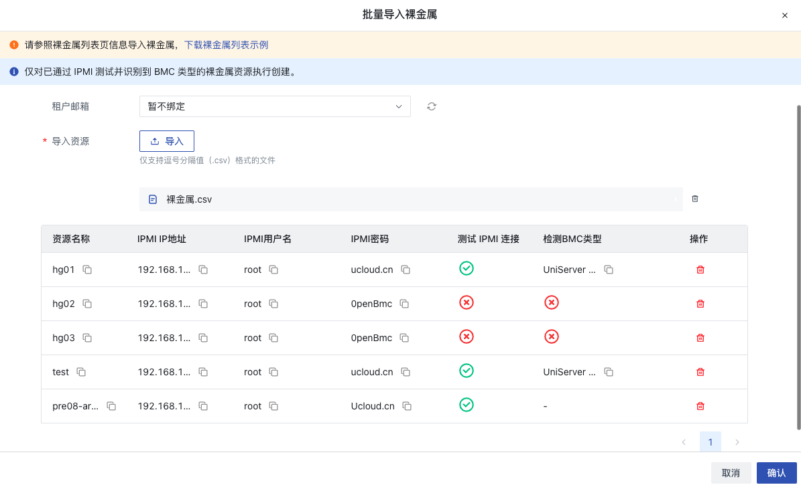

### 17.2.3 查看裸金属

#### 17.2.3.1 管理员查看裸金属

管理员可通过裸金属列表及详情查看账号下已添加的裸金属信息及当前状态，如下图所示：

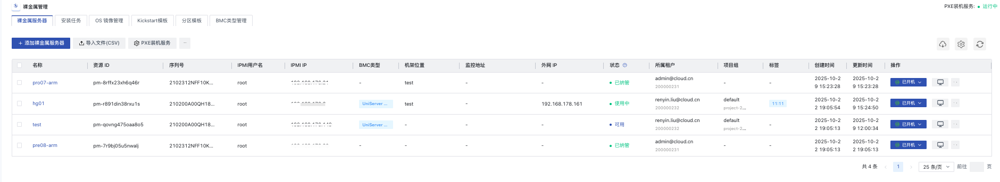

* 名称：裸金属的名称。
* 资源 ID：全局资源唯一标识符。
* 序列号：裸金属的整机序列号。
* IPMI 用户名：裸金属的 IPMI 登录用户名。
* IPMI IP：裸金属的 IPMI IP 地址。
* BMC 类型：裸金属的 BMC 类型。
* 机架位置：裸金属所处的机架位置。
* 监控地址：仅展示用户自定义的获取裸金属监控数据的地址。
* 外网IP：裸金属装机时绑定的EIP。
* 状态：裸金属状态，包括：已纳管、硬件发现中、可用、安装中、使用中、清理中等。
* 所属租户：分配的租户，没分配时挂在admin管理员名下，但是实际没有用户归属，无法使用绑定告警模版、项目组、标签等租户维度的功能。
* 项目组：裸金属的项目组。
* 标签：裸金属的标签。
* 创建时间：裸金属的添加时间。
* 更新时间：裸金属的更新时间。
* 电源状态：裸金属的电源状态，如已开机、已关机等。

列表上的操作项中可对单台裸金属进行电源操作、登录kvm控制台、登录vnc控制台、分配裸金属、 编辑裸金属、采集硬件信息、安装操作系统、回收、修改告警模版、修改标签及删除等操作，支持批量删除裸金属，其中删除后管理员可重新进行添加。


#### 17.2.3.2 租户查看裸金属

租户也可以通过裸金属列表及详情查看账号下已添加的裸金属信息及当前状态，如下图所示：

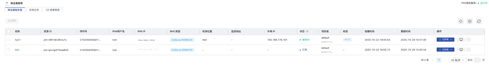

租户侧查看和管理员侧查看没什么区别，详情也是一样的，但是添加裸金属、开启 PXE 服务、分配裸金属、编辑裸金属、采集硬件信息、回收裸金属功能，只能管理员操作；Kickstart 模板、分区模块、BMC 类型管理只能管理员维护，租户有新的这些资源需求，请联系管理员操作。


#### 17.2.3.3 裸金属详情

可通过访问列表上裸金属的名称进入裸金属的详情页面，查看裸金属的详细信息，包括基本信息和配置信息：

* 基本信息包括：裸金属的ID、名称、BMC 类型、IPMI 用户、IPMI IP地址、机架位置、电源状态、告警模版、所属租户、项目组、标签、创建时间、更新时间等基础信息。

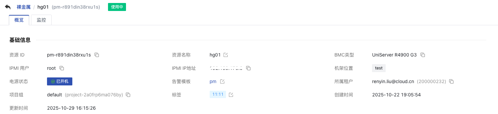

* 配置信息包括：裸金属的 CPU 信息、内存信息、存储信息及网络信息等。

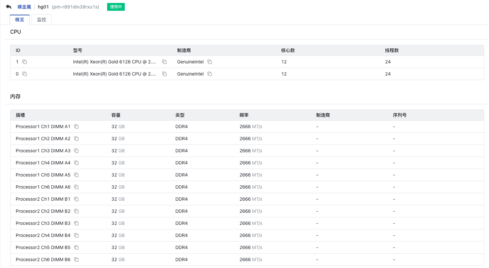

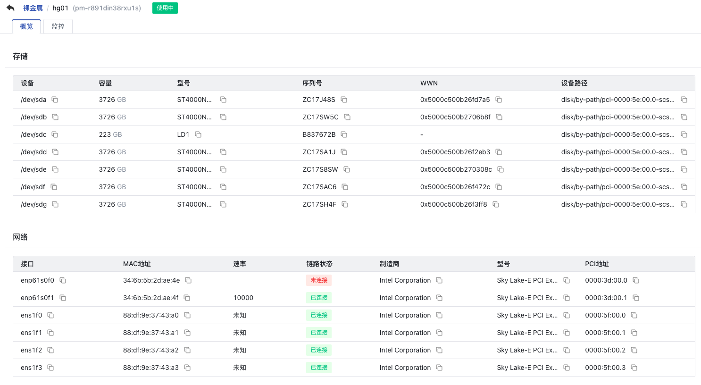

#### 17.2.3.4 裸金属监控

同时裸金属的详情页面，也可以查看监控信息，裸金属内需要安装node_exporter，使用默认端口才能采集到监控数据；纳管状态的裸金属，可以自行安装node_exporter后，提供可访问的地址，通过编辑裸金属，配置上监控地址。

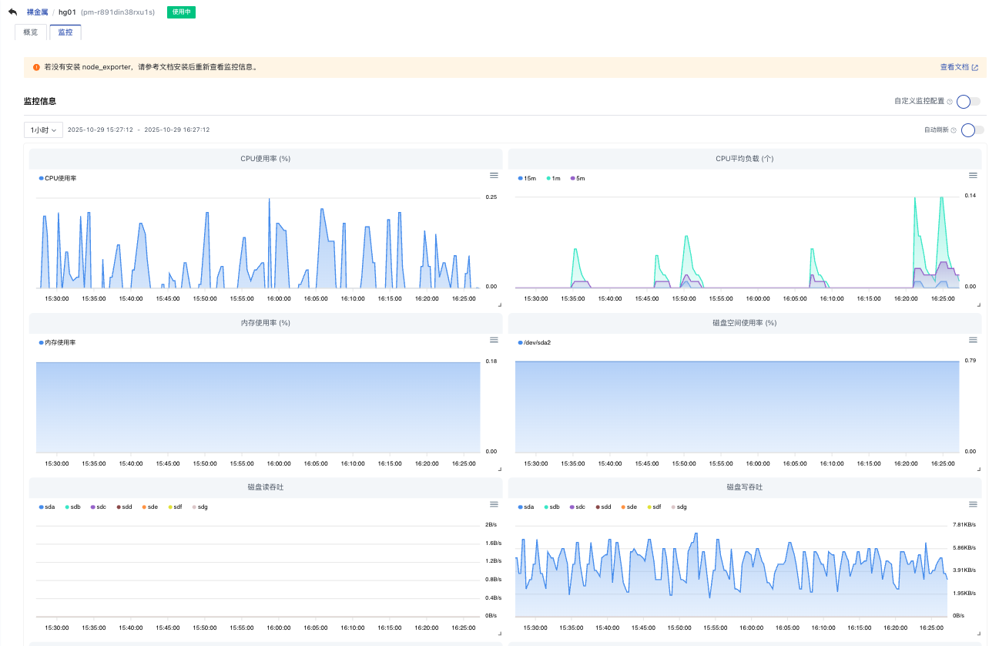

```shell
# 安装node_exporter
# 登录裸金属，从官网下载安装包
wget https://github.com/prometheus/node_exporter/releases/download/v1.8.2/node_exporter-1.8.2.linux-amd64.tar.gz

# 解压安装包
tar -xvzf node_exporter-1.8.2.linux-amd64.tar.gz
cd node_exporter-1.8.2.linux-amd64

# 启动node_exporter，默认端口9100
./node_exporter-1.8.2.linux-amd64

# 想长期运行，需要配置成系统服务，设置开机自启

```
node_exporter运行后，使用裸金属可访问的 IP ，加服务端口，即可以得到监控地址，例如裸金属外部可访问 IP ：192.168.178.161，使用默认端口启动，那监控地址为：http://192.168.178.161:9100/metrics

### 17.2.4 裸金属电源操作

平台支持对已纳管的裸金属进行开机、软关机、强制关机、重启、强制重启的电源操作，用于维护和管理裸金属的生命周期。电源状态为开启时，才可执行软关机、强制关机、重启、强制重启操作；电源状态为关闭时，才可执行开机操作。提供的电源操作受物理机支持的电源操作项约束。

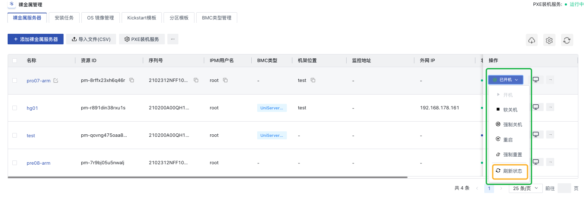

操作电源操作后，平台列表定时1分钟刷新电源状态，如果需要尽快查看，可以手动点击电源操作内的“刷新状态”按钮，进行手动刷新该裸金属电源状态。

### 17.2.5 登录 KVM 控制台

KVM 是远程访问物理机操作系统的一种方式，添加的时候扫描出来的 BMC 类型，决定怎么适配 KVM 远程登录。如果没有匹配到 BMC 类型，请根据服务器品牌选择合适的BMC类型；如果没有对应的 BMC类型，可以在平台创建适配新的 BMC类型，具体操作查看下面的 [BMC 类型管理](#_177-BMC-类型管理)。

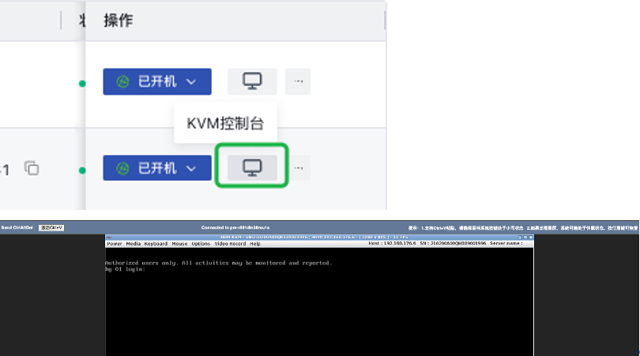

### 17.2.6 登录 VNC 控制台

VNC 是远程访问物理机操作系统的另一种方式，可以和 KVM 并用，不过受限于物理机支持，同时登录可能有一方会被顶掉。输入设置的登录密码即可访问。


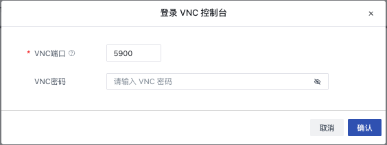

物理机支持 VNC 远程登录访问方式，平台才支持登录。

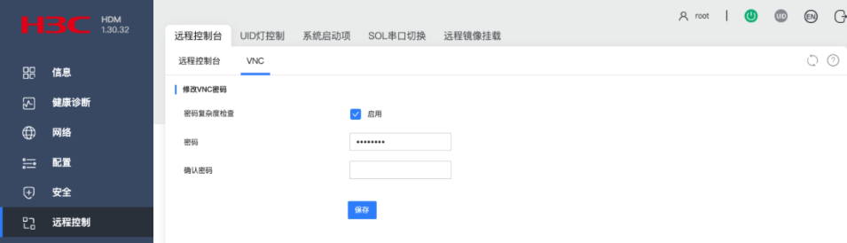


### 17.2.7 分配裸金属

可对已纳管、可用的裸金属进行分配操作，分配成功后，再次分配切换租户，需要执行回收操作，回收成功后，才可以进行再次分配。如下图所示：

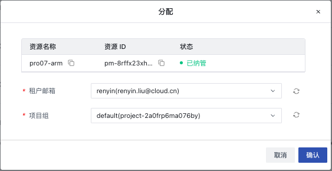

- 租户邮箱：选择要分配的租户。
- 项目组：选择裸金属要归属的项目组。

### 17.2.8 编辑裸金属

可对裸金属进行编辑，可以更新裸金属的名称、备注、IPMI 连接配置、BMC 类型、机架位置、监控地址，编辑的时候，如果变更了IPMI 连接配置，需要重新一键检测，确保通过IPMI连接的服务器是当前裸金属的SN号对应的服务器，如果更换了，将无法更新成功。

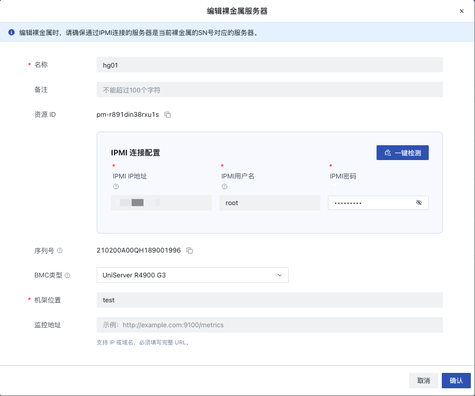

* 名称：指裸金属在平台的名称标识，添加时必须指定。
* 备注：裸金属备注信息。
* 资源 ID：裸金属的ID，不可修改。
* IPMI 连接配置 - IPMI IP 地址：裸金属的 IPMI IP 地址，更改后需要再次一键检测。
* IPMI 连接配置 - IPMI IP 用户名：裸金属的 IPMI 登录用户名，常见默认值：root、admin，更改后需要再次一键检测。
* IPMI 连接配置 - IPMI IP 密码：裸金属的 IPMI 密码，更改后需要再次一键检测。
* 序列号：服务器序列号，不可修改。
* BMC 类型：裸金属的 BMC 类型，一键检测后会获取服务器的产品名称，自动匹配平台 BMC 类型管理内存在的BMC类型；如果没有匹配到，可以自行选择，但请根据服务器品牌选择合适的BMC类型，影响KVM等功能的兼容性；如果没有对应的 BMC类型，可以在平台创建适配新的 BMC类型，具体操作查看下面的 [BMC 类型管理](#_177-BMC-类型管理)。
* 机架位置：裸金属所处的机架位置。
* 监控地址：支持添加纳管的物理机的node_exporter地址获取监控信息。例如：http://x.x.x.x:9100/metrics

### 17.2.9 PXE 装机服务

PXE 装机服务是装机操作的必要服务，装机获取硬件信息之前需要开启。

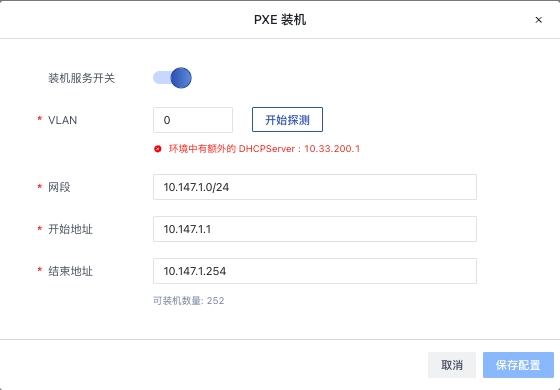

- 装机服务开关：支持开关PXE装机DHCPServer，默认关闭。
-  VLAN：裸金属装机网络VLAN，默认使用部署装机网络VLAN，支持探测平台内是否存在额外开启的DHCPServer。如果网络环境中开启了其他的 DHCP 服务，请先关闭后，才能正确添加 PXE 装机服务。
- 网段：裸金属装机网络网段，请注意不要和其他网段冲突。
- 开始地址：裸金属装机网络网段开始IP，支持指定IP范围。
- 结束地址：裸金属装机网络网段结束IP，支持指定IP范围。

装机完毕后，可以关闭 PXE 装机服务：


### 17.2.10 采集硬件信息

裸金属纳管状态，可以操作采集硬件信息，该操作是装机之前的必要操作，同时采集硬件信息，将操作服务器将从 PXE 网络 **重新启动**，加载专用的硬件检测系统（LiveCD），自动收集CPU、内存、磁盘、网卡等硬件信息，采集完成后自动重启回原系统，**整个过程大约需要3-5分钟**，请确保服务器已配置PXE启动，且网络连接正常，采集过程中可通过 KVM控制台 查看进度。硬件采集成功后，裸金属变成可用状态，并且裸金属详情中展示配置信息。


### 17.2.11 安装操作系统

#### 17.2.11.1 选择安装模式 

开启 PXE装机服务、可用状态并且分配了租户的裸金属，可以进行安装操作系统，安装有2种方式：

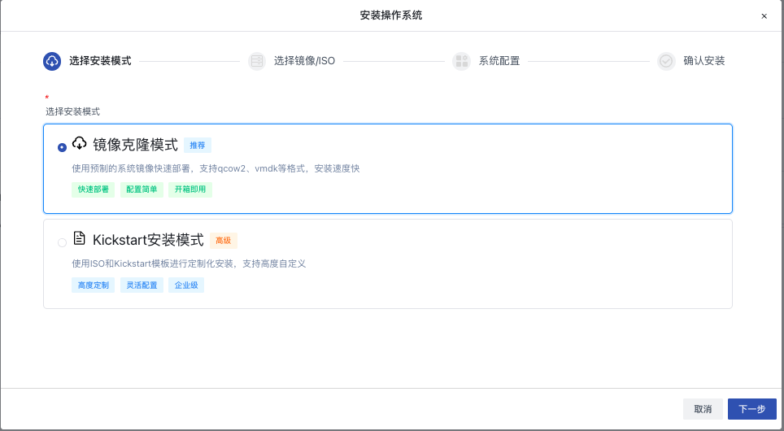

- 镜像克隆模式：使用预制的系统镜像快速部署，支持qcow2、vmdk等格式，安装速度快，推荐使用这种模式。
- Kickstart安装模式：使用ISO和Kickstart模板进行定制化安装，支持高度自定义，装机更灵活，但需要熟悉Kickstart装机工具，可以自行到官网学习相关操作配置。

#### 17.2.11.2 镜像克隆模式

1.选择镜像/ISO

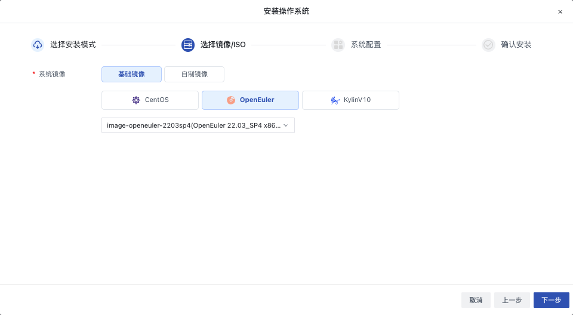

- 系统镜像：选择装机使用的镜像，支持系统镜像、自制镜像。

2.系统配置


- OS 配置 - 主机名：裸金属安装的操作系统内部的计算机名。

- OS 配置 - OS 用户名：裸金属安装的操作系统用户名，例如：admin、root等。

- OS 配置 - OS 密码：裸金属安装的操作系统密码，最少8位字符。

- 磁盘配置 - 磁盘选择策略：系统盘选择策略，支持按WWN选择、按设备路径选择，请根据机器系统盘能访问的方式选择。

- 磁盘配置 - 磁盘：选择安装操作系统的系统盘，选择错误，安装会失败，可以通过 KVM 或者 VNC 查看具体失败原因，安装失败可以选择回收裸金属，回收成功后重新安装操作系统。

- 网络配置 - 添加网卡：支持配置物理网卡、Bond聚合、VLAN等复杂网络拓扑。每个接口可以配置多个IP地址。

  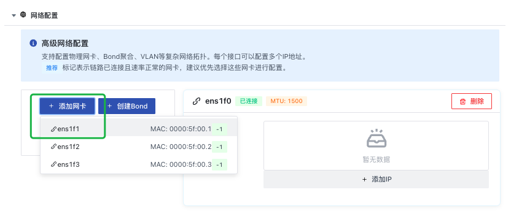

- 网络配置 - 创建Bond：创建Bond聚合网卡

  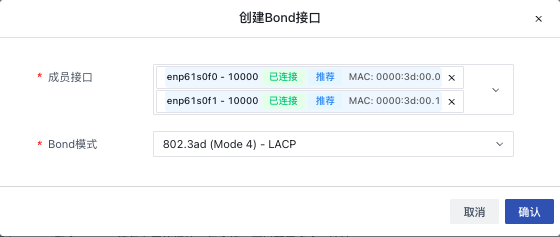

- 网络配置 - 网卡 IP 配置：设置各网卡绑定的IP，这里复用 EIP 产品，使用的时候，建议给裸金属划分一个专用网段。

  

3.确认安装

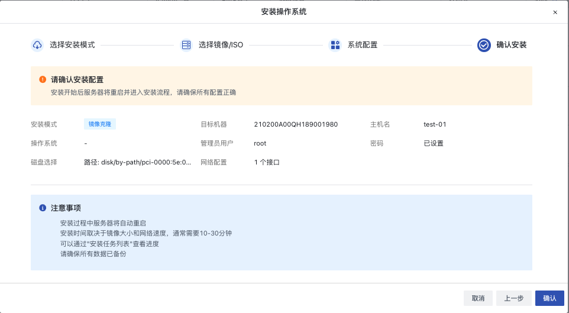

确认后将进入安装流程，可以通过 KVM 或者 VNC 查看具体失败原因，安装失败可以选择回收裸金属，回收成功后重新安装操作系统。同时会创建一条安装任务记录，可以在安装任务中查看日志、重试、取消等操作。


#### 17.2.11.3  Kickstart安装模式

1.选择镜像/ISO


- ISO 镜像：选择使用的 ISO镜像，可以通过 [OS 镜像管理](#_174-OS-镜像管理)导入。
- Kickstart 模板：选择使用的 Kickstart 模板，可以通过   [Kickstart 模板](#_175-Kickstart-模板)增加，Kickstart 模板只能管理员维护，如需操作，请联系管理员。

2.系统配置

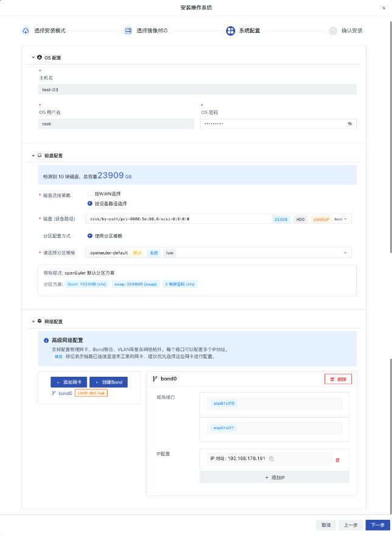

- OS 配置 - 主机名：裸金属安装的操作系统内部的计算机名。

- OS 配置 - OS 用户名：裸金属安装的操作系统用户名，例如：admin、root等。

- OS 配置 - OS 密码：裸金属安装的操作系统密码，最少8位字符。

- 磁盘配置 - 磁盘选择策略：系统盘选择策略，支持按WWN选择、按设备路径选择，请根据机器系统盘能访问的方式选择。

- 磁盘配置 - 磁盘：选择安装操作系统的系统盘，选择错误，安装会失败，可以通过 KVM 或者 VNC 查看具体失败原因，安装失败可以选择回收裸金属，回收成功后重新安装操作系统。

- 磁盘配置 - 分区配置方式：选择分区方式，当前默认使用分区模板。

- 磁盘配置 - 请选择分区模板：选择系统盘的分区方式模版，可以通过[分区模板](#_176-分区模板)增加，分区模板只能管理员维护，如需操作，请联系管理员。

- 网络配置 - 添加网卡：支持配置物理网卡、Bond聚合、VLAN等复杂网络拓扑。每个接口可以配置多个IP地址。

  

- 网络配置 - 创建Bond：创建Bond聚合网卡

  

- 网络配置 - 网卡 IP 配置：设置各网卡绑定的IP，这里复用 EIP 产品，使用的时候，建议给裸金属划分一个专用网段。

  

3.确认安装

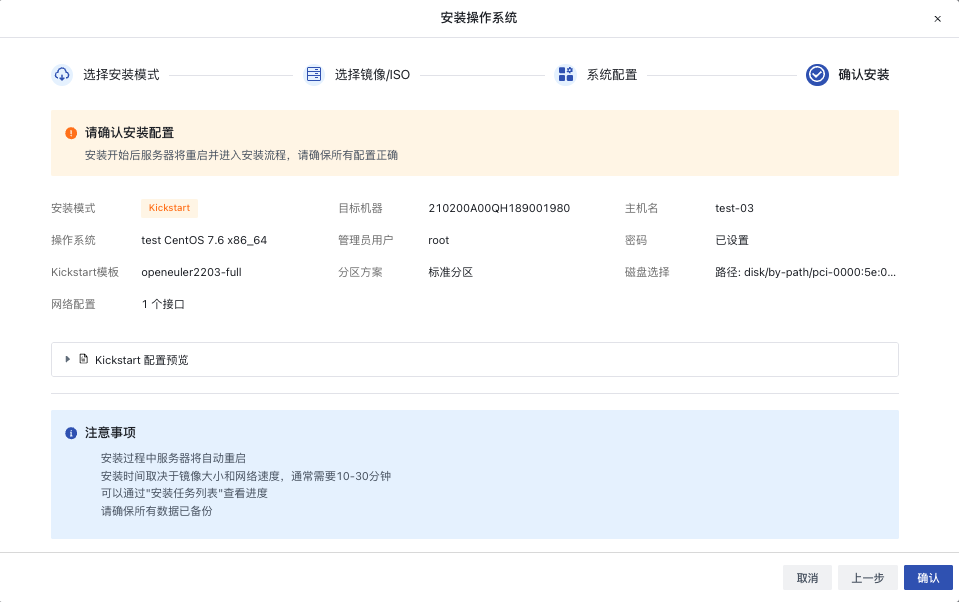

确认后将进入安装流程，可以通过 KVM 或者 VNC 查看具体失败原因，安装失败可以选择回收裸金属，回收成功后重新安装操作系统。同时会创建一条安装任务记录，可以在安装任务中查看日志、重试、取消等操作。

> 重装操作系统可以使用安装操作系统功能。


### 17.2.12 回收裸金属

除了硬件发现中、清理中状态外，其他状态的裸金属都支持回收。已纳管状态操作回收，仅回收租户层资源（如标签、告警模板、关联信息等），操作系统（如有）将保留。可用/安装中/使用中等状态操作回收，回收操作将清除全部租户数据，同时删除操作系统及系统数据，请在确认数据已备份或不再需要后执行此操作。回收仅管理员可以操作，租户如有需要，请联系管理员。

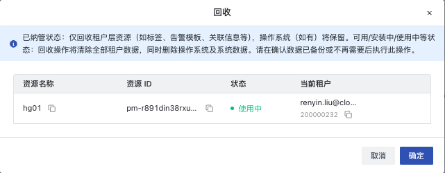

### 17.2.13 修改告警模版

可以给已分配租户的裸金属绑定、切换告警模版，修改告警模版是对裸金属的监控数据进行告警的配置，通过告警模板定义的指标及阈值，可在裸金属相关指标故障及超过指标阈值时，触发告警，通知相关人员进行故障处理，保证裸金属及业务的正常运行。请确保已经给裸金属安装了node_exporter，并且监控数据显示正常。

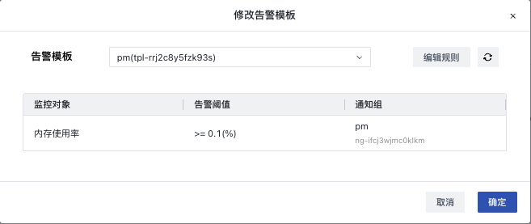

### 17.2.14 修改标签

可以给已分配租户的裸金属修改标签。


### 17.2.15 删除裸金属

平台支持删除已添加的裸金属，删除后可重新添加给其它租户，裸金属被删除后，会直接进行释放，不会进入回收站。裸金属删除并不会影响裸金属内已运行的操作系统及业务服务。


## 17.3 安装任务

给裸金属装机后，会生成一条装机记录，可以查看装机过程中的执行阶段日志，知晓装机进度，如果长时间卡在一个阶段，可以通过 KVM 或者 VNC 查看具体失败原因。

### 17.3.1 查看安装任务

安装任务列表可以查看裸金属的所有安装记录。

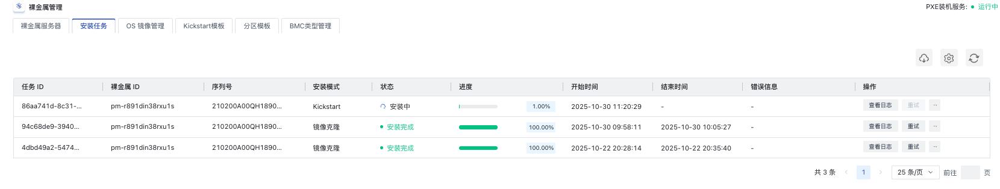

- 任务 ID：安装任务的 ID。
- 裸金属 ID：裸金属资源的 ID。
- 序列号：裸金属的序列号，可以用来定位同一台物理机的装机记录。
- 安装模式：安装操作系统的模式，支持镜像克隆、Kickstart 安装。
- 状态：安装任务状态，包含安装中、安装已取消、安装完成、安装失败。
- 进度：安装任务执行进度，100%时即安装成功。
- 开始时间：安装任务开始执行时间。
- 结束时间：安装任务结束执行时间。
- 错误信息：安装失败错误信息。

### 17.3.2 查看安装任务日志

该安装日志功能支持多维度装机过程追踪与管理：

- **日志检索与过滤**：可按关键字搜索日志内容，按日志级别（如 INFO 等）精准过滤，快速定位关键信息；
- **动态展示控制**：支持安装过程中开启日志自动滚动，实时跟进装机进度，也可手动刷新日志确保信息最新；
- **日志操作管理**：提供日志下载（便于离线分析）、清空（重置日志展示）、全屏查看（优化阅读体验）功能；
- **全流程阶段覆盖**：完整记录装机执行阶段，镜像克隆模式主要包含任务创建、PXE 启动、磁盘清理、镜像克隆、分区扩展、系统初始化、操作系统检测、主机名配置、用户配置、网络配置、系统初始化等装机执行阶段，Kickstart安装模式主要包含任务创建、准备Kickstart配置、Kickstart 安装等装机执行阶段，最终明确反馈安装成功状态，助力用户清晰把控装机全流程。以下是镜像克隆模式：

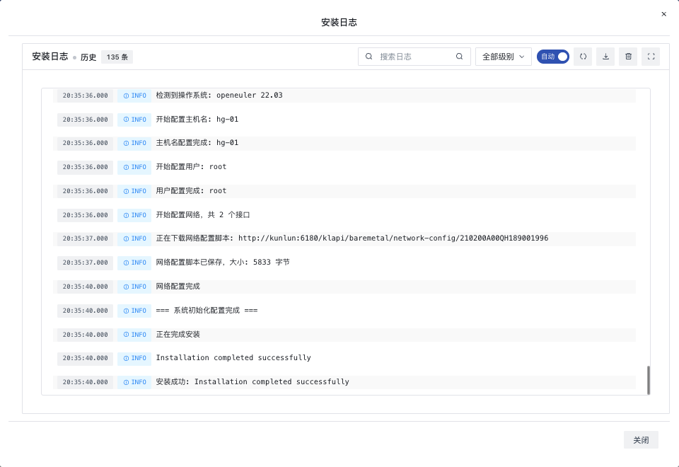

### 17.3.3 重试安装任务

安装完成、安装已取消的任务可以重试，采用原配置，进行再次安装，裸金属会从使用中变成安装中状态，如果不想继续安装，也可以执行取消安装。

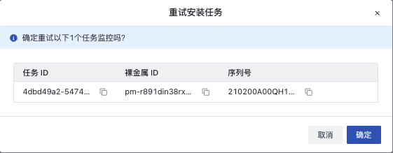

### 17.3.4 取消安装任务

安装中的任务可以取消，取消成功后，裸金属进入可用状态，可以重试安装任务，也可以重新安装操作系统，生成新的安装任务。

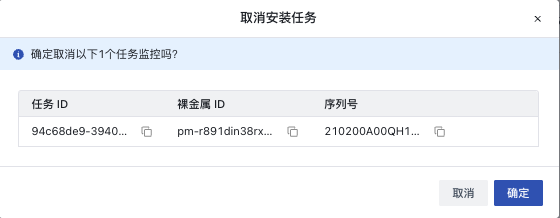

### 17.3.5 删除安装任务

安装完成、安装已取消的安装任务支持删除，删除不影响裸金属之前执行的安装流程。


## 17.4 OS 镜像管理

采用 Kickstart 安装模式给裸金属安装操作系统，需要使用 OS 镜像，管理员支持将平台的 ISO 镜像转换成 OS 镜像，租户仅能使用自己的 ISO 镜像转换，如果想使用他人镜像，可以联系管理员操作。OS 镜像不支持转换 Windows ISO镜像。

### 17.4.1 创建 OS 镜像

支持创建 OS 镜像，将平台 ISO 镜像转换成裸金属 Kickstart 安装模式使用的 OS 镜像。

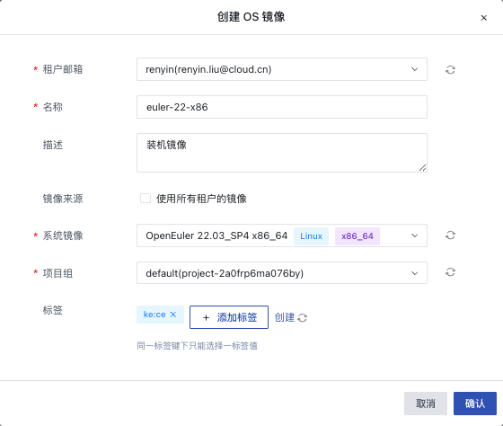

- 租户邮箱：创建的 OS 镜像归属的租户。
- 名称：创建的 OS 镜像名称。
- 描述：创建的 OS 镜像描述。
- 镜像来源：管理员可以选择是否使用所有租户的镜像，默认值否，租户没有该项选择。
- 系统镜像：选择 需要转换的 ISO镜像。
- 项目组：创建的 OS 镜像所属项目组。
- 标签：创建的 OS 镜像所属标签。

### 17.4.2 查看 OS 镜像

支持查看 OS 镜像列表，支持创建、删除 OS镜像，支持修改 OS 镜像的标签。

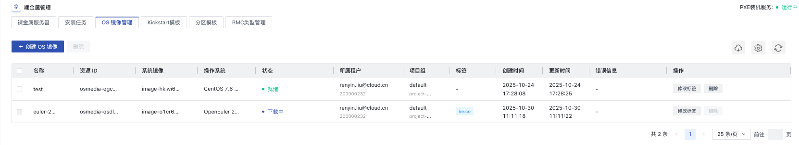

- 名称：OS 镜像名称。
- 资源 ID：OS 镜像资源 ID。
- 系统镜像：OS 镜像的操作系统、版本、架构信息。
- 状态：OS 镜像状态，包含待验证、下载中、解压中、就绪。
- 所属租户：OS 镜像归属的租户。
- 项目组：OS 镜像归属的项目组。
- 标签：OS 镜像归属的标签。
- 创建时间：OS 镜像的创建时间。
- 更新时间：OS 镜像归属的更新时间。
- 错误信息：OS 镜像转换失败的错误信息。

### 17.4.3 修改标签

支持给 OS 镜像修改标签。

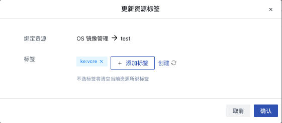

### 17.4.4 删除 OS 镜像

就绪状态 OS 镜像支持删除，删除镜像不影响已经安装好操作系统的裸金属，如果有裸金属正在使用 OS装机，请不要删除。


## 17.5 Kickstart 模板

`Kickstart` 是 Red Hat 系列 Linux 发行版（如 RHEL、CentOS、Fedora）中用于 **自动化操作系统安装** 的工具，核心作用是通过预先配置的 “应答文件”（Kickstart 文件），替代人工干预安装过程（如选择分区、设置密码、安装软件等），实现批量、无人值守的系统部署，能大幅提升大规模部署的效率和标准化程度。Kickstart 配置可以查看官网进行了解和进一步学习使用。Kickstart 模板仅管理员可以操作。

### 17.5.1 创建 Kickstart 模板

支持创建 Kickstart 模板，自定义装机配置文件。

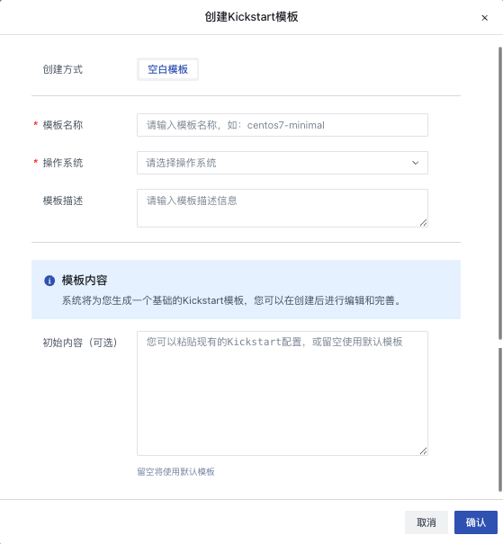

- 创建方式：当前默认空白模板。
- 模板名称：Kickstart 模板的名称。
- 操作系统：模块配置适配的操作系统。
- 模板描述：Kickstart 模板的描述。
- 初始内容：Kickstart 模板内容，可以不填，使用默认模版，也可以粘贴已有的 Kickstart 配置。

### 17.5.2 查看 Kickstart 模板

支持查看Kickstart 模板列表，可以对模版进行预览、编辑、克隆、验证、删除等操作

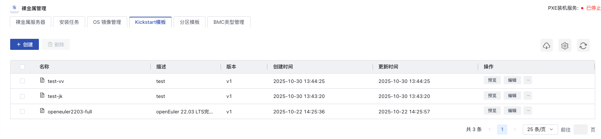

- 名称：Kickstart 模板的名称。
- 描述：Kickstart 模板的描述。
- 版本：Kickstart 模板的版本，默认v1。
- 创建时间：Kickstart 模板的创建时间。
- 更新时间：Kickstart 模板的更新时间。


### 17.5.3 预览 Kickstart 模板

Kickstart 模版的核心模块，可以按需调整参数，查看预览效果。

- **安装方式**：指定系统安装源（如 `url --url=http://镜像地址` 用于网络源）；
- **分区配置**：定义磁盘分区方案（如 `/boot`、`/`、swap 分区的大小和格式）；
- **用户配置**：设置 root 密码、创建普通用户（支持密码加密）；
- **软件包选择**：指定安装的软件组（如 `@base` 基础组）或单个软件（如 `gcc`）；
- **网络配置**：设置 IP、主机名、DNS 等网络参数；
- **安装后脚本**：系统安装完成后执行的自定义命令（如启动服务、配置防火墙）。

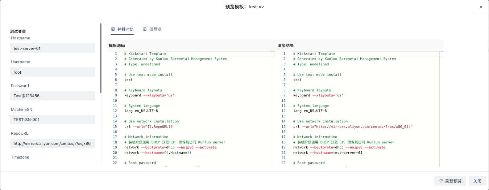


### 17.5.4 编辑 Kickstart 模板

平台支持编辑 Kickstart 模板。

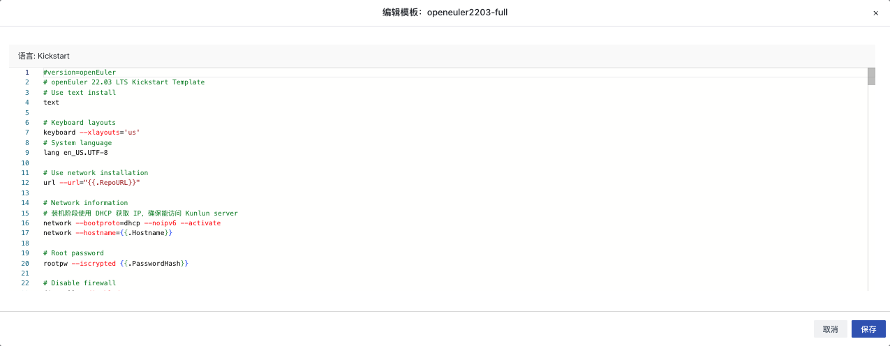

### 17.5.5 克隆 Kickstart 模板

平台支持克隆 Kickstart 模板。


### 17.5.6 验证 Kickstart 模板

平台支持验证 Kickstart 模板，验证通过会提示“模版验证通过”，验证失败会提示相关错误。

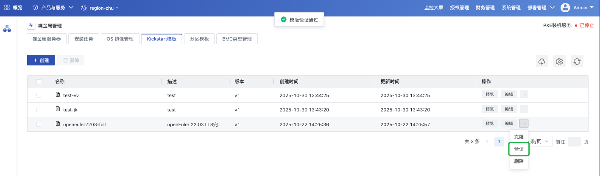

### 17.5.7 删除 Kickstart 模板

平台支持删除 Kickstart 模板，删除模版不影响已经安装好操作系统的裸金属，如果有裸金属正在使用 Kickstart 模板，请不要删除。

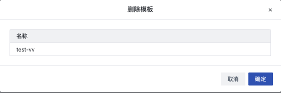

## 17.6 分区模板

分区模板是用于标准化定义磁盘分区方案的配置模板，可在操作系统部署时复用，确保分区规则的一致性。采用 Kickstart 安装模式给裸金属安装操作系统，需要使用分区模板。分区模板仅管理员可以操作。

### 17.6.1 创建分区模板

平台支持创建分区模板，支持设置基础信息、分区配置、验证配置。


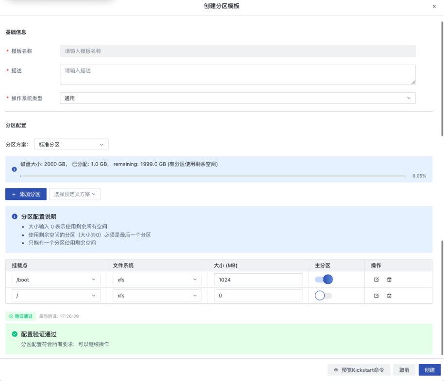

- 模板名称：输入具有标识性的名称，用于区分不同模板。

- 描述：填写模板的用途或特点，方便后续理解。

- 操作系统类型：选择适配的系统类型（如 “通用” 或特定系统），确保分区规则兼容。

- 分区配置 - 分区方案：选择预设方案，包含标准分区、LVM。

- 分区配置 - 选定预定义方案，包含：最小化（/boot + /）、标准（/boot + / + /home），选择后会更新分区详细设置。

- 分区配置 - 添加分区：可通过 “添加分区” 按钮新增分区，基于总磁盘大小（如示例中 2000GB），规划各分区的挂载点、文件系统、大小。

  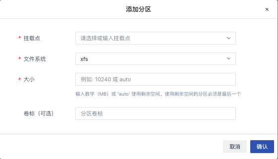
  
- 分区配置 - 添加分区-挂载点：设置分区挂载点，例如 `/home`、`swap` 等。
  
- 分区配置 - 添加分区-文件系统：设置分区文件系统，例如xfs、ext4 等。

- 分区配置 - 添加分区-大小：设置分区的大小，单位MB，或者填“auto”使用剩余空间，需遵循 “仅一个分区使用剩余空间且为最后一个分区” 的规则。

- 分区配置 - 添加分区-卷标：设置分区的卷标。

### 17.6.2 查看分区模板

支持查看分区模板列表，支持查看详情、预览 Kickstart 命令、编辑、克隆、设为默认、删除分区等功能。

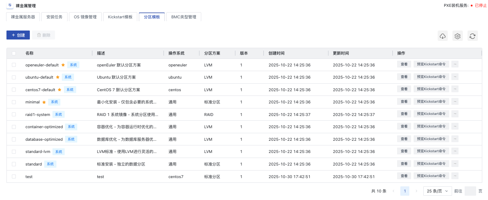

- 名称：分区模板的名称。
- 描述：分区模板的描述。
- 操作系统：分区模板的操作系统，如 “通用” 或特定系统。
- 分区方案：分区模板的分区方案，包含：标准分区、LVM。
- 版本：分区模板的版本，当前默认固定1。
- 创建时间：分区模板的创建时间。
- 更新时间：分区模板的更新时间。

### 17.6.3 查看分区模板详情

支持查看分区模板详情，展示模版基础信息：模版名称、操作系统类型、分区方案类型、版本、描述、LVM卷组名称、创建者、创建时间、更新时间；分区信息：挂载点、文件系统、大小、是否主分区、加密。

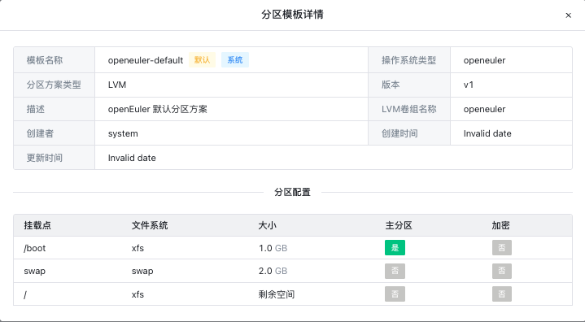

### 17.6.4 预览 Kickstart 命令

创建分区模板、分区模板列表支持预览 Kickstart 命令。将图形化的分区配置转换为可执行的 Kickstart 脚本命令，以便在自动化安装操作系统时调用。界面将基于逻辑卷管理的分区策略（如`/boot`分区、swap 分区、根分区`/`），自动生成对应的 Kickstart 命令。

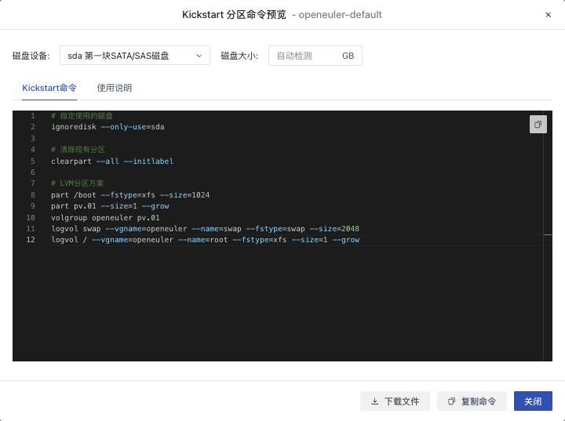

- **磁盘与大小设置**：可选择目标磁盘（如`sda`），并支持自动检测磁盘大小；
- **命令预览与复用**：提供 “Kickstart 命令” 标签页查看完整脚本，支持 “复制命令” 直接复用，或 “下载文件” 保存为独立的 Kickstart 配置文件；
- **使用说明辅助**：可切换 “使用说明” 标签页，查看如何使用这些命令和注意事项，降低使用门槛。

### 17.6.5 编辑分区模板

平台支持编辑分区模板，支持修改基础信息、分区配置、验证配置。

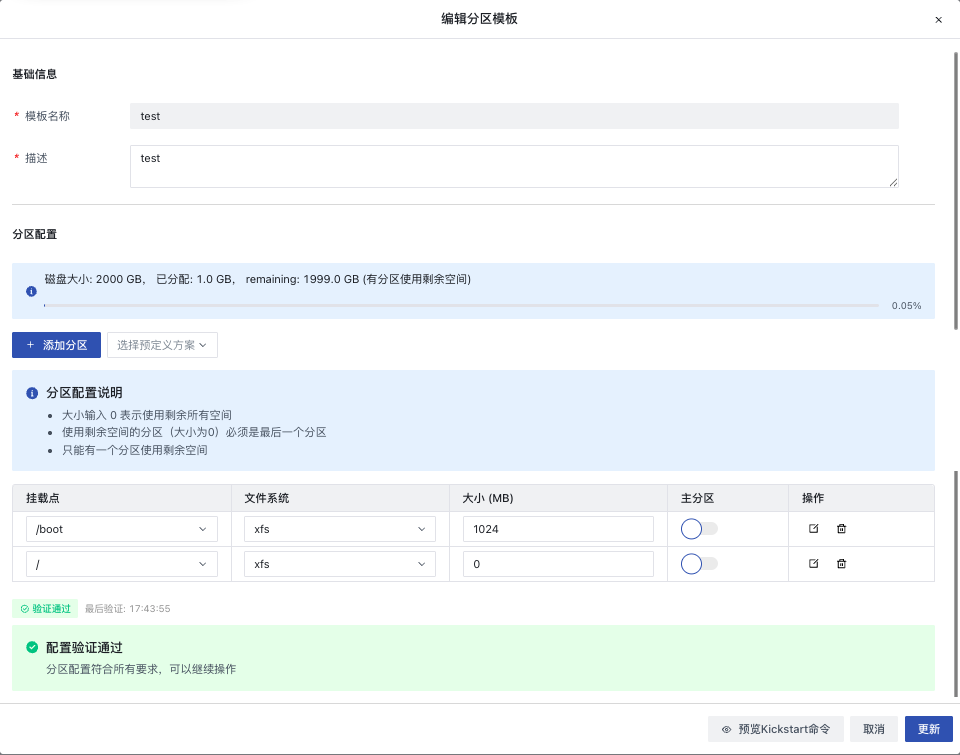

- 模板名称：输入具有标识性的名称，用于区分不同模板。
- 描述：填写模板的用途或特点，方便后续理解。
- 分区配置 - 分区方案：选择预设方案，包含标准分区、LVM。
- 分区配置 - 选定预定义方案，包含：最小化（/boot + /）、标准（/boot + / + /home），选择后会更新分区详细设置。
- 分区配置 - 添加分区：可通过 “添加分区” 按钮新增分区，基于总磁盘大小（如示例中 2000GB），规划各分区的挂载点、文件系统、大小。

### 17.6.6 克隆分区模板

平台支持克隆分区模板。


### 17.6.7 设为默认

平台支持设置成默认分区模板，列表排序优先展示默认分区模板，设置成默认模版无法取消，请谨慎设置。


### 17.6.8 删除分区模板

平台支持删除分区模板，删除模版不影响已经安装好操作系统的裸金属，如果有裸金属正在使用分区模板，请不要删除。


## 17.7 BMC 类型管理

BMC 类型管理是对服务器 基板管理控制器（BMC） 的各类硬件型号、协议版本、功能参数及运维操作进行统一配置、监控与维护的管理模块，核心作用是 “标准化管控不同类型 BMC 设备，确保远程硬件管理的稳定性与效率”。

### 17.7.1 添加 BMC 类型

平台支持添加 BMC 类型，添加的时候配置步骤采用默认的，如果需要适配，需要再次操作编辑进行更改。


- 名称：BMC 类型名称，请确保输入的BMC名称与IPMI系统中的名称完全一致，这将确保系统能够正确识别和管理设备，否则 KVM、VNC 远程登录功能将无法使用。

- 描述：BMC 类型描述。

### 17.7.2 查看 BMC 类型

平台支持查看 BMC 类型列表，支持编辑、测试、删除功能。

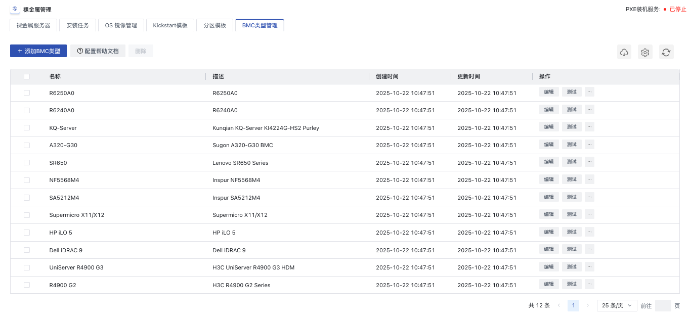

- 名称：BMC 类型的名称。
- 描述：BMC 类型的描述。
- 创建时间：BMC 类型的创建时间。
- 更新时间：BMC 类型的更新时间。

### 17.7.3 配置帮助文档

平台提供了完善的 BMC 类型配置帮助文档，如果需要适配 BMC类型，请一定要查看该文档。

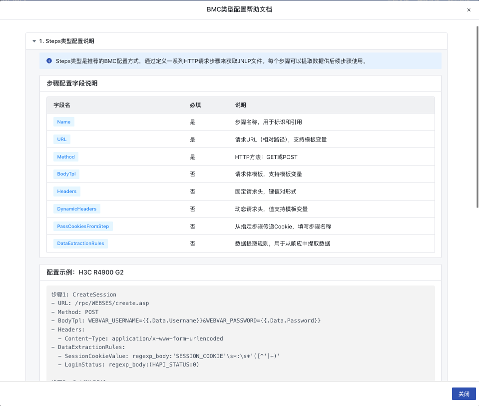

### 17.7.4 编辑 BMC 类型

平台支持编辑 BMC 类型，基于这里比较复杂，我们在“配置帮助文档”中有详细的适配描述，请一定要查看文档。


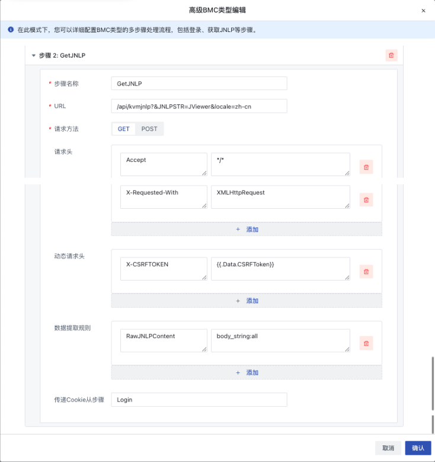

### 17.7.5 测试 BMC 类型

BMC 类型配置成功后，支持测试是否能正确访问，此功能整合了JNLP测试和分步骤测试，您可以选择不同的测试模式。如果测试失败，会提示失败信息，请再次在编辑中适配。

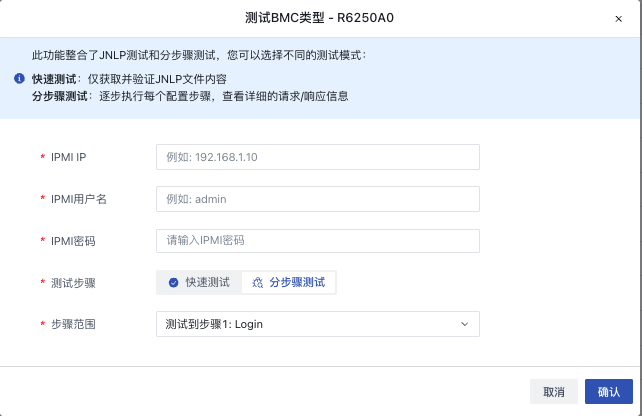

- IPMI IP：裸金属的 IPMI IP 地址。
- IPMI 用户名：裸金属的 IPMI 登录用户名。
- IPMI 密码：裸金属的 IPMI 密码。
- 测试步骤：测试方式，包含：快速测试：仅获取并验证JNLP文件内容、分步骤测试：逐步执行每个配置步骤，查看详细的请求/响应信息。
- 步骤范围：分步骤测试，可以选择需要测试的步骤，也可以选择“测试所有步骤”。

### 17.7.6 删除 BMC 类型

平台支持删除 BMC 类型，如果裸金属已经使用了 BMC类型，请不要删除。

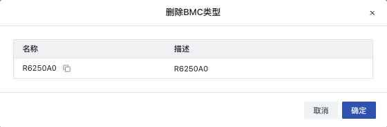


