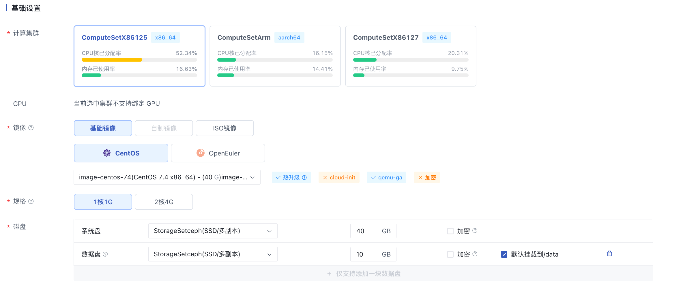
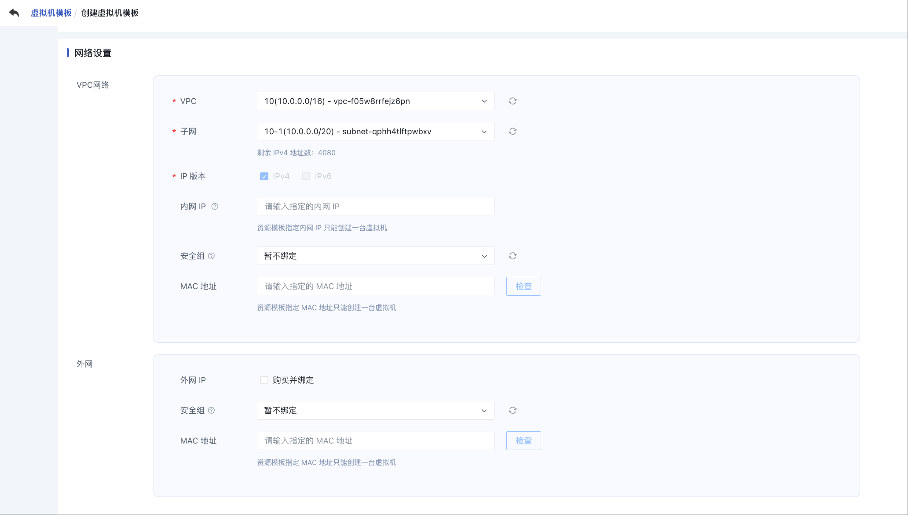
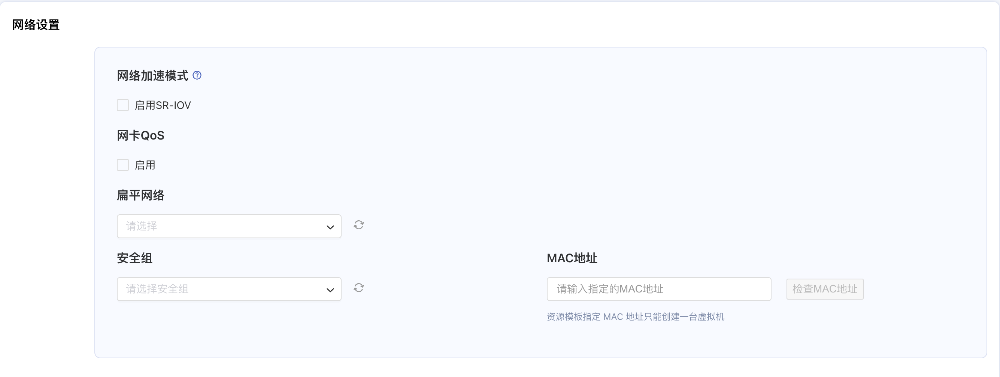
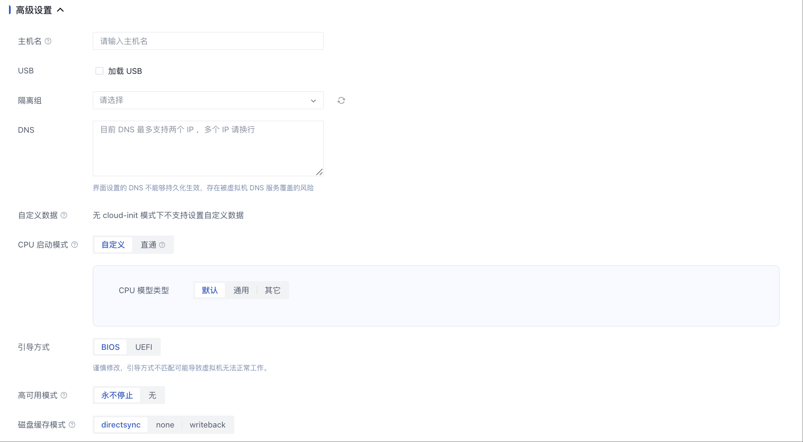
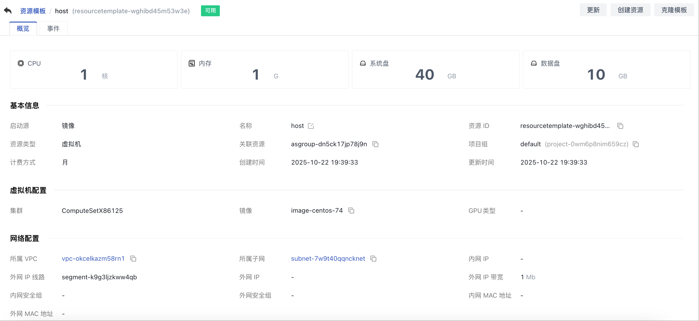
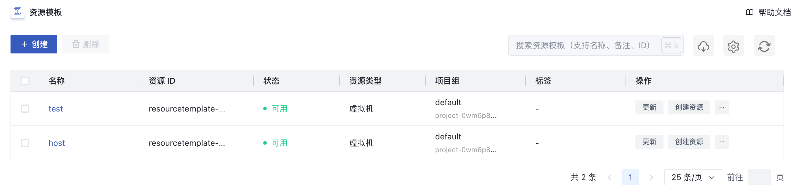
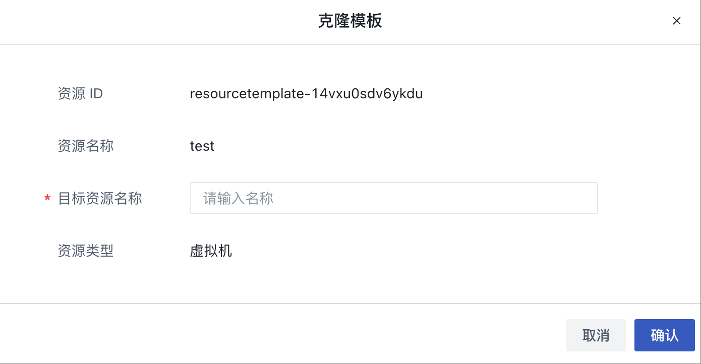
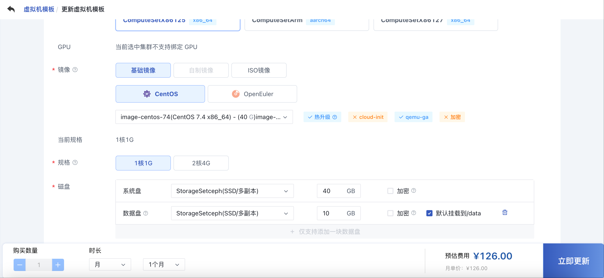
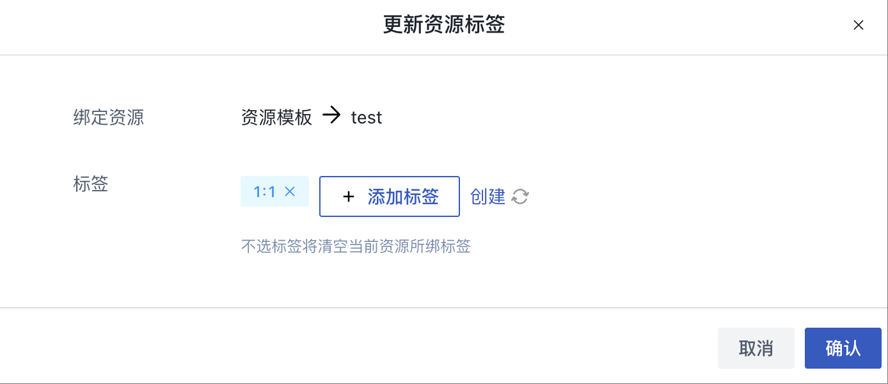
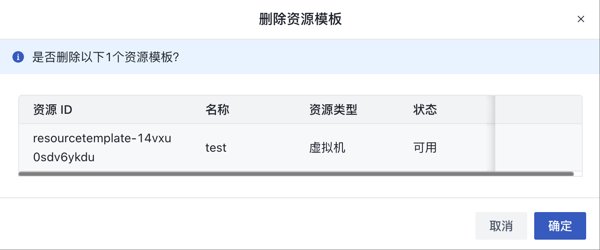

# 27 资源模板

## 27.1 概述

资源模版支持租户预定义创建资源的参数配置，保存到模版中，便于后续快速创建，以及结合水平弹性伸缩完成业务节点的快速扩缩。

## 27.2创建模版

### 27.2.1 创建虚拟机模板

云平台用户可以通过指定机型、规格、镜像、虚拟硬盘、VPC 网络、公网 IP、安全组及虚拟机相关基础信息一键创建虚拟机模板，用于从模板创建虚拟机实例。虚拟机模板不占用实际资源。

1. 选择地域（数据中心）后，在左侧导航栏选择资源模板，进入资源模板控制台，点击“创建” ，弹出虚拟机模板创建向导；

   
   
2. 选择虚拟机模板的机型，并确定虚拟机模板的操作系统镜像；

   * 机型是运行虚拟机的节点的集群类型，代表不同架构、不同型号的 CPU 或硬件特征，可由管理员自定义，如 x86 机型、GPU 机型、ARM 机型等，通过 ARM 机型创建的实例为 ARM 版虚拟机实例，已适配国产芯片、服务器及操作系统，并可运行国产化操作系统，如 UOS 或 银河麒麟；
   * 镜像即虚拟机实例运行环境的模板，可以选择基础镜像、自制镜像和 ISO镜像；
     * 基础镜像是由平台官方默认提供，包括多发行版 Centos 、Ubuntu 及 Windows 等原生操作系统，同时基础镜像的默认时区为上海；
     * 自制镜像是由用户通过虚拟机自行导出或自定义导入的自有镜像，可用于创建虚拟机，仅账号自身有权限查看和管理；
     * ISO 镜像是由用户通过虚拟机自行导出或自定义导入的自有镜像，可用于创建虚拟机，仅账号自身有权限查看和管理。
3. 选择虚拟机模板的规格配置，即定义提供计算能力的 CPU 内存及 GPU 配置，规格可由平台管理员进行自定义；

   * CPU 机型默认提供 1 核 2G 、2 核 4G 、4 核 8G 、8 核 16G 、16 核 32G 及 64 核 128G 等虚机规格；
   * 平台提供 GPU 设备透传能力，若机型为 GPU 机型，可创建并运行拥有 GPU 能力的虚拟机；
   * 针对 GPU 机型，平台支持最高配置 4 颗 GPU 芯片，为使 GPU 虚拟机发挥最佳性能，平台限制最小 CPU内存规格为 GPU 颗数的 4 倍以上，如 1 颗 GPU 芯片最小需要 4 核 8G 规格，2 颗 GPU 芯片最小需要 8 核 16G 规格，4 颗 GPU 芯片最小需要 16 核 32G 规格。
4. 选择并配置虚拟机模板的系统盘和数据盘，可分别配置系统盘和虚拟硬盘的容量。

    * 系统盘：运行虚拟机镜像的系统盘，创建虚拟机模板时必须选择系统盘类型及系统盘容量；

      * 选择系统盘的磁盘类型，如 SSD 磁盘 或 HDD 磁盘，磁盘类型可由管理员进行自定义；
      * 配置系统盘容量，Linux 和 Windows 镜像默认系统盘均为 40GB ，加密系统盘创建时默认增加 1G 空间，虚拟机系统盘的容量范围可以通过规格配置进行调整，支持的配置值范围为 40GB 至 2000GB，具体的系统盘大小根据镜像大小确定，步长为 1GB，即容量需为 1GB 的整数倍；
    * 数据盘：一种基于分布式存储系统为虚拟机提供持久化存储空间的弹性块设备，创建虚拟机模板配置一块云盘。

      * 数据盘挂载路径可选择默认为 `/data`（windows系统除外）。

5. 配置网络相关设置，包括 VPC 网络、子网、内网 IP 地址、内网安全组、外网 IP 及外网安全组等选项：  

    * VPC 网络是一个属于用户的、逻辑隔离的二层网络广播域环境。在一个 VPC 网络内，用户可以构建并管理多个三层网络，即子网（ Subnet ），VPC 私有网络是子网的容器，不同 VPC 间网络绝对隔离；
      * 创建虚拟机模板时必须选择 VPC 网络和所属子网；
      * 控制台已为用户计算所选子网的可用 IP 数量，创建时需指定可用 IP 数量足够的子网；
      * 安全组是平台提供的虚拟防火墙，提供出入双方向流量访问控制规则，定义哪些网络或协议能访问资源；
      * 外网安全组用于控制虚拟机南北向（外网 IP）的流量，内网安全组用于虚拟机东西向（网卡间）的安全访问控制；
      * 外网 IP 为虚拟机提供的弹性外网出口服务，平台支持 IPv4/IPv6  双栈网络。创建虚拟机模板时选中外网IP，可在虚拟机模板创建虚拟机时为虚拟机绑定一个外网 IP 地址。

在HCI 和 Virt 版本的云平台下，创建虚拟机资源模板时网络设置选择扁平网络，如下：

安全组和IP是可选项。

6. 选择并配置虚拟机模板基础管理配置，包括登录方式、登录密码（可选择随机生成）和项目组信息等。

    * 管理员名称：CentOS 的管理员为 `root` ，Ubuntu 的管理员为 `ubuntu` ，Windows 系统的管理员名称为  `administrator` ；
    * 登录方式：为虚拟机模板设置登录凭证，即登录虚拟机的密码，可选择随机生成。

  选择的镜像既无 cloud-init 特性也无 qemu-ga 特性时，不支持设置密码，管理员名称、登录方式、管理员密码不展示。

  > HCI 和 Virt 版本不支持选择项目组。

7. 配置高级设置，包括主机名、USB、隔离组、DNS、自定义数据、CPU 启动模式、引导方式、高可用模式、磁盘缓存模式。

   

    * 主机名：表示操作系统内部的计算机名，批量创建时会在当前填写主机名添加有序后缀，新的主机名会在实例重启后生效；

  > Windows系统，长度为2\~15个字符。Linux系统，长度为2\~63个字符。在批量创建时，windows最大支持12字符，Linux最大支持60位字符。
  >
    * USB：支持USB透传功能，物理机 USB 设备可直接透传至该物理机上所运行的云主机，USB 设备包含以下两种模式：

      * 直通：将 USB 设备加载到此物理机所在计算集群内的云主机，迁移云主机时需要卸载此 USB 设备；
      * 转发：将 USB 设备加载到此物理机所在计算集群内的云主机，迁移云主机时不需要卸载此 USB 设备。
    * 隔离组：隔离组是一种针对虚拟机资源的简单编排策略，支持组内或组之间的实例分散到不同物理机上，用以保障业务的高可用；
    * DNS：支持自定义 DNS，最多支持两个 ip，多个 ip请换行；
    * 自定义数据：即自定义初始化脚本，经过 base64 编码，最大 1M，可在初次启动和每次开机/重装/重启时执行。选择的镜像支持 cloud-init 时，支持输入；
    * CPU 启动模式：虚拟机启动时 CPU 使用的模式，分为自定义和直通，其中直通模式在线迁移需要 2 个物理机的 CPU 型号完全一致；
    * 引导方式：虚拟机的引导方式，包括 BIOS 和 UEFI 两种；
    * 高可用模式：该策略可触发云主机自动重启,提高云主机可用性；高可用为永不停止的虚拟机进行保活，为无的不进行保活。
    * 磁盘缓存模式：虚拟机磁盘的缓存模式，包括 directsync、none 以及 writeback。

8. 选择购买数量和付费方式，如下图所示确认订单并点击“立即创建” 进行虚拟机模板创建操作。  

    * 购买数量：固定为1；
    * 付费方式：选择虚拟机的计费方式，支持按小时、按月、按年三种方式，可根据需求选择适合的付费方式；
    * 合计费用：用户选择虚拟机 CPU、内存、数据盘、外网 IP 等资源按照付费方式的费用展示；
    * 立即创建：点击立即创建后，会返回虚拟机模板列表页，不进行实际的扣费操作。从虚拟机模板创建虚拟机时需进行扣费操作。

### 27.2.1.1 查看虚拟机模板详情信息

   在资源模板列表上点击模板名称进入模板详情页面，虚拟机模板包含基本信息、虚拟机配置、网络配置、存储配置、高级设置。

### 27.2.1.2 创建资源

  在资源模板列表点击创建资源，设置资源名称，管理员密码，即可创建出对应配置的虚拟机。

## 27.3 查看资源模版列表

  资源模板列表页可查看当前账户下已有的资源模板，包括名称、资源 ID、状态，资源类型，项目，标签，操作等，同时也可通过“自定义列表”按钮，自定义列表所需信息。

  

## 27.4 克隆模版

  在资源模版列表点击克隆模版，设置目标资源名称，即可克隆出相同配置的资源模版。

## 27.5 更新模版

  在资源模版列表点击更新，打开更新资源模版页，更新要修改的配置点击立即购买，即可更新资源模版。

在HCI 和 Virt 版本的云平台中，创建资源不再有计费概念。

## 27.6 修改标签

  在资源模版列表点击修改标签按钮，选择要修改的标签点击确认，即可更新资源模版的标签。

## 27.7 删除资源模版

  在资源模版列表点击删除按钮，点击确认即可删除资源模版。资源模板已关联资源时不可删除，删除资源模板后对通过资源模板创建的资源无影响。

